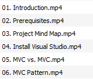
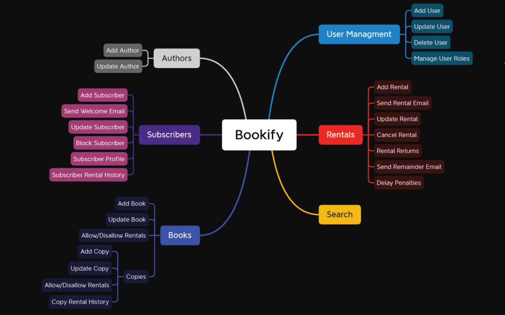
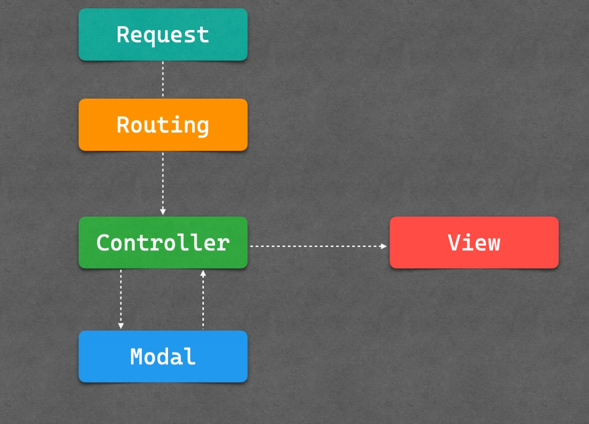

## Introduction

## Bookify Project Mind Map

## What is ASP.NET ?
- **ASP.NET** is a web application framework developed by Microsoft that allows developers to build dynamic web applications and web services. It is built on the .NET framework and supports multiple programming languages, including C#, Visual Basic, and F#.
  
- **Web Forms**: An event-driven development model that uses a drag-and-drop, WYSIWYG interface. It is suitable for developers who prefer a more visual approach to designing web applications.
- **MVC (Model-View-Controller)**: A design pattern that separates an application into three main components: the Model, the View, and the Controller. This separation helps manage complex applications by promoting a clean separation of concerns.

## MVC
- **Model**: Represents the data and the business logic of the application. It is responsible for managing the data, logic, and rules of the application.
- **View**: Represents the user interface of the application. It is responsible for displaying the data and interacting with the user.
  - View in ASP.NET MVC is a .cshtml file (Razor Pages) that contains HTML markup and C# code. that makes it easy to communicate with the Model and the Controller.
- **Controller**: handles the user request. Acts as an intermediary between the Model and the View. It is responsible for processing the user input, updating the Model, and returning the updated data to the View.
  
    
