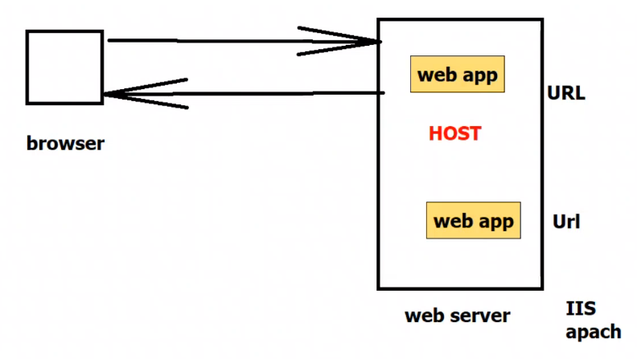
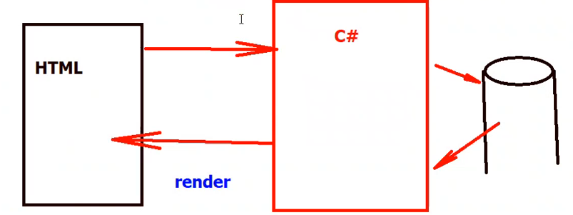
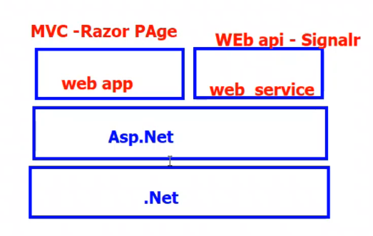

- [1. Introduction](#1-introduction)
- [2. Project](#2-project)
  - [2.1. `Controller`](#21-controller)
  - [2.2. `View`](#22-view)
  - [2.3. `Model`](#23-model)


## 1. Introduction
- Web apps are software applications that run on a `web server` and are accessed by a `web browser`
  
  - `Web server` is a computer that runs a software that listens for incoming requests from clients and sends responses back to the clients
    - `IIS` is a web server that runs on windows
    - `Apache` is a web server that runs on linux
  
  - `Web browser` is a software that runs on a client computer and sends requests to web servers and displays the responses
    - `Chrome`, `Firefox`, `Safari`, `Edge` are web browsers

    
___

**Two methodologies for building web apps**
- Full web Application (MVC)

- `Backend` API (Web API) + `Frontend` Web App or Mobile App or Desktop App

___

**Types of web apps**
- Static web apps (HTML, CSS, JS)

- Dynamic web apps (HTML, CSS, JS + Server-side code)
    
    

___
**In Microsoft For Web app**

- Asp.Net Core 
  - open source web framework
  
  - cross-platform
  - Web applications (MVC) and services (Web API)
    - need .NetCore + Asp.NetCore
    


- MVC design pattern is a software architecture pattern that separates an application into three main components:
  - Model (data , business logic)
  - View (UI)
  - Controller (handles requests, work with model, return view)

- separate of concerns
- routing mapping (no need to create physical files , no extension)
  - example: /Home/Index -> `HomeController.cs -> Index method`
  - but there are some physical files like static files (css, js, images) must be in wwwroot folder must be using physical path 
- razor view engine (`HTML + C#`) run on server and return HTML to client
___
## 2. Project
- `Dependencies` : has all the libraries that are required for the project

- Settings : json file
 
  - `launchSettings.json` : settings for launching the project (port, environment variables)
 
    > Virtual hosting 
    > - using IIS Express (windows only), we can host multiple websites on different ports `listening as application in the system tray`
    > - using kestrel (Proxy server) , `listens using terminal`
    ```json
      {
        "$schema": "http://json.schemastore.org/launchsettings.json",
        "iisSettings": {
          "windowsAuthentication": false,
          "anonymousAuthentication": true,
          "iisExpress": {
            "applicationUrl": "http://localhost:20458",
            "sslPort": 0
          }
        },
        "profiles": {
          "http": {
            "commandName": "Project",
            "dotnetRunMessages": true,
            "launchBrowser": true,
            "applicationUrl": "http://localhost:5299",
            "environmentVariables": {
              "ASPNETCORE_ENVIRONMENT": "Development"
            }
          },
          "IIS Express": {
            "commandName": "IISExpress",
            "launchBrowser": true,
            "environmentVariables": {
              "ASPNETCORE_ENVIRONMENT": "Development"
            }
          }
        }
      }
    ```


- `wwwroot` : static files (css, js, images)
  - use physical path to access files
  - request for static files are not handled by MVC, it is handled by the server
  - it searches for the static file in the wwwroot folder

- `appsettings.json` : settings for the application (connection strings, app settings)
  - have some values that are used in the application which can be changed without recompiling the application


- `Program.cs` : entry point of the application
  - create builder of WebApplication
  - configure the WebApplication object 
  - run the WebApplication object


### 2.1. `Controller`
  - HomeController : Controller
  
  - Controller : ControllerBase
  
    > - ControllerBase has all the methods that are required for the controller
    >  - HttpContext : request, response, session, cookies...

  <br>

  - Actions
    - public non-static methods
    - return :
      - String ----------->ContentResult
      - View ------------>ViewResult
      - json ------------->JsonResult
      - file -------------->FileResult
      - notfound ------->NotFoundResult
      - redirect --------->RedirectResult
      - >all the above classes are inherited from `ActionResult` class which implements `IActionResult` interface
    ```csharp
    public ContentResult Index()
    {
      //declare the content type
      ContentResult content = new ContentResult();
      
      //initialize the content
      content.Content = "Hello World";
      
      //return the content
      return content;
    }
    ```

  - Action Parameters
    ```csharp
    // ---/Home/Show?name=test&id=1
    public IActionResult ShowMix(string name, int id)
    // IActionResult is a base interface for all the results
    {
      if(id %2 == 0)
      {
        return View("Home");
        // View("Home") is a method that returns a ViewResult
      }
      else
      {
        return Content($"Hello {name} with id {id}");
        // Content() is a method that returns a ContentResult
      }
    }
    ```

### 2.2. `View`
Razor view engine (`HTML + C#`) run on server and return HTML to client
- C# code is written in `@{ }`
  
  - Block of code
  
    ```cshtml
    @{
      //C# code
      int x = 10;
      string name = "test";
    }
    ```

  - Inline code
    ```cshtml
    <h1>@name</h1>
    @x
    ```

### 2.3. `Model`
Stores the data and business logic
- Student : structure of the data
  ```csharp
  public class Student
  {
    public int Id { get; set; }
    public string Name { get; set; }
    public string ImageUrl { get; set; }
  }
  ```
- StudentBL : Business logic
  ```csharp
  public class StudentBL
  {
    public List<Student> GetStudents()
    {
      List<Student> students = new List<Student>();
      students.Add(new Student { Id = 1, Name = "test1", Email = "1.png" });
      students.Add(new Student { Id = 2, Name = "test2", Email = "2.png" });
      return students;
    }
    public Student GetStudent(int id)
    {
      return students.FirstOrDefault(s => s.Id == id);
  }
  ```

- StudentController : Controller
  ```csharp
  public class StudentController : Controller
  {
    public IActionResult Index()
    {
      StudentBL studentBL = new StudentBL();
      List<Student> students = studentBL.GetStudents();
      //return View("index"); overload for specifying the view name
      return View(students); // overload for passing the model
    }
  }
  ```

- Index.cshtml : View
  ```html
  @Model
  <!-- with capital its dynamic type-->
  <!-- can say it's loosely typed view -->

  ```
  ```html
  @model List<Student> 
  <!-- with small m its object List not dynamic-->
  ```
  ```cshtml
  @model List<Student>

  <table class="table table-bordered">
  @foreach(var item in Model)
  {
    <tr>
      <td>@item.id</td>
      <td>@item.Name</td>
      <td>
        
      </td>
    </tr>
  }
  </table>
  ```
