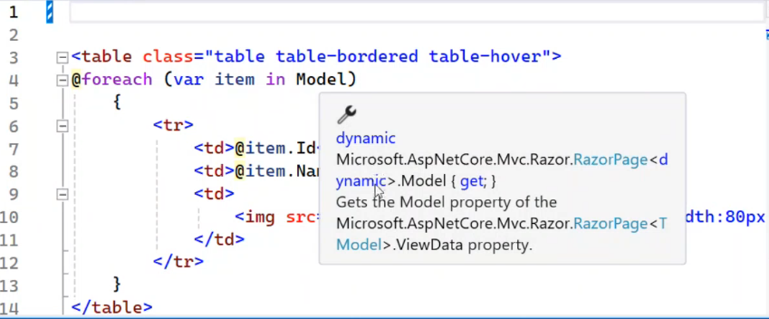
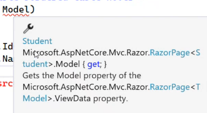
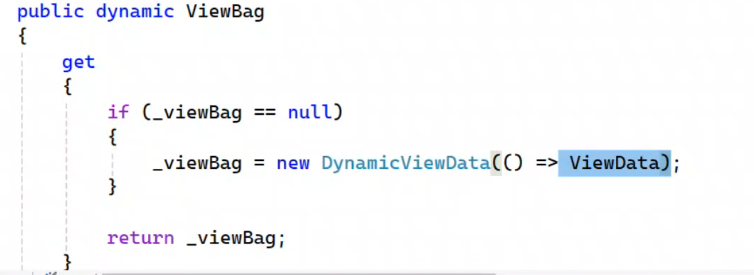
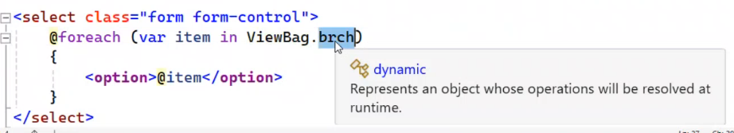

- Strong type view
- code first DB
- pass data to view

#### 0.0.1. Table of Contents
- [1. C# in View](#1-c-in-view)
- [2. Connect to DB](#2-connect-to-db)
- [3. Pass Data to View](#3-pass-data-to-view)


##  1. C# in View
>- how the C# code written in the view is executed in the server side and the result is sent to the client side as html code
>- the C# code must have class to be written in , so the view cshtml file has a class that is inherited from RazorPage class that is a generic class that has a type that is the model that is passed to the view

<br>

- **Class RazorPage<T>**
    
    ```csharp
    class RazorPage<T>
    {
        public T Model { get; set; }
    }
    ```
1. **ViewClass is inherited from RazorPage in generic way**
   >```csharp
   >class ViewClass<T> : RazorPage<T>
   >{
   >    public T Model { get; set; }
   >}
   >```
   >the object will be dynamic if you don't specify the type
   >
   >```csharp
   >class ViewClass<dynamic> : RazorPage<dynamic>
   >{
   >    public dynamic Model { get; set; }
   >}
   >```
   >this view is loosely typed view
   >

2. **ViewClass is inherited from RazorPage in specific way**
   > ```html
   > @model Student
   > ```
   > ```csharp
   > class ViewClass<Student> : RazorPage<Student>
   > {
   >     public object Model { get; set; }
   > }
   > ```
   > 
   > 
   > 


## 2. Connect to DB
1. ADO.NET
2. EntityFramework Core
   - db first
   - code first
        >- non core has only sql server
        >- core has many providers
___
- Code First
```csharp
class Employee
{
    public int Id { get; set; }
    public string Name { get; set; }
    public decimal Salary { get; set; }
    public string JobTitle { get; set; }
    public string ImageUrl { get; set; }
    public string Address { get; set; }
    
    [ForeignKey(nameof(Department))]
    public int DepartmentId { get; set; }
    public Department Department { get; set; }
}
```
```csharp
class Department
{
    public int Id { get; set; }
    public string Name { get; set; }
    //public string>? ManagerName { get; set; }

    public List<Employee>? Employees { get; set; }
}
```
```csharp
class ITIContext : DbContext
{
    public DbSet<Employee> Employees { get; set; }
    public DbSet<Department> Departments { get; set; }
}
```
- Connection String can passed through 
  
  - `OnConfiguring` method
  
    - make builder and set the connection string
    - `optionsBuilder.UseSqlServer("connection string")`
    - constructor of the context class will be called every time the context is created and call parameterless constructor
    which call parameterized constructor which call `OnConfiguring` method
  - injected through `DbContextOptions` in the constructor using services provider

## 3. Pass Data to View

>- /Department/index
>    - server will make controller object and call the action method which will return the view and pass the model to the view
>   - server will make the view object and pass the model to the view
>    - the view will be rendered and the html code will be sent to the client side
>  
>  `then destroy the controller object and the view object`

- Controller which inherits from Controller class 
  - it has some properties like [session , httpRequest , httpResponse , viewBag , viewData , tempData]

### 3.1. ViewData
- viewData is a dictionary that can be used to pass data from the controller to the view
  - has key `string` and value `object`
- its scope is the current request inside the action to the view
- can see that the viewData has property `Model` that is the model that is passed to the view but passing it as model is better than passing it as viewData 
- in the view you can access the viewData using `ViewData["key"]` and cast it to the type you want
>- in the controller viewData is a property of the controller object
>- in the view viewData is a property of the razorPage object

1. `Magic String` the dictionary if the key is mislead it will return null
    ```csharp
    // key string     value is object
    ViewData["Temp"] = 50;
    ```
    ```html
    <h1>@ViewData["Tmp"]</h1>
    <!-- this will build and successfully run but the value will be null -->
    ```

2. `Type Casting` the value is object so need to be casting
    ```html
    <h1>@(ViewData["Temp"])</h1>  <!-- this will show 50 -->
    
    <h1>@(ViewData["Temp"] - 10)</h1>  <!-- if i want to do some operation on it must cast first -->

    <h1>@(int.Parse(ViewData["Temp"].Tostring()) - 10)</h1>  <!-- this will show 40 -->

    ```
    ```html
    <!-- ViewData["Branches"] is list of string but appended as object so not iterative-->
    <ul>
        @foreach (var item in (List<string>)ViewData["Branches"])
        {
            <li>@item</li>
        }
    </ul>
    ```

3. created with each controller and each request create its one object 
   - so it is not shared between the controllers or actions

### 3.2. ViewBag
- viewBag is a dynamic property that store the data inside same private field as viewData but it is dynamic so you can access it directly without casting
- it is a property of the controller object and the view object
- access it directly without casting
- access it using `ViewBag.key` or `ViewBag["key"]` 
    
    

    ```html
    <h1>@(ViewBag.Temp - 10)</h1>  <!-- this will show 40 -->

    ```
    


### 3.3. ViewModels
it is a class that has the properties that you want to pass to the view
- more than one model can be passed to the view
- some properties of the domain model can be passed to the view
- Extra information above the domain model can be passed to the view 