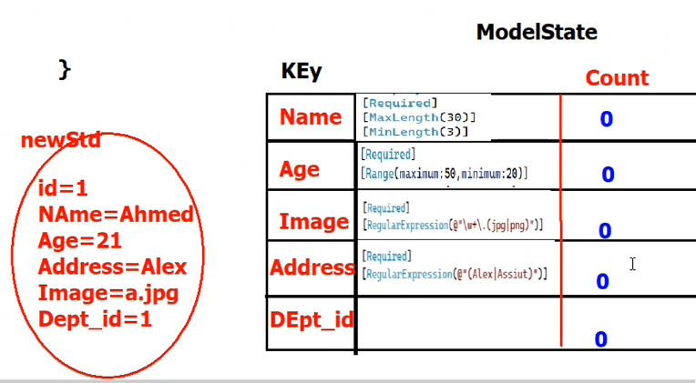
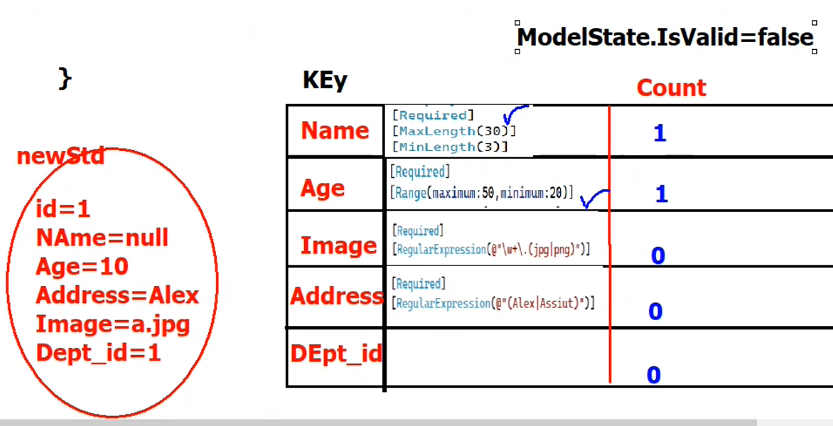
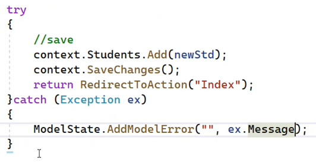

- [1. Validation](#1-validation)
  - [1.1. Server-side validation](#11-server-side-validation)
  - [1.2. Custom Validation](#12-custom-validation)
  - [1.3. Tag-Helper Validation on Client-Side Validation](#13-tag-helper-validation-on-client-side-validation)
  - [1.4. Custom Validation with Ajax](#14-custom-validation-with-ajax)


## 1. Validation
- Validation is the process of checking the data entered by the user on the client side and server side to ensure that the data is correct and valid.
    
    - `Client-side validation`: is done on the client side using JavaScript.
    
    - `Server-side validation`: is done on the server side using C#.
    - `Constraints`: can be added to the model to validate the data.
  
___
### 1.1. Server-side validation
    
  - **Model** : we can add constraints to the model to validate the data.
    
    - Validation Conditions `Data Annotations`: are attributes that can be added to the model to validate the data.
      - Required
      - Range
      - Regular Expression
      - String Length
      - Compare
      - Custom Validation
  
  - **View** : we can display the error messages in the view.

  - **Controller** : we can check if the model is valid and return the view with the error messages.
    - `ModelState`: is a property of the controller that holds the state of the model binding.
   
    - `ModelState.IsValid`: is a property that checks if the model is valid.
  ___
**Example:**

    Name 
    - format "regular expression" char only
    - not null required
    - max length 50
    - min length 3
>
    Age
    - always number
    - range 18-60
    - custom validation
- **Model**
    ```csharp
    [Required(ErrorMessage = "Name is required")]
    [StringLength(50, MinimumLength = 3, ErrorMessage = "Name must be between 3 and 50 characters")]
    [RegularExpression(@"^[a-zA-Z]+$", ErrorMessage = "Name must contain only characters")]
    string Name { get; set; }

    [Required(ErrorMessage = "Age is required")]
    [Range(18, 60, ErrorMessage = "Age must be between 18 and 60")]
    [CustomValidation(typeof(CustomValidation), "ValidateAge")]
    int Age { get; set; }
    ```
- **Controller**
   
   
    ```csharp
    public IActionResult Index()
    {
        return View();
    }

    [HttpPost]
    public IActionResult Index(Person person)
    {
        if (ModelState.IsValid)
        {
            return RedirectToAction("Index");
        }
        return View(person);
    }
    ```
    - in the controller i inherited from the `Controller` class which has the `ModelState` property.
    
    - `ModelState` is dictionary that holds the state `After Model Binding` even the prop that has no attributes.
    
        
        

- **View**
    - to display the error messages in the view we can use the `asp-validation-for` helper method in span only.
    
        ```html
        <div class="form-group">
            <label asp-for="Name"></label>
            <input asp-for="Name" class="form-control" />
            <span asp-validation-for="Name" class="text-danger"></span>
        </div>
        ```

    - to display the error messages in the view we can use the `asp-validation-summary` helper method in span only.
    
        ```html
        <div asp-validation-summary="All" class="text-danger"></div>
        make the errors of the model validations and the custom validations appear.

        <div asp-validation-summary="ModelOnly" class="text-danger"></div> 
        make the errors of the model validations appear only.

        <div asp-validation-summary="None" class="text-danger"></div>
        ```
<br>

### 1.2. Custom Validation
>- **Custom Validation**: is a validation that is not provided by the `Data Annotations` attributes.
>   - can be done in the controller.
>   - can be done in the model using `ValidationAttribute` class.

- **One Case in specific action use `if` to check the value of the prop.**
    >or Send Exception to the `ModelState` prop.
    
    
    - use if to check the value of the prop.
       
        ```csharp
        if(newEmployee.DepartmentId != 0)
        {
            //valid case and save the data
        }
        ```
    
    - then add the error message to the `ModelState` prop.
    
        ```csharp
        else
        {
            ModelState.AddModelError("DepartmentId", "Department is required");// name of the prop and the error message
            // if not add the prop name it will return to summary all errors
        }
        return View(newEmployee);
        ```
<br>

- **Custom Attribute `Filter`**
    - create a class that inherits from `ValidationAttribute` class.
    - override the `IsValid` method.
    - add the custom attribute to the model.
    
    ```csharp
    public class CustomValidation : ValidationAttribute
    {
        protected override ValidationResult IsValid(object value, ValidationContext validationContext)
        {
            if ((int)value % 2 == 0 && (int)value > num)
            {
                return ValidationResult.Success;
            }
            return new ValidationResult("Age must be an even number");


            // value is the value of the prop
            // validationContext is the context of the prop 
            //            has many properties like DisplayName
            //                                     MemberName
            //                                     ObjectInstance

            // validationContext.DisplayName // the name of the prop
            // validationContext.MemberName // the name of the prop
            // validationContext.ObjectInstance // the object that has the prop
            // validationContext.ObjectType // the type of the object
        }
        public int num { get; set;} = 0; // public prop to send value to the attribute to make logic
    }
    ```
    - add the custom attribute to the model.
    
    ```csharp
    [CustomValidation]
    [CustomValidation(num = 2)]
    public int Age { get; set; }
    ```
    - the error message will appear in the view.

<br>

### 1.3. Tag-Helper Validation on Client-Side Validation
  - once using the `asp-validation-for` helper method in the view the client-side validation will be enabled.
    
    ```html
        <div class="form-group">
            <label asp-for="Name"></label>
            <input asp-for="Name" class="form-control" />
            <span asp-validation-for="Name" class="text-danger"></span>
        </div>    
    ```
  - the client-side validation will be done using the `jquery` , `jquery.validate` and `jquery.validate.unobtrusive` libraries.
    - `<Script src="~/lib/jquery/dist/jquery.min.js"></Script>`
    - `<script src="~/lib/jquery-validation/dist/jquery.validate.min.js"></script>`
    - `<script src="~/lib/jquery-validation-unobtrusive/jquery.validate.unobtrusive.min.js"></script>`

  - `jquery-validate-unobtrusive` use attributes to check the inputs `data-val` attributes.
 
  - then render to
    ```html
    <input type="text" class="form-control is-invalid" placeholder="Title" 
    data-val="true" 
    data-val-maxlength="Length connot be more than 500 characters" 
    data-val-maxlength-max="500"
    data-val-remote="Book with same Title is already exists with The Author" data-val-remote-additionalfields="*.Title,*.Id,*.AuthorId" 
    data-val-remote-url="/Books/AllowItem" 
    data-val-required="The Title field is required." id="Title" maxlength="500" name="Title" value="" 
    aria-invalid="true" aria-describedby="Title-error">
    ```

<br>

### 1.4. Custom Validation with Ajax
- `[Remote]` Attribute in MVC namespace
>takes the controller name and the action name that will be called to check the value of the prop.
- return `JsonResult` with `true` or `false` to check the value of the prop.
- the `Remote` attribute will check the value of the prop on the client side without submit after go to server to check the action if unobtrusive is available.
   
    ```csharp
    [Remote("CheckTitle", "Books", ErrorMessage = "Book with same Title is already exists with The Author")]
    public string Title { get; set; }
    ```
- in the controller
    ```csharp
    public JsonResult CheckTitle(string Title)
    {
        if (_context.Books.Any(b => b.Title == Title)
        {
            return Json(false);
        }
        return Json(true);
    }
    ```
If I want to send more data
- add the `additionalfields` to the action.
    ```csharp
    [Remote("CheckTitle", "Books", AdditionalFields = "Id,AuthorId", ErrorMessage = "Book with same Title is already exists with The Author")]
    public string Title { get; set; }
    ```
    ```csharp
    public JsonResult CheckTitle(string Title, int Id, int AuthorId)
    {
        if (_context.Books.Any(b => b.Title == Title && b.Id != Id && b.AuthorId == AuthorId))
        {
            return Json(false);
        }
        return Json(true);
    }
    ```