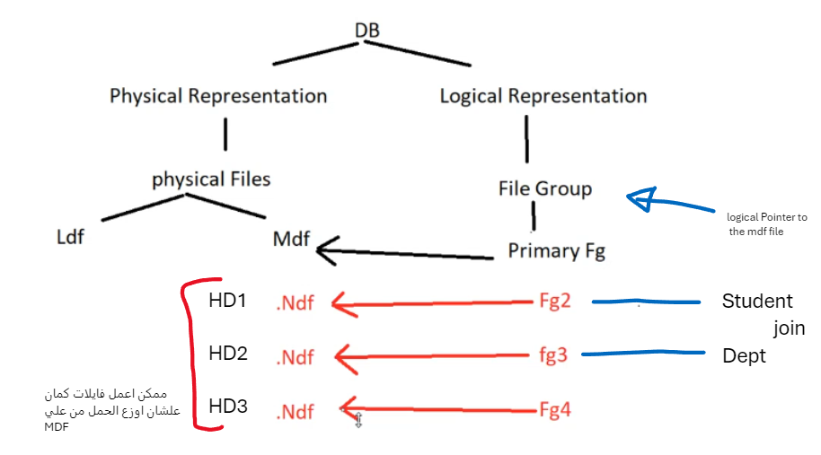
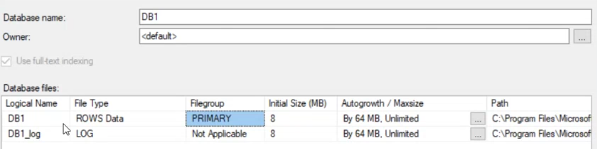
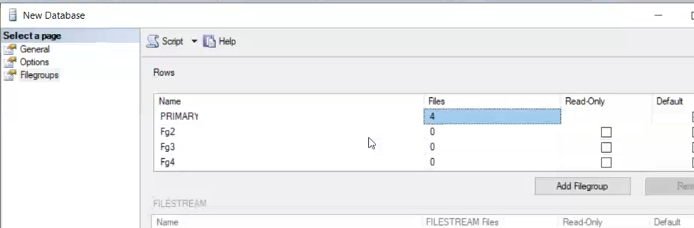
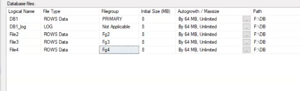
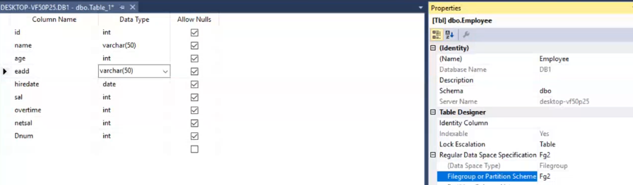
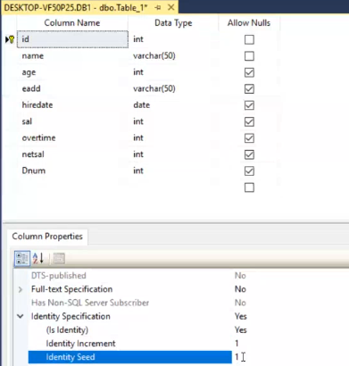
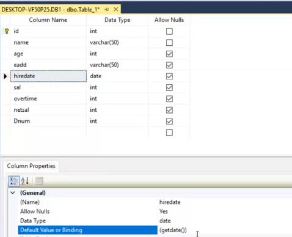
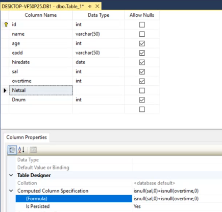
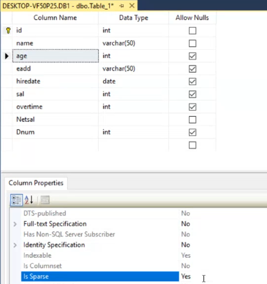
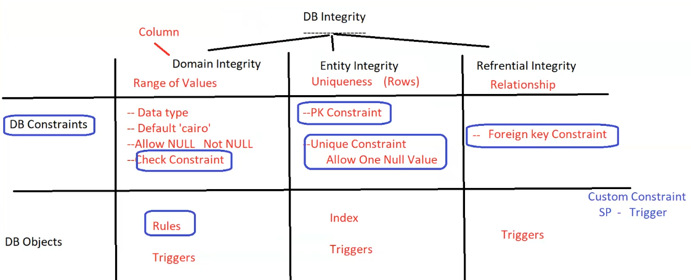

- [1. DB](#1-db)
  - [1.1. Internals DB](#11-internals-db)
  - [1.2. Create DB](#12-create-db)
    - [1.2.1. Divide DB into Files](#121-divide-db-into-files)
    - [1.2.2. Properties](#122-properties)
  - [1.3. Schema](#13-schema)
  - [1.4. Permission](#14-permission)
  - [1.5. Synonyms](#15-synonyms)
- [2. Constraints](#2-constraints)
  - [2.1. Practical Example](#21-practical-example)
  - [2.2. Rule](#22-rule)
  - [2.3. Default](#23-default)
  - [2.4. Create Datatype](#24-create-datatype)


# 1. DB
## 1.1. Internals DB 

This help performance **How?**
- If having tables making join on them continuously and the tables are big, it will take time to load them in memory because it made sequentially
    
    > making each table in a file getting performace better due to it can work parallel <br>
    >- time i load first table in memory from FG2 on .Ndf file on disk (a)
    >- i can load second in memory from FG3 on .Ndf file on disk (b) is the same time

- If making backup from one file it work sequentially, but if making backup from multiple files on diff disks it work parallel

    >- time i backup first file on disk (a)
    >- i can backup second file on disk (b) is the same time

- Better to make the data in the secondary files
- and the structure , stored procedures, functions in the metadata file to make its size small

- .ndf file data stored in small Packets (Data Pages (8KB)) ordered by PK

## 1.2. Create DB
### 1.2.1. Divide DB into Files
- by default, DB create primary file and log file
    
    
    >so all tables automatic exist in the primary file .mdf

- **Creating MultiFiles**
  - create file group
    
    
  - create file on diff disks (in real world, server has multiple disks)
   
    
    >each file has initial size and auto growth size (when reach max size what to do)

- **Creating Table**
  - **when create table specify file group to store the table in it**
    
    

### 1.2.2. Properties
- **Table Properties** 
  - **main Properties of table is name , schema , Filegroup**
      
    
- **Column Properties** 
  - Primary key (identity)
    
    
    - Identity Increment : how much to increment the value by
    - Identity Seed : the first value to start with 
  
  - Default value 
    
    
    - if the value not inserted, it will take the default value , Default value can be a constant or a function
    - if the value inserted, it will take the inserted value

  - Derived Column (Calculated Column)
    
    
    - formula : to write the formula to calculate the value of the column
    - is persisted : you want to save the value in the table or calculate it every time you select it
  
  - Allowed nulls 
    - if age is null -> it store null in the table and take 4 byte for int
    - to make nulls not stored in physical make `is sparse = yes`
    - why do ? because if I have 1000 rows and 100 rows have nulls, it will take 100 * 4 byte = 400 byte
    - so it made in the columns has many nulls

    
    - Why I may choose to store null in 4 bytes?
      - because if I not store nulls in physical, so when to update the column to value it will shift data in space to make 4 byte to store the value and make the update slow

- **Relations Properties**
  - Tables and Columns Specification
    - used to know the pk from the parent table and corresponding fk in the child table
  
  - Insert and Update Specification
    > what to do when insert or update in the child table and the value not exist in the parent table
    - No Action : do nothing (default, not delete or update)
    - Set Null : on delete or update set the `value of FK` to null
    - Cascade : same done to parent done to child (both delete or both update)
    - set default : set the value of FK to default value (must has default value)
      >this default value is in FK , so must be value in PK in Parent table

## 1.3. Schema
- **Schema** : is a logical container for objects (tables, views, stored procedures, functions, ...)

- Used to Solve some problems:

  1.  having the same name of two object (table , view , procedure ) in the same DB
  2.  has groups for objects related to each other (student, instructor, ...)
  3.  permission control (grant permission to schema not to each object)

- How to created
  ```sql
  -- Use ITI
  create schema HR

  create schema Sales
  ```
  >can show it from ITI -> Security -> Schemas

- How to use it
  ```sql
  alter schema HR transfer Student
  -- changed from dbo.Student to HR.Student
  ```
  >not affect on data or relations, just change the schema name

- Same Table with the same name in diff schemas
  ```sql
  create table Student
  (
    ID int primary key,
    Name nvarchar(50)
  )
  -- this will create table in dbo schema by default (dbo.Student) different from HR.Student
  ```

## 1.4. Permission
1. make server mixed mode authentication
2. restart the server
3. create login user `to login to the server`
4. create user in the DB `make this login user to DB` : he will see DB but can't open Tables
5. Make Schema
6. Transfer object to the schema
7. Grant Permission to the schema
    - schema properties -> permissions -> add user -> select the user -> select the permissions
8. Grant , with Grant , Deny 
    - according to business rules
9. Disconnect and reconnect with the user to see the changes
    - he will see the tables in the schema and can't see the tables in the dbo schema

10. New query to told the SSMS that I'm the user 
    
    ```sql
    select * from HR.Student
    insert into HR.Student values (1, 'Ahmed')
    -- this will work because I have permission to the schema

    update dbo.Student 
        set st_age+=1
    -- the error will be update permission denied

    delete from dbo.Student
      where st_age = 20
    -- the error will be delete permission denied
    ```

## 1.5. Synonyms
- **Synonyms** : is an alias for an object (table, view, stored procedure, function, ...)

- What if i use schema.table in many function and want to change the schema name ?
  - it will be hard to change it in all functions

- so can use synonyms to make alias for the schema.table
  ```sql
  create synonym SynonymName for SchemaName.TableName
  ```
  >so can use SynonymName instead of SchemaName.TableName  
  > it appears in the object explorer (Synonyms) in the same level of the table

- ok what else

- if i change the schema name, i will change it in the synonym only
- so i can use the synonym in all functions and when i change the schema name, i will change it in the synonym only

# 2. Constraints
- **Constraints** : is a rule that must be followed by the data in the table to maintain the integrity of the data in the table 
> - DB Integrity : is the accuracy and consistency of the data in the DB to business > rules 
>   - Domain Integrity
>   - Entity Integrity
>   - Referential Integrity



## 2.1. Practical Example
```sql
create table Dept
(
  Dept_ID int primary key, -- this table has one constraint (PK)
  DName nvarchar(20)
)
```
- add constraints to the table
```sql
create table Emp
(
  --eid int primary key identity(1,1), -- this table has one constraint (PK) and identity
  eid int identity(1,1), 
  ename nvarchar(20),
  eadd varchar(20) default 'Cairo', -- this table has Default value 
  hiredata date default getdate(), -- this table has Default value
  sal int,
  overtime int,
  netsal int as (isnull(sal,0) + isnull(overtime,0))  persisted, -- this table has Derived Column (Calculated Column) 
  BD data ,
  --age as (year(getdate()) - year(BD)) persisted, -- get error because has non-deterministic function (getdate()) changed every time
  age as (year(getdate()) - year(BD)) , -- without persisted work 
  gender vchar(1),
  hour_rate int,
  did int ,

  constraint c1 primary key (eid, ename), -- composite primary key
  constraint c2 unique(sal),
  constraint c3 unique(overtime),

  constraint c4 check (sal > 1000), -- check constraint

  constraint c5 check( eadd in ('Cairo', 'Alex', 'Giza')), -- check constraint

  constraint c6 check(gender='f' or gender='m')
  constraint c7 check(overtime between 0 and 100)
  
  constraint c8 foreign key (did) references Dept(Dept_ID) -- foreign key constraint
                  on delete set null -- on delete set null
                  on update cascade -- on update cascade
)
```
- add constraints after creating the table
```sql
alter table Emp add constraint c9 check (hour_rate > 0)
-- this will add check constraint to the data already in table
-- if the data not satisfy the constraint, the constraint will not be added
```
- drop constraint
```sql
alter table Emp drop constraint c9
```

- constraint is applied to the table written in 
- constraint is applied to old data and new data

> what if i want to do the following
> - constraint ---------> new data
> - constraint ---------> shared between tables
> - Datatype   ---------> contain the constraint + default 
>
> these all is done by Rule


## 2.2. Rule
- **Rule** : is a general check constraint that can be applied to multiple tables 

- rule is applied to next data only , if exist data not satisfy the rule, it will be applied

- one column can have one rule only
  - but can has many constraints

```sql
create rule r1 as @x > 1000 -- rule to check the value > 1000
-- saved in db -> programability -> rules
```
- add rule to the column
  
  ```sql
  -- salary stored with 500
  alter table Instructor add constraint r1 check (sal > 1000)

  -- to use the rule
  sp_bindrule 'r1', 'Instructor.salary'  -- what happen is he replace @x with Instructor.salary
  ``` 
  - if i make another rule and bind to same column it will overwrite without telling you.
- drop rule
  ```sql
  sp_unbindrule 'Instructor.salary' -- must unbind the rule from the column before drop it
  drop rule r1
  ```
<br>

>- can apply constraint + rule to the same column
>   - first : apply constraint
>    - second: apply rule

## 2.3. Default

- like rule which can write once applied to multi tables

  ```sql
  create default d1 as 0 -- default value 0
  
  sp_bindefault 'd1', 'Instructor.salary' -- bind the default to the column
  
  sp_unbindefault 'Instructor.salary' -- unbind the default from the column
  
  drop default d1
  ```

## 2.4. Create Datatype
- need to make new Datatype `(int   >1000   default 5000)`

- to make it must 
  - Create rule, default , type
    
    ```sql
    create rule r1 @x>1000
    create default def1 as 5000

    sp_addtype ComplexDT , 'int'
    ```

  - bind these to Datatype
    ```sql
    sp_bindrule r1 , ComplexDT
    sp_bindefault def1 , ComplexDT
    ```

- once use the new Datatype , it applies the check constraint + default
  ```sql 
    create table tes3 
    (
      id int ,            -- int datatype
      name varchar(20),
      salary ComplexDT    -- int datatype + constraint + default
    )

- **this is why one rule is applied to column**
  > because column has one datatype , and rule is related to datatype so one rule to the column

___
|         Constraint          |                 Rule                 |
| :-------------------------: | :----------------------------------: |
|  specific object per table  | object per db, then added to columns |
|     one column has many     |       one column has one rule        |
|       old data + new        |            new data only             |
|  not assigned to datatype   |        can assign to datatype        |
| applied first if both exist |     applied second if both exist     |
