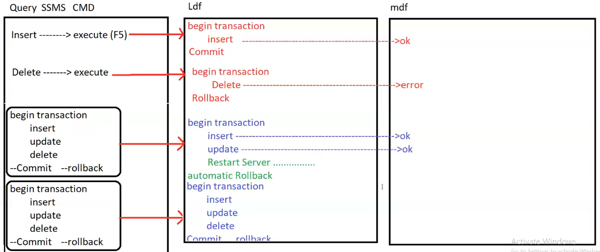
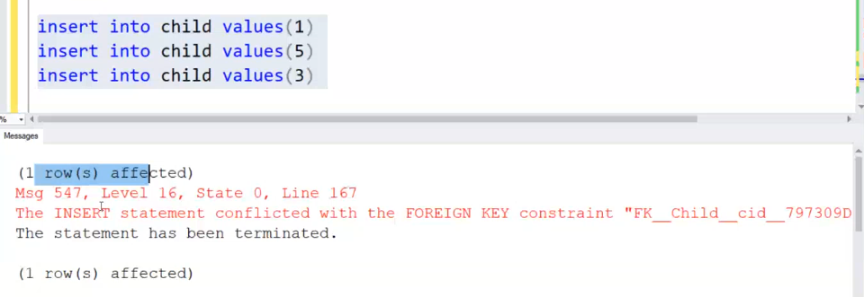
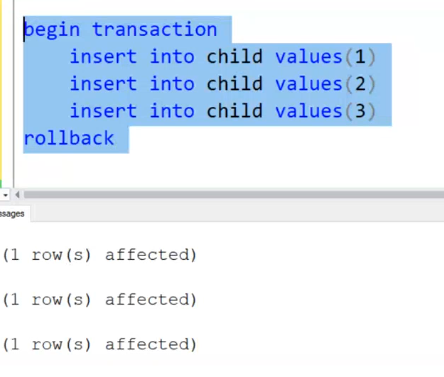
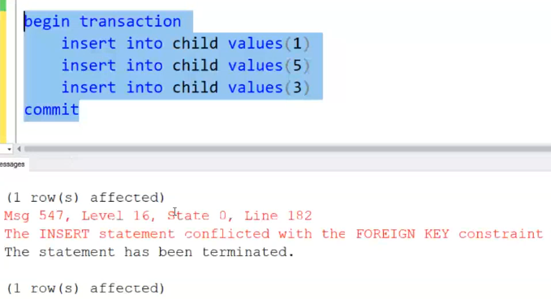
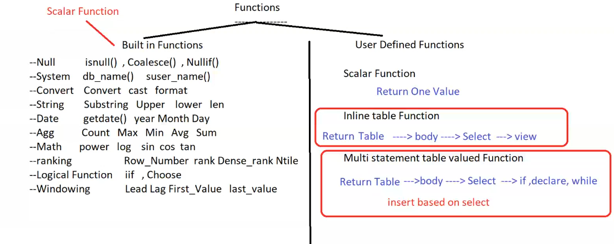

- [1. Variables](#1-variables)
- [2. Control Flow](#2-control-flow)
  - [2.1. if](#21-if)
  - [2.2. if exists if not exists](#22-if-exists-if-not-exists)
  - [2.3. try catch](#23-try-catch)
  - [2.4. while](#24-while)
  - [2.5. case](#25-case)
  - [2.6. iif](#26-iif)
  - [2.7. waitfor](#27-waitfor)
  - [2.8. choose](#28-choose)
- [3. Batch , Script , Transaction](#3-batch--script--transaction)
  - [3.1. batch](#31-batch)
  - [3.2. Script](#32-script)
  - [3.3. Transaction](#33-transaction)
- [4. Functions](#4-functions)
- [5. Window functions](#5-window-functions)
  - [5.1. Lead , Lag](#51-lead--lag)
  - [5.2. First\_value , Last\_value](#52-first_value--last_value)


# 1. Variables
- Variables are used to store data, like string, integer, float, etc.
    - local : local variables are defined inside a function and can only be used inside that (function , stored procedure , batch(Query selected to be executed)).
    - Global : global variables are defined outside a function and can be used anywhere in the program.

- **Declare a variable**
   
    ```sql
    Declare @x int -- declare a variable with null value of type int
    
    set @x=10
    select @x=100
    -- both are same

    declare @y int=20 -- declare a variable with value of 20 of type int
    
    -- to print the value of variable
    select @x
    ```
 
  - Variables can be used in select, insert, update, delete, etc.
     
      ```sql
      select @x=age from student where id=1 -- assign value from a query
      select @x 
      ```
  - Variables can be used in update statement to select value of that row without using another select statement.
      
      ```sql
      update student set fname ='omer', @x=age where id=1  
       -- update the value of x with age of student so can be used in select statement 
      select @x 
      ```

- **Global Variables**
  - can't declare global variables in SQL Server.
  - can't assign value to global variables in SQL Server.
  - just use global variables already initialized in SQL Server.
  - this variables are affected by the last statement executed
  - use `@@` before the variable name
    
    ```sql
    select @@servername -- print the server name
    
    select @@rowcount -- print the number of rows affected by the last statement
    
    select @@version -- print the version of SQL Server
    
    select @@error -- print the error number of the last statement
    
    select @@identity -- print the last identity value generated in the current session
    ```
  - can use it 
      ```sql
      select @x=@@rowcount -- assign the number of rows affected by the last statement to x
      ```

- **Usage**
    ```sql
    declare @y int =100
    select @y=age from student where id=990
    
    select @y
    -- if the id doesn't exist the value of y will be last value of y 100
    -- if the id exist the value of y will be the age of the student with id 990
    -- if no where clause and return array of values the value of y will be the last value of the array
    ```

    ```sql 
    declare @x int , @name varchar(20)
    select @x=age , st_name from student where id=1 -- can't use select to assign and view
    select @x=age , @name=st_name from student where id=1 
    select @x , @name
    ```

    ```sql
    declare @x int
    update student set st_name='omer' , @x=dept_id where id=1
    -- here i went to disk once to update the student name and get dept_id in @x to use it in select statement after that 
    select @x
    ```
  - Get multiple rows in a variable (table)

    ```sql
    declare @x table (id int , name varchar(20))

    insert into @x
    select id , st_name from student where dept_id=1

    select * from @x
    ```
  - if I pass table name as a variable 
    ```sql
    declare  @col varchar(20)='*' @tab varchar(20)='student'
    
    select @col from @tab -- error because the table name should be static
    

    select `select * from student` -- return the string not execute it

    exec(`select * from student`) -- execute the string
    
    -- so can use exec to execute the string with variable table name
    
    exec('select ' +@col+ ' from '+ @tab)       -- dynamic query once change the table name or column name
    ```
  - use global
    ```sql
    update student 
        set st_age+=1
    select @@rowcount -- print the number of rows affected by the last statement
    
    select @@error -- print the error number of the last statement -- 0 if no error
    
    insert into student values ('omer',20,1)
    select @@identity -- print the last identity value generated in the current session
    ```


# 2. Control Flow
## 2.1. if
- if condition is true execute the statement
    
    ```sql
    declare @x int

    update student
        set st_age+=1

    select @x=@@rowcount

    if @x>0
        select 'updated successfully'
    else
        select 'no rows updated'
    ```
- condition can be any expression that return boolean value (and , or , not , > , < )
- instead of curly braces use begin and end
```sql 
if @x>0
    begin
        select 'updated successfully'
        select @x
    end
else
    select 'no rows updated'
```

## 2.2. if exists if not exists
- it takes a query as a parameter and check if the result of the query is empty or not

```sql 
-- if the table student is already exist it will throw an error 
create table student
(
    id int primary key,
    name varchar(20),
    age int
)
```
so use `sys.tables` sys is built-in schema in SQL Server that contains all the system metadata
```sql
if exists(select * from sys.tables where name='student') 
    select 'table already exist' 
else
    create table student
    (
        id int primary key,
        name varchar(20),
        age int
    )
```
- if delete row from table and has relations with other tables , which can cause an error

    ```sql
    if not exists(select dept_id from student where dept_id=20)
        and not exists(select dept_id from instructor where dept_id=20) -- if not exist in student and instructor tables has relation with dept_id , you can delete it
            delete from department where id=20

    else 
        select 'can not delete this student'

    ```

## 2.3. try catch

- try catch block is used to handle errors in SQL Server
- if any error occurred in try block the catch block will be executed
- if i not know the expected error to handle it using if exists if not exists , i can use try catch block
```sql
begin try
    delete from department where id=20
end try

begin catch
    select 'can not delete this student'
    
    select error_message() -- print the error message
    select error_number() -- print the error number
    select error_line() -- print the line number of the error
end catch
```

## 2.4. while

```sql 
declare @x int =10
    while @x<=20
        begin

            set @x+=1
            if @x = 14
                continue

            if @x = 16
                break
                select @x
        end
-- will print numbers from 11 12 13 15
```
## 2.5. case 
## 2.6. iif 
## 2.7. waitfor
## 2.8. choose

# 3. Batch , Script , Transaction
## 3.1. batch
- a batch is a group of one or more Transact-SQL statements sent at the same time from an application to SQL Server for execution.
- statements have no effect on each other
- each statement is executed independently
- if one statement fails, the rest of the statements in the batch are still executed.
```
insert 
update -- if this statement fails  
delete

-- insert will be executed and delete will be executed
```

## 3.2. Script
- group of queries that can't run in the same batch
    
    ```
    create table 
    --with 
    drop table

    -----------------------also

    create rule
    --with
    sp_bindrule
    ```
- can't use two DDL statements in the same batch
- so must use two batches or use `go` keyword to separate between the two statements
    ```sql
    create table student
    (
        id int primary key,
        name varchar(20),
        age int
    )
    go
    drop table student
    ```

## 3.3. Transaction
- a transaction is a sequence of one or more SQL operations treated as a single unit of work.


- Every [`insert` , `update` , `delete`] is a transaction by implicit 
  - has commit when the transaction is successful
  - has rollback when the transaction is failed

- **Explicit transaction**
  - begin transaction
  - commit
  - rollback
    


```sql
create table parent (pid int primary key)
create table child (cid int foreign key references parent(pid))

insert into parent values (1)
insert into parent values (2)
insert into parent values (3)
insert into parent values (4)

```
- **If I execute as batch**

    

- **if i write rollback after successfully command**
    
    
    
    but no data will be inserted in the table because the rollback will be executed

- **If I write commit after failed command**

    

-------
- Explicit transaction is up to you to determine when to commit and when to rollback
    - when to commit -> when all the statements are executed successfully
    - when to rollback -> when any statement is failed

- so use try catch block to handle the error and rollback the transaction
___

- **if any error occurred in the try block the catch block will be executed and rollback the transaction**

    ```sql
    begin try
        begin transaction
            insert into child values (1)        -- 1 row affected
            insert into child values (5)        -- will throw an error but in try so go to catch
            insert into child values (3)
        commit
    end try
    begin catch
        rollback                                -- 0 row affected because it will rollback the transaction
    end catch
    ```
- if data is inserted successfully the transaction will be committed

    ```sql
    begin try
        begin transaction
            insert into child values (1)        -- 1 row affected
            insert into child values (2)        -- 1 row affected
            insert into child values (3)        -- 1 row affected
        commit                                                          -- will commit the transaction
    end try
    begin catch
        rollback                                
    end catch
    ```

# 4. Functions
- function is a block of code that can be called by name

- Two types of functions
    
    

    - Scalar function
        
        ```sql
        -- string getSName (int id)
        create function getSName (@id int)
        returns varchar(20)
            begin
                declare @name varchar(20)
                select @name=st_name from student where id=@id
                return @name
            end
        ```
        this will create function inside the database -> programmability -> functions -> scalar-valued functions
        ```sql
        select dbo.getSName(1) -- omer
        -- must use dbo. before the function name to differentiate between the user-defined function and the built-in function 
        ```
        - this is one of the cases which must write schema name before the function name
    
    - Inline Table-valued function  
        > function take dept_id and return names of instructors in this department  
        > based it's body is select without if or while or any control flow
        ```sql
        create function getInstructors (@dept_id int)
        returns table
            as
            return (select ins_name , salary*12 as totalsal  from instructor where dept_id=@dept_id)
                                                -- must specify the columns name 
        ```
        ```sql
        -- when calling the function , it return table so must use select to view the result
        select * from dbo.getInstructors(1)   -- this type of function can be used without dbo.
        ```


    - Multi statement Table valued function
        >Based on parameter passed return different table
        ```sql
        create function getStudents (@format varchar(20))
        returns @t table (id int , ename varchar(20))
            as
            begin
                if @format='first'
                    insert into @t
                    select st_id , st_fname from student
               
                else if @format='last'
                    insert into @t
                    select st_id , st_lname from student
               
                else if @format='full'
                    insert into @t
                    select st_id , st_lname + ' ' +st_lname from student
              
                else
                    insert into @t
                    select id , st_name from student where dept_id=1
                return
            end
        ```
        ```sql


# 5. Window functions
lead , lag , first_value , last_value
## 5.1. Lead , Lag
```sql
select sname , grade 
                    x=lag(grade) over (order by grade) ,  -- previous grade after ordering
                    y=lead(grade) over (order by grade) , -- next grade after ordering
from grades
```
- **if i need specific row**
  
    ```sql
    select sname , grade 
                        x=lag(grade) over (order by grade) ,  -- previous grade after ordering
                        y=lead(grade) over (order by grade) , -- next grade after ordering
    from grades
    where sname='omer'
    ```
    - result
        ```
        sname   grade   x       y
        omer    90      null    null            
        ```
        > lag and lead -> performed on the result of the query after ordering  
        > because omer is the first row in the result of the query after ordering so no previous or next row

    - must use subquery
        ```sql
        select * from (select sname , grade 
                            x=lag(grade) over (order by grade) 
                            y=lead(grade) over (order by grade)  from grades) as t
        where sname='omer'
        ```
    - result

        ```
        sname   grade   x       y
        omer    90      80    95            
        ```

                        
- Partition by
    ```sql
    select sname , grade , Cname
                        Prod_prev=lag(grade) over (partition by Cname order by grade) ,
                        Prod_next=lead(grade) over (partition by Cname order by grade) 
    from grades
    ```
    
    - partition by making groups of courses and then apply lag and lead on each group
    
    > <br> if i need to get the previous grade and next grade of the `same course` for each student
    result
    ```
    sname   grade   Cname   Prod_prev   Prod_next
    mona    75      DB      null        80
    ahmed   80      DB      75          85
    ali     85      DB      80          90
    omer    90      DB      85          null

    omer    85      ITI     null        90
    ali     90      ITI     85          95
    mona    95      ITI     90          100
    ahmed   100     ITI     95          null
    ```
## 5.2. First_value , Last_value
- first_value , last_value -> get the first or last value in the ordered result of the query
- and assign it to each row in the table
```sql
select sname , grade , Cname
                        Prod_first=first_value(grade) over (partition by Cname order by grade) ,
                        Prod_last=last_value(grade) over (partition by Cname order by grade)
from grades
```
- result
    ```
    sname   grade   Cname   Prod_first  Prod_last
    mona    75      DB      75          90
    ahmed   80      DB      75          90
    ali     85      DB      75          90
    omer    90      DB      75          90
    ```