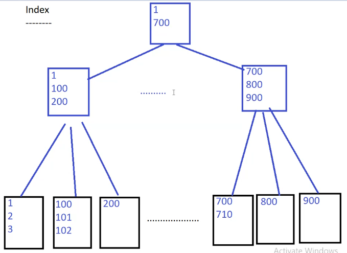
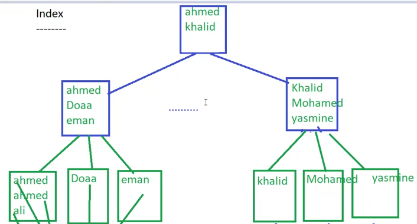
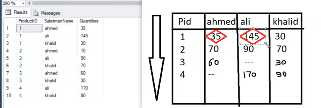
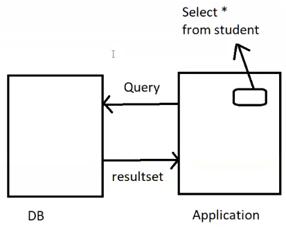
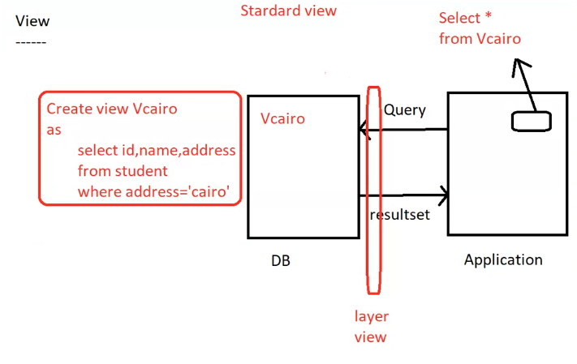
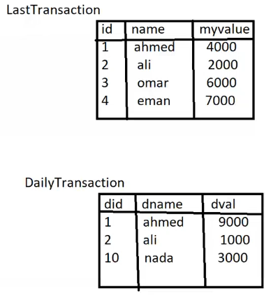
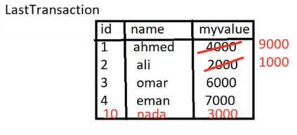

- [1. System Databases](#1-system-databases)
- [2. Indexing](#2-indexing)
  - [2.1. Clustered Index](#21-clustered-index)
  - [2.2. Non-Clustered Index](#22-non-clustered-index)
- [3. Pivot and Group](#3-pivot-and-group)
  - [3.1. rollup](#31-rollup)
  - [3.2. cube](#32-cube)
  - [3.3. grouping sets](#33-grouping-sets)
  - [3.4. pivot](#34-pivot)
  - [3.5. UnPivot](#35-unpivot)
- [4. Views](#4-views)
  - [4.1. Standard View](#41-standard-view)
    - [4.1.1. Creation of View](#411-creation-of-view)
    - [4.1.2. DML](#412-dml)
  - [4.2. Partitioned View](#42-partitioned-view)
  - [4.3. Indexed View](#43-indexed-view)
- [5. Merge](#5-merge)

# 1. System Databases
- `master` -> system database
  - contains all the information and configuration about the server (user , password , logins ,etc)

- `model` -> system database
   - used as a template for all databases created on the server
   - if i has user or table i want to be in all databases , i can put it in model database

- `msdb` -> system database
  - used by SQL Server Agent for scheduling alerts and jobs(making queries at specific time) 

- `tempdb` -> system database
  - used to store temporary data such as global or local temporary tables and temporary stored procedures
  - when you make a Subquery, it will store the result  in tempdb

> **Temporary Tables**
>- Local Table (session based tables)
>
>    ```sql
>    -- make # before table name to make it local
>
>    create table #table_name
>    (
>        column_name data_type
>    )
>    ```
>    - session based table : when you close the session, the table will be deleted
>    - if you make a table with the same name in another session, 
>    it will not conflict with the first table because it's session-based will give each table different id
>
>- Global Table (shared tables)
>
>    ```sql
>    -- make ## before table name to make it global
>
>    create table ##table_name
>    (
>        column_name data_type
>    )
>    ```    
>    - shared table : one create it and all sessions can access it
>       - it will be deleted when you close the last session that uses it
___
4-Types of tables
- physical table
- local temp table
- global temp table
- variable table


# 2. Indexing
- index is a pointer to a specific location in the database

## 2.1. Clustered Index
- PK is a type of index to make data sorted (clustered index)
>
- **Clustered Index -> make tree of data sorted by PK**
 
    

    always is 3 level tree
    ```sql 
    select * from table where PK = 804

    -- 1. go to root
    -- 2. go to branch  
    -- 3. go to specific page
    -- inside page search for data (page scan)
    ```
    this convert table scan to page scan (instead of scan all table, scan only page)

- **PK --constraint --> Clustered Index**
- if table has no PK, it's up to you to make clustered index

## 2.2. Non-Clustered Index

if searching by non-PK, it will search by table scan (scan all table)

`select * from table where name = 'omer'`

> so

- **Non-Clustered Index** -> make tree of data sorted by non-PK

  - non-clustered index is a separate tree from clustered index
  - make by yourself
  - Then will make a tree of data sorted by non-PK (name)
  - and will make a pointer to the specific location in the clustered index

    
    
    note last level is a pointer to the clustered index
    `not the actual data`

    ```sql
    select * from table where name = 'omer'

    -- 1. go to root
    -- 2. go to branch
    -- 3. go to leaf to search for omer (page scan) (this will return pointer to clustered index)
    -- 4. go to clustered index to get the actual data
    ```

- making non-clustered index will make the search faster
  - but is slower than clustered index
  - but it will make the insert slower because it will make a tree of data sorted by non-PK so it will take time to insert data in the correct place
  - so it's a trade-off between search and insert
  - so you should use it wisely
  - you can make multiple non-clustered index
  - making non-clustered index `on all columns is not a good idea` because it will make the insert slower also it will take more space

- Making non-clustered index
    ```sql
    create nonclustered index index_name on table_name(column_name)
    ```

- **unique --constraint --> non-clustered index**
    ```sql
    create unique index index_name on table_name(column_name)
    -- will make constraint unique and non-clustered index
    ```

___
**Analysis Tools**
  - **sql server profiler**

    - after make trace file during the day you can analyze it
  
  - **sql server tuning advisor**
  
    - you can give it a trace file , `start analysis` and it will give you the best index

# 3. Pivot and Group
## 3.1. rollup
 - make a summary of data . it will make a summary of data (with the same function i make in aggregate) in the last row
  ```sql
  select ProductID, sum(Quantity) as Quantity
  from Sales
  group by ProductID 
  -- result 
  -- ProductID  Quantity
  -- 1          10
  -- 2          20
  -- 3          30
  ```
  ```sql
  select ProductID, sum(Quantity) as Quantity
  from Sales
  group by rollup(ProductID)
  -- result
  -- ProductID  Quantity
  -- 1          10
  -- 2          20
  -- 3          30
  -- NULL       60    -- summary of all data which is sum of Quantity of all rows
  ```
```sql
select ProductID, SalesmanName,sum(Quantity) as Quantity
from Sales
group by ProductID, SalesmanName
-- result
-- ProductID  SalesmanName  Quantity
-- 1          omer          5
-- 1          ali           5
-- 2          omer          15
-- 2          ali           5
-- 3          omer          30
```
```sql
select ProductID, SalesmanName,sum(Quantity) as Quantity
from Sales
group by rollup(ProductID, SalesmanName)
-- result
-- ProductID  SalesmanName  Quantity
-- 1          omer          5
-- 1          ali           5
-- 1          NULL          10  -- summary of ProductID 1
-- 2          omer          15
-- 2          ali           5
-- 2          NULL          20  -- summary of ProductID 2
-- 3          omer          30
-- 3          NULL          30  -- summary of ProductID 3
-- NULL       NULL          60  -- summary of all data
```
- total Quantity for
  - each product + each salesman   `group by ProductID, SalesmanName`
  - each product  
  - all data


## 3.2. cube
- make a summary of data in all possible ways
  
  ```sql
  select ProductID, SalesmanName,sum(Quantity) as Quantity
  from Sales
  group by cube(ProductID, SalesmanName)
  -- result
  -- ProductID  SalesmanName  Quantity
  -- 1          omer          5
  -- 1          ali           5
  -- 1          NULL          10  -- summary of ProductID 1
  -- 2          omer          15
  -- 2          ali           5
  -- 2          NULL          20  -- summary of ProductID 2
  -- 3          omer          30
  -- 3          NULL          30  -- summary of ProductID 3

  -- NULL       omer          50  -- summary of SalesmanName omer
  -- NULL       ali           10  -- summary of SalesmanName ali
  
  -- NULL       NULL          60  -- summary of all data
  ```
  - Total Quantity for
    - each product + each salesman  `group by ProductID, SalesmanName`
    - each product
    - each salesman
    - all data
  
## 3.3. grouping sets
- make a summary of data without making the group by summary
  
  ```sql
  select ProductID, SalesmanName,sum(Quantity) as Quantity
  from Sales
  group by grouping sets(ProductID, SalesmanName)
  order by SalesmanName
  -- result
  -- ProductID  SalesmanName  Quantity
  -- 1          null          10  -- summary of ProductID 1
  -- 2          null          20  -- summary of ProductID 2
  -- 3          null          30  -- summary of ProductID 3
  
  -- null       omer          50  -- summary of SalesmanName omer
  -- null       ali           10  -- summary of SalesmanName ali
  
  -- null       null          60  -- summary of all data
  ```
  - Total Quantity for
    - each product
    - each salesman
    - all data
  - without making the group by summary


## 3.4. pivot
- making a table from rows to columns

- Syntax
  
  ```sql
  SELECT (ColumnNames) 
  FROM (TableName) 
  PIVOT
  ( 
    AggregateFunction(ColumnToBeAggregated)
    FOR PivotColumn IN (PivotColumnValues)
  ) AS (Alias) //Alias is a temporary name for a table
  ```

```sql
select * from sales
Pivot (
          sum(Quantity) 
          for SalesmanName in ([Ahmed],[Ali],[Khalid])
      ) as p

-- will take the SalesmanName and make it columns
-- and the productID as rows 
-- and make the Quantity as values

-- result
-- ProductID  Ahmed  Ali  Khalid
-- 1          5      5    NULL
-- 2          15     5    NULL
-- 3          30     NULL NULL

```
## 3.5. UnPivot
- making a table from columns to rows
- do the opposite of pivot 
- Written as 
 
  ```sql
  SELECT (ColumnNames) 
  FROM (TableName) 
  UNPIVOT
  ( 
    AggregateFunction(ColumnToBeAggregated)
    FOR PivotColumn IN (PivotColumnValues)
  ) AS (Alias)
  ```

```sql
SELECT CourseName, CourseCategory, Price 
FROM 
(
    SELECT CourseName, PROGRAMMING, INTERVIEWPREPARATION FROM geeksforgeeks 
    PIVOT 
    ( 
        SUM(Price) 
        FOR CourseCategory IN (PROGRAMMING, INTERVIEWPREPARATION) 
    ) AS PivotTable
) P 

UNPIVOT 
( 
    Price 
    FOR CourseCategory IN (PROGRAMMING, INTERVIEWPREPARATION)
) AS UnpivotTable

```

# 4. Views 
> **View** is a select statement that is stored in the database
- Through the APP
  - queries is transferred to the server and the server will make the query and return the result
    

  - This can cause security issues because the hacker can use the meta data to change the query
    `drop table student` because he knows the table name

- Through the View
  - the view is a virtual table that contains the result of a query

  

> - increase Security by hiding the DB Objects
> - Simplify complex queries 
> <br><br>
> - Has no Parameters
> - Has no DML (insert, update, delete) inside its body
> <br><br>
> - Standard View can be considered as virtual table
> - Indexed View can increase performance


- **Types of Views**
  - **Standard** 
  - **Partitioned**
  - **Indexed**
    - can increase performance
    - can has data 

## 4.1. Standard View
- can be considered as a virtual table
  ```sql
  create view Vstudents
  as
    select * from students
  ```
  - so now i can make a query on Vstudents as if it's a table
  - so I hide the metadata of the table from the user
  ```sql
  select * from Vstudents
  select st_name from Vstudents
  ```
### 4.1.1. Creation of View
- also can make alias for the columns
  ```sql
  create view Vstudents(sid,sname,sadd)
  as
    select st_id,st_name,st_address from students
  ```
  ```sql
  select sid,sname from Vstudents
  -- although the column name in the table is st_id and st_name
  ```

- can make this view to specific schema so only the user with this schema can access it
  ```sql
  create view HR.Vstudents
  as
    select * from students
  --
  alter schema HR transfer dbo.Vstudents
  ```
  ```sql
  select * from HR.Vstudents
  ```

- Simplify complex queries
  ```sql 
  select st_id , st_fname , d.dept_id , dept_name 
  from students s inner join departments d
  on s.dept_id = d.dept_id
  ```
  ```sql
  create view Vjoin(sid,sname,did,dname)
  as 
    select st_id , st_fname , d.dept_id , dept_name
    from students s inner join departments d
    on s.dept_id = d.dept_id
  ```

- can make join between view and table
  ```sql
  select sname , dname ,grade
  from Vjoin v inner join grades g
  on v.sid = g.sid
  ```
  - also can make that into new view
  ```sql
  create view VstudGrad(sname,dname,grade)
  as
    select sname , dname ,grade
    from Vjoin v inner join grades g
    on v.sid = g.sid
  ```

- But If the hacker is smart, he can know the query of the view
  ```sql
  sp_helptext VstudGrad

  -- this will show the query of the view
  -- result
  -- create view VstudGrad(sname,dname,grade)
  -- as
  --   select sname , dname ,grade
  --   from Vjoin v inner join grades g
  --   on v.sid = g.sid
  ```
  - so we can make the view with encryption
  ```sql
  create view with encryption VstudGrad(sname,dname,grade)
  as
    select sname , dname ,grade
    from Vjoin v inner join grades g
    on v.sid = g.sid
  ```
  so when get the code of the view
  ```sql
  sp_helptext VstudGrad
  
  -- result
  -- The Text for object 'VstudGrad' is encrypted

  -- also when try to make script for DB it will refuse to make the script for encrypted view
  ```

### 4.1.2. DML
- inside view can't make DML (insert, update, delete)
- But can treat view as table and make DML with it
  
  ```sql
  insert into vcairo 
  values(111,'ali','cairo')
  ```
  - so this will insert data in the table that the view is based on
- `but must has some conditions`
1. View get data from one table
   
   - also other columns not in View must be one of (identity , allow null , default value , derived column)

2. View get data from multiple tables
   - can't make delete
   - can insert or update if i insert or update in one table only
    
    ```sql
    insert int Vjoin
    values(111,'ali',1,'IT') -- error this will insert in 2 tables
    ```
    ```sql
    insert into Vjoin
    values(111,'ali') -- this will insert in students table only
    ```
>**Note**
- if I run this query
  
  ```sql
  insert into Vcairo
  values(111,'ali','alex')  -- this will insert in table , although the view is based on cairo
  ```
  - must have check in the view to make sure that the data is inserted in the correct table
 
    ```sql
    create view Vcairo
    as
      select * from students
      where city = 'cairo'
      with check option     
    -- this will make sure that data inserted is correct according to where written in the view
    ```


## 4.2. Partitioned View
- used to divide a large table into smaller, more manageable pieces
 
    - each piece is called a partition
    - can get data from multiple Databases
    
      ```sql
      Create view view_name
      as 
        select * from Mans_server.iti.dbo.Students
        union all
        select * from Sohag_Server.iti2.dbo.Students
      ```
    - can get data from multiple tables
      ```sql
      Create view view_name
      as 
        select * from Students
        union all
        select * from Students2
      ```
## 4.3. Indexed View

```sql
create view vdata
with schema binding
as 
  select ins_name , salary
  from dbo.instructors
  where dept_id = 10
```
- this will make a view with data

- so if I change the table 
  
  ```sql
  alter table instructors alter column ins_degree varchar(50) -- this not in the view so it will success

  alter table instructors drop column ins_name varchar(100) -- this in the view so it will fail
  -- because the view depends on this column
  ```

> **Note on the fly**
>- must write schema name in 
>   - using index view
>   - using scalar function
>   - if in database and use table from other database

# 5. Merge
- if I have 2 tables 

  
  
  by the end of the day , I want to take the values from daily to update the last table
  
  

  this will update 2 rows and insert 1 row which not in LastTransaction

>**This is done by `Merge`**
- Merge two table into one table `will compare tables and see what is matched and what is not matched and do the action`

```sql
Merge LastTransaction as t
using DailyTransaction as s
on t.id = s.id

when matched then
  update set t.myValue = s.myValue  -- 1,2 row will update the value 

when not matched then
  insert(id,name ,myValue)
  values(s.did,s.dname,s.myValue)  -- id 10 will be inserted
```

2. Source can be subquery

    ```sql
    Merge LastTransaction as t
    using (select * from DailyTransaction where id > 5) as s
    on t.id = s.id

    when matched then
      update set t.myValue = s.myValue  -- 1,2 row will update the value 

    when not matched then
      insert(id,name ,myValue)
      values(s.did,s.dname,s.myValue)  -- id 10 will be inserted
    ```


3. Can also add conditions on matched

    ```sql
    Merge LastTransaction as t
    using (select * from DailyTransaction where id > 5) as s
    on t.id = s.id

    when matched and s.myValue > t.myValue then   
      update set t.myValue = s.myValue  -- 1 row will update the value 
      -- only if the value in DailyTransaction is greater than the value in LastTransaction
      -- so i can add conditions on matched according to business logic

    when not matched then
      insert(id,name ,myValue)
      values(s.did,s.dname,s.myValue)  -- id 10 will be inserted
    ```

4. Not Matched by Source

    ```sql
    Merge LastTransaction as t
    using (select * from DailyTransaction where id > 5) as s
    on t.id = s.id

    when matched and s.myValue > t.myValue then   
      update set t.myValue = s.myValue  -- 1 row will update the value 

    when not matched by target then
      insert  -- not in target but in source -- 10
      values(s.did,s.dname,s.myValue)

    when not matched by source then
      delete  -- not in source but in target -- 3,4
    ```
    > - not marched by target -> exists in source but not in target
    >   - this the default
    > - not marched by source -> exists in target but not in source