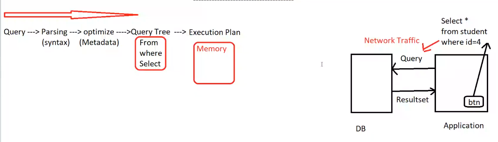

- [1. Stored Procedure](#1-stored-procedure)
  - [1.1. Creation](#11-creation)
  - [1.2. Parameters](#12-parameters)
- [2. Triggers](#2-triggers)
  - [2.1. on table](#21-on-table)
  - [2.2. auditing](#22-auditing)
- [3. XML](#3-xml)
  - [3.1. Raw](#31-raw)
  - [3.2. auto](#32-auto)
  - [3.3. path](#33-path)
  - [3.4. Get table from XML](#34-get-table-from-xml)

# 1. Stored Procedure

- once click the button again , it will make all Execution plan (this affect the performance of the query)
- also the network traffic will be increased because the query is just stream of characters

> so **Stored Procedure** is better than Ad-hoc query

```sql
create procedure GetStudents @id int
as 
    select * from Students where id = @id
```
so instead of sending the query to the server, we can send the name of the stored procedure and the parameter value
  - stored procedure can be any query, it can be select, insert, update, delete, or any other query
___
**Better for** 
- **Security wise** 
  - just send the name of the stored procedure (hiding db objects + prevent SQL injection)

- **Performance wise**
  - better for Network traffic
  - Query Tree is already created and stored in the server
  
    > - in the first run , it will parsing -> optimizing -> Query Tree `will saved`-> Execution Plan
    > - then after first run, the server will just execute the Query Tree without parsing and optimizing 

- **Simple to use**
  - just send the name of the stored procedure and the parameter value

- **Error Handling**
  - can handle the errors in the stored procedure

- **Hiding Business Logic**
  - can hide the business logic in the stored procedure

___
- **Business wise**
  - we can use views , functions to implement the business logic
  - then use these views and functions in the stored procedure

___
- Can use it for DML operations (insert, update, delete)

    ```sql
    create procedure InsertStudent @id int, @name varchar(50)
    as 
        insert into Students(id, name) values(@id, @name)
    ```

    instead of give errors in the application, we can handle the errors in the stored procedure
    ```sql
    create procedure InsertStudent @id int, @name varchar(50)
    AS
        IF NOT EXISTS (SELECT * FROM Students WHERE id = @id)
            insert into Students(id, name) values(@id, @name)
        ELSE
            Select 'Student already exists'
    ```
___
**Types**
  - built in SP
    > sp_bindrule , sp_unbindrule , sp_helpconstraint , sp_rename , sp_addtype
    > - sp_helptext : to show the text of the stored procedure or the function or the view

  - user defined SP
  - Trigger : special type of SP


## 1.1. Creation
- **Syntax**
    ```sql
    create procedure getSt 
    as
        select * from Students

    -- calling
    getSt
    -- or
    exec getSt
    ```
___
- **With Parameters**
   
    ```sql
    create procedure getStbyAddress @address varchar(50)
    as
        select * from Students where address = @address

    -- calling
    getStbyAddress 'Cairo'              -- first run save the query tree
    getStbyAddress @address = 'alex'    -- use the saved query tree
    ```
___
- **DML**
    ```sql
    delete from Students where id = 1

    insert into Students(id, name) values(1, 'Ahmed')

    --both can give errors, so we can use stored procedure and make the error handling in it
    ```

    - **Error Handling**  
    ```sql
    create procedure InsertStudent @id int, @name varchar(50)\
    as
        begin try
            insert into Students(id, name) values(@id, @name)
        end try
        begin catch
            select 'Error'
        end catch
    ```
___

- **insert based on execution**

    ```sql
    create procedure GetStbyAge @age1 int, @age2 int
    as
        select * 
        from Students 
        where age between @age1 and @age2
    ```
    use it in the query
    ```sql
    declare @t table(id int, name varchar(50))

    insert into @t
    exec GetStbyAge 20, 30
    ```
    - here must write the stored with `execute` keyword
    - the result of the stored procedure must be the same as the table structure
___
## 1.2. Parameters
- **Calling SP with Parameters**
```sql
create procedure sumData @a int, @b int
as
    select @a + @b

sumData 10, 20  -- calling parameter by position
sumData @b = 20, @a = 10  -- calling parameter by name
```

- **Default value for parameters**
```sql
create procedure sumData @a int = 10, @b int = 20
as
    select @a + @b

sumData  -- will use the default values 10, 20
sumData 30  -- will use the default value for @b = 20
```
___
- **return value from SP**
   
    ```sql
    create proc getData @id int
    as
        declare @age int
            select @age = age from Students where id = @id
        return @age
    ```
    use it in the query
    ```sql
    declare @age int
    set @age = execute getData 1

    select @age
    ```
the return of stored is `int` type only , also must one return statement in the stored procedure
- So used the return value as status code of the stored procedure

___

- **Output parameter**
    
    ```sql
    create procedure GetData @id int, @age int output , @name varchar(50) output
    as
        select @age = st_age , @name = st_name
        from Students
        where id = @id
    ```
    use it in the query
    ```sql
    declare @x int , @y varchar(50)
    exec GetData 1, @x output , @y output

    select @x , @y
    ```
    - here must write the stored with `execute` keyword

___ 
- **input-output parameter**
        
    ```sql
    create procedure GetData @age int output , @name varchar(50) output
    as
        select @age = st_age , @name = st_name
        from Students
        where id = @age
    ```
    use it in the query
    ```sql
    declare @x int =6 , @y varchar(50)
    exec GetData @x output , @y output

    select @x , @y
    ```
    can use the same variable for input and output

___
- **Benefits of SP**
  - can use query or DML operations
  - security wise to hide the db objects
  - performance wise to reduce the network traffic
  - performance wise to engine (save the query tree) 
  - flexibility to use the parameters (input, output, input-output)
  - hiding the business logic
  - error handling

<br>

`function can used as some to do specific task and return value`

`view also can be used as some of query`
> then use these functions and views in the stored procedure

# 2. Triggers
`special type of stored procedure can't call it or send parameters to it`
- Implicit code that listen to action occurs in the server
- two types of triggers
  - `After` : after the action occurs
  - `Instead of` : instead of the action occurs
<br>


## 2.1. on table   

> listen to insert, update, delete on the table
- **After**
   
    ```sql
    create trigger tr1
    on Students
    after insert
    as
        select 'Welcome to ITI'
    ```
  - **Calling**
      
      ```sql
      insert into Students(id, name) values(1, 'Ahmed')
      ```
      ```
      Welcome to ITI
      ```

- **instead of**

    ```sql
    create trigger tr2
    on department
    instead of insert , update , delete
    as
        select 'Read only'
    ```
    - **Calling**
        
        ```sql
        insert into department(id, name) values(1, 'IT')
        ```
        ```
        Read only
        ```

- **Update function**
    ```sql
    create trigger tr3
    on Students
    after update
    as 
        if update(st_name)
            select 'Name is updated'
    ```
    this is specific to the column `st_name` only
    ```sql
    update Students set id=10 where id = 1  -- fired but not affected

    update Students set st_name='Ali' where id = 1  -- fired and affected so will show the message
    ```
- **Disable Trigger**
    ```sql
    alter table Students disable trigger tr3

    alter table Students enable trigger tr3
    ```
    or can `drop` the trigger
    ```sql
    drop trigger tr3
    ```


<br>

- **Triggers**
  - triggers is fired after the insert operation is done if affected or not `but if error not fired`
  - triggers take schema of the table
  - update is a function so can use it in the body of the trigger
  - if create trigger to make table read only, then can't insert, update, delete on the table , can `drop` the trigger to make the table writable again or `disable` the trigger

___

## 2.2. auditing 
- **With Every Fire for Trigger**
  - it creates two tables `inserted` and `deleted` tables in the two case of `After` and `Instead of` triggers
  - these tables are temporary tables
  - structure of tables is the same as the table that the trigger is created on
  - `inserted` table contains the new data that will be inserted or new for updated
  - `deleted` table contains the old data that will be old which will updated or deleted
    
    ```sql
    create trigger tr4
    on course
    after update 
    as
        select * from inserted
        select * from deleted
    ```
    ```sql
    update course set name = 'Cloud' , duration = 45
    where id = 1
    -- this will show the inserted and deleted tables
    
    -- results
    -- inserted
    -- id  name  duration
    -- 1   Cloud 45
    
    -- deleted
    -- id  name  duration
    -- 1   IT    40
    ```

- If I want to prevent delete on Friday
    ```sql
    create trigger t6
    on course
    after delete
    as
        if format(getdate(), 'dddd') = 'Friday'
            begin
                --rollback
                insert into course
                select * from deleted
            end
    ```

    - `rollback` will cancel the delete operation
    - `insert into course select * from deleted` will insert the deleted data again to the table
    
    <br>
    
    ```sql
    create trigger t7
    on course
    instead of delete
    as 
        if format(getdate(), 'dddd') != 'Friday'
            begin
                delete from course
                where id in (select id from deleted)
            end
    ```
___
- Make history for table
  - prevent the user from updating topic table and make history if update the topic_id

    ```sql
    create table history
    (
        _user varchar(50),
        _date datetime,
        _old int,
        _new int
    )

    create trigger t8
    on topic
    instead of update
    as
        if update(top_id)
            begin
                declare @old int , @new int
                select @old = id from deleted
                select @new = id from inserted

                insert into history
                values(user_name(), getdate(), @old, @new)
            end
    ```
___
- **Output keyword**
  - act like runtime trigger 
   
    ```sql
    delete from course 
    output deleted.*        -- to show the deleted data
    where id = 1
    ```

    ```sql
    update course
        set name = 'Cloud'
    output deleted.* , inserted.*  -- to show the deleted and inserted data
    where id = 1
    ```

# 3. XML
- independent language between different database systems 
- can be used to transfer data between different database systems
> XML is a markup language that defines a set of rules for encoding documents in a format that is both human-readable and machine-readable

<br>

- **XML in SQL server**
    
    | For XML          | Open XML |
    |:----------------: | :-: |
    |    write          | read |
    |    For XML raw      | Open XML |
    |    For XML auto     | Open XML |
    |    For XML explicit | Open XML |
    |    For XML path | Open XML |

## 3.1. Raw
- row tag is the default tag for the `for xml` statement and the column name is the attribute of the tag
    ```sql
    select * from Students 
    for xml raw
    ```
    ```xml
    <row id="1" name="Ahmed" age="20" address="Cairo" />
    <row id="2" name="Ali" age="25" address="Alex" />
    ```
- can change the name of the tag
    ```sql
    select * from Students
    for xml raw('student')
    -- change the name of the tag
    ```
    ```xml
    <student id="1" name="Ahmed" age="20" address="Cairo" />
    <student id="2" name="Ali" age="25" address="Alex" />
    ```

- change the attributes as elements
    ```sql
    select * from Students
    for xml raw('student'), elements
    ```
    ```xml
    <student>
        <id>1</id>
        <name>Ahmed</name>
        <age>20</age>
        <address>Cairo</address>
    </student>
    <student>
        <id>2</id>
        <name>Ali</name>
        <age>25</age>
        <address>Alex</address>
    </student>
    ```

- make root tag
    ```sql
    select * from Students
    for xml raw('student'), elements, root('students')
    ```
    ```xml
    <students>
        <student>
            <id>1</id>
            <name>Ahmed</name>
            <age>20</age>
            <address>Cairo</address>
        </student>
        <student>
            <id>2</id>
            <name>Ali</name>
            <age>25</age>
            <address>Alex</address>
        </student>
    </students>
    ```

- show null values in the xml
    ```sql
    select * from Students
    for xml raw('student'), elements xsinil , root('students')
    ```
    ```xml
    <students>
        <student>
            <id>1</id>
            <name>Ahmed</name>
            <age>20</age>
            <address>Cairo</address>
        </student>
        <student>
            <id>2</id>
            <name>Ali</name>
            <age>25</age>
            <address>Alex</address>
        </student>
        <student>
            <id>3</id>
            <name>NULL</name>
            <age>NULL</age>
            <address>NULL</address>
        </student>
    </students>
    ```

- can make order by or group by on the table and the result is correct
    ```sql
    select *,count(*) from Students
    group by address
    for xml raw('student'), elements xsinil , root('students')
    ```
    ```xml
    <students>
        <student>
            <address>alex</address> 2 </student>
        <student>
            <address>cairo</address> 1 </student>
    </students>
    ```

- **Join Problem** 
    ```sql
    select * from Students
    join department
    on Students.dep_id = department.id
    for xml raw('student'), elements xsinil , root('students')
    ```
    ```xml
    <students>
        <student>
            <id>1</id>
            <name>Ahmed</name>
            <age>20</age>
            <address>Cairo</address>
            <dep_id>1</dep_id>
            <id>1</id>
            <name>IT</name>
        </student>
        <student>
            <id>2</id>
            <name>Ali</name>
            <age>25</age>
            <address>Alex</address>
            <dep_id>2</dep_id>
            <id>2</id>
            <name>CS</name>
        </student>
    </students>
    ```
    - he treat each row as a separate row in the xml
    - but i need to make the department as a parent tag for the student so when list the department, list the students in it
    - like the following
    ```xml
    <departments>
        <department>
            <id>1</id>
            <name>IT</name>
            <students>
                <student>
                    <id>1</id>
                    <name>Ahmed</name>
                    <age>20</age>
                    <address>Cairo</address>
                </student>
            </students>
        </department>
        <department>
            <id>2</id>
            <name>CS</name>
            <students>
                <student>
                    <id>2</id>
                    <name>Ali</name>
                    <age>25</age>
                    <address>Alex</address>
                </student>
            </students>
        </department>

## 3.2. auto
```sql
select * from Students
join department
on Students.dep_id = department.id
for xml auto, elements xsinil , root('students')
```
```xml
<students>
    <department id="1" name="IT">
        <Students id="1" name="Ahmed" age="20" address="Cairo" />
        <Students id="3" name="mona" age="20" address="Cairo" />
    </department>
    <department id="2" name="CS">
        <Students id="2" name="Ali" age="25" address="Alex" />
    </department> 
</students>
```
- the department is the parent tag for the students
- but the department is repeated in the xml
- the student is the child tag for the department
 
## 3.3. path
- can mix between attributes and elements
- change the structure of the xml
>- xPath : how to navigate in the xml
>     - @ : attribute
>     - "" : tag name
>     - / : child
>     - // : all children
>     - .. : parent

```sql
select st_id "@studentID",
        st_fname "studentName/FirstName",
        st_lname "studentName/LastName",
        st_address "Address",
from Students
for xml path('student'), root('students')
```
```xml
<students>

    <student studentID="1">

        <studentName>
            <FirstName>Ahmed</FirstName>
            <LastName>Ali</LastName>
        </studentName>

        <Address>Cairo</Address>

    </student>

    <student studentID="2">
        <studentName>
            <FirstName>Ali</FirstName>
            <LastName>Ali</LastName>
        </studentName>
        <Address>Alex</Address>
    </student>
</students>
```

## 3.4. Get table from XML
1. declare variable to store the xml
  
    ```sql
    declare @x xml =
            '<students>
                <student studentID="1">
                    <studentName>
                        <FirstName>Ahmed</FirstName>
                        <LastName>Ali</LastName>
                    </studentName>
                    <Address>Cairo</Address>
                </student>
                <student studentID="2">
                    <studentName>
                        <FirstName>Ali</FirstName>
                        <LastName>Ali</LastName>
                    </studentName>
                    <Address>Alex</Address>
                </student>
            </students>'
    ```
2. declare handler document
    ```sql
    declare @hdoc int
    ```

3. create memory tree
    ```sql
    exec sp_xml_preparedocument @hdoc output, @x
    ```
    make tree from xml to check if the xml is correct or not , and the output is the handle of the tree

4. process document 'read tree from memory' 
    - OpenXML creates result set from document
    ```sql
    select * 
    from openxml (@hdoc, '//student')   -- xPath to navigate in the xml to all tags with name student
    with (st_id int '@studentID',
            st_fname varchar(50) 'studentName/FirstName',
            st_lname varchar(50) 'studentName/LastName',
            st_address varchar(50) 'Address')
    ```

5. remove the memory tree
    ```sql
    exec sp_xml_removedocument @hdoc
    ```
    remove the tree from the memory

> all this must run in one batch
- result
    ```
    st_id    st_fname    st_lname    st_address
    1        Ahmed       Ali         Cairo
    2        Ali         Ali         Alex
    ```
