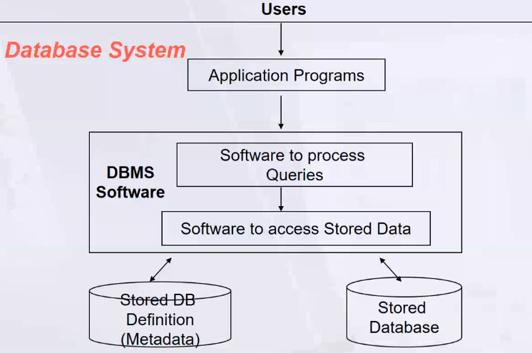
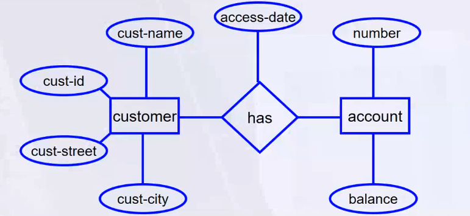
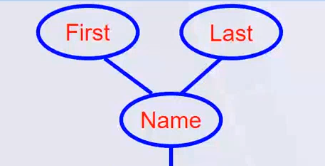
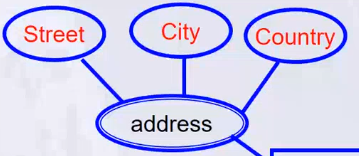
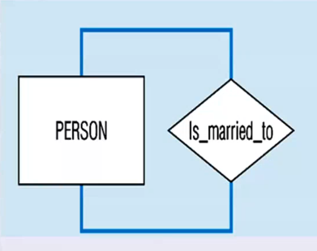
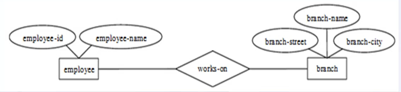
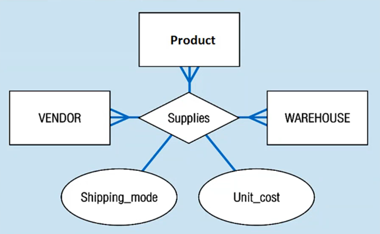
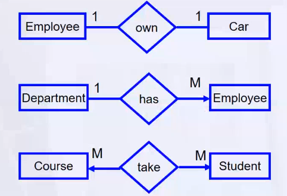
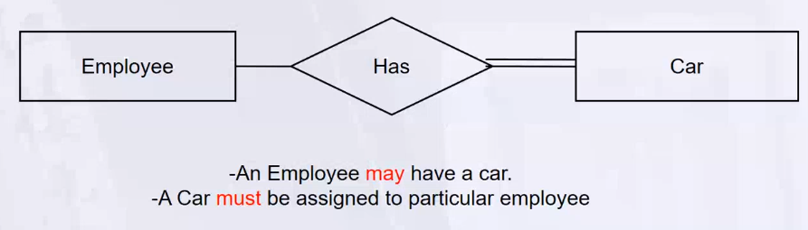
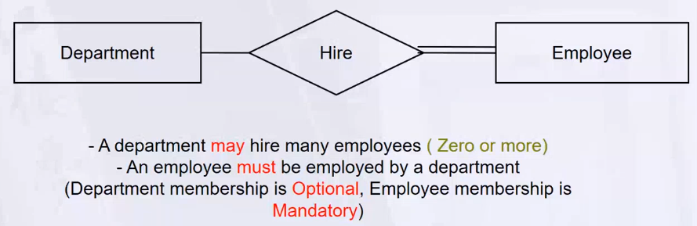

- [1. DB Life Cycle](#1-db-life-cycle)
- [2. File Based System](#2-file-based-system)
  - [2.1. Advantage:](#21-advantage)
  - [2.2. Disadvantages:](#22-disadvantages)
- [3. DB System](#3-db-system)
- [4. ERD](#4-erd)
  - [4.1. Strong Entity vs Weak Entity](#41-strong-entity-vs-weak-entity)
  - [4.2. Types of Attributes](#42-types-of-attributes)
  - [4.3. Types of Relationships](#43-types-of-relationships)
  - [4.4. Keys](#44-keys)

___
## 1. DB Life Cycle
1. `Requirement Analysis` 
    > - What is the need of DB , Scope of DB
    > - **System Analyst** write the requirement in Requirement Document

2. `Design` 
    > - **DB Designer**
    > - Design the DB Entity Relationship Diagram (ERD)  
   Entity can't say table, it is a real world object which want to store data about it.  
    > - Same Req Doc can result in many **ERD** , so we must return to analyst to finalize the ERD

3. `DB Mapping` 
    > - Mapping the ERD to DB Schema -> **DB Designer**
    > - Set of rules to convert ERD to DB Schema  
    > - Actual DB Schema   
    > - Tables

4. `DB Implementation` 
    > - Physical DB Creation -> **DB Developer**
    > - using Tool RDBMS (Relational DB Management System)
    > - SQL Server, Oracle, MySQL, Postgres, SQLite
    > - SQL : Structured Query Language
    > once installed the RDBMS, we have DB Server running on our machine (Centralized DB)

5. `Application Development`
    > - **DB Developer** will write the SQL Queries to interact with DB
    > - **Application Developer** will write the code to interact with DB `DB User`

6. `Client` 
    > -> End User -> Browser -> URL -> Web Server -> Application Server -> DB Server

## 2. File Based System
- **Definition**: A system where data is stored in independent files without centralized control. Examples include `Student.txt`, `Employee.txt`, and `Course.txt`.
- **File Types**:
  - **Delimited Files**: Data fields are separated by delimiters like commas, tabs, or pipes.
    - Example: 
      ```
      1,Ahmed,22
      2,Ali,24
      3,John,25
      ```
  - **Fixed Width Files**: Each field has a fixed width (e.g., 2 or 4 bytes).
    - Example: 
      ```
      1    Ahmed    22
      2    Ali      24
      3    John     25
      ```

### 2.1. Advantage:
- **Cost-Effective**: No need for external tools to manage files.

### 2.2. Disadvantages:
1. **Data Management Challenges**:
   - **Difficult to Search**: Searching for data is not efficient.
   - **Low Performance**: File-based operations are slower compared to database systems.
   - **Separated Copies of Data**: Leads to consistency problems.
   - **No Relationships**: Data across files cannot be connected or related easily.

2. **Data Integrity and Redundancy**:
   - **No Data Integrity**: Data validation and integrity constraints are lacking.
   - **Redundancy**: Data duplication across files is common.
   - **No Constraints or Rules**: Data rules must be manually enforced.

3. **Development and Maintenance**:
   - **Long Development Time**: Custom constraints and rules require manual implementation.
   - **Security Issues**: Limited options for permissions and data security.
   - **Manual Backup and Recovery**: No built-in mechanisms for data recovery.
   - **No Standardization**: Makes understanding and integrating data difficult.

4. **Data Quality**:
   - **No Data Validation**: Any data type can be stored without validation.
   - **Limited Data Sharing**: Centralized data control is missing, limiting efficient sharing.

___
## 3. DB System
- **Database** : Collection of Interrelated Data and Set of Programs to access that data
  - Tables & Relationships
- **DBMS** : Software to manage DB
  - One Standard Sql
  - Data + Metadata (Data about Data : Data Type, Constraints, Rules)
  - Column -> Data Type
  - Primary Key (Unique Identifier - Not Null)
  - Foreign Key (Reference to Primary Key of another Table)
  - Centralized DB (Single DB Server) -> Multiple Users interfaces

- **Basic Definitions**
  - Database : Collection of Tables (.mdf - .ldf)
  - Database Management System (DBMS) : Software to manage DB
    > model introduced by IBM 
  - Database System : (DB + DBMS) + Application 
    > DB System is a collection of DB, DBMS and Application Software to access DB (By Client) 

    
- **Advantages**
  - Standardization and better Data accessibility and response (SQL)
  - Sharing data.
    - Different users get different views of the data
- Enforcing Integrity Constraints
- Improved Data Quality
  - Constraints, data validation rules
- Inconsistency can be avoided because of data sharing.
- Restricting Unauthorized Access.
- Providing Backup and Recovery.
  - Disaster recovery is easier
- Minimal Data Redundancy
  - Leads to increased data integrity/consistency
- Program-Data Independence
  - Metadata stored in DBMS, so applications don't worry about data formatsething
  - Data queries/updates managed by DBMS

- **Disadvantages**
  - it needs expertise to use
  - DBMS itself is complex software 
  - The DBMS may be incompatible with other available DBMSs

- **Database Users**
    - `System Analyst` (Requirement Analysis)
    - `Database Administrator` (setup, installation, performance, security ...)
    - `Database Designer` (ERD, Mapping)
    - `Database Developer` (SQL Queries for creating DB , Tables, Constraints)
    - `Application Programmer` (GUI , Application Development using DB)
    - `BI & Big Data Specialist` (Data Analysis , data which already exist)
    - `End User`


___
## 4. ERD 
Entity Relationship Diagram : identifies information required by the business by displaying entities, attributes, and relationships between entities.
- **Entity** : Real world object which want to store data about it.
- **Attribute** : Properties of Entity
- **Relationship** : Connection between Entities
  
ER Diagram is a graphical representation of the logical structure of a database.

- **Entity** : Rectangle
- **Attribute** : ellipse
- **Relationship** : Diamond

### 4.1. Strong Entity vs Weak Entity
- **Strong Entity** : Entity which has its own existence, exist by itself (Primary Key)
- **Weak Entity** : Entity which depends on another entity (No Primary Key)

  
  no need for transaction when i delete the associated account

**Partial Key** : Set of attributes that can be associated with Pk of owner entity set to distinguish a weak entity set. 
### 4.2. Types of Attributes
- **Simple Attribute** : Atomic (Single Value , can't break down) Value (ellipse)  

  
- **Composite Attribute** : Can be broken down into smaller sub-parts  

  
- **Derived Attribute** : Derived from other attributes (Dashed ellipse)  
  
  
- **Multi Valued Attribute** : Can have multiple values  

  
- **Complex Attribute** : Composite + Multi Valued  

  

### 4.3. Types of Relationships
> Relationships are associations between entities.

- Relation has three Properties :
  - **Degree Of Relationship** : Number of Entities Participating in Relationship
    - Unary (1 Entity) : Between two instances of same entity  
    

    - Binary (2 Entities) : Between instances of two different entities  
    

    - Ternary (3 Entities) : Between instances of three different entities  
    

  - **Cardinality Constraint** : Number of Instances of an Entity that can be associated with the Relationship
    - One to One
    - One to Many
    - Many to Many  

    
  - **Participation Constraint** : Whether all entities must participate in the relationship or not
    - Total Participation : All entities must participate in the relationship
      - `Weak Entity must have Total Participation`
    - Partial Participation : Not all entities must participate in the relationship

    
    

### 4.4. Keys
1. **Candidate Key** : Unique Identifier for a record in a table , Set of attributes that can be PK  
   - ID -> Candidate Key  
   - SSN -> Candidate Key  
   - Phone Number -> Candidate Key  
   - any attribute that can be used as PK , you can choose any of them as PK
   - If no Id , ssn , phone number then we can use combination of attributes as PK
   - if no combination of attributes can be used as PK then we can add new attribute (ID) as PK

2. **Primary Key** : Candidate Key that is chosen as PK 
   - Unique
   - Not Null
   - No Duplicates
   - Underline (PK)
3. **Foreign Key** : Attribute in a table that is a primary key in another table
   - Used to link two tables
   - Value in FK must exist in PK of another table
   - FK can be Null
4. **Composite Key** : Combination of two or more attributes that can be used as PK
5. **Partial Key** : Set of attributes in weak entity that can be associated with Pk of owner entity set to distinguish a weak entity set
6. **Alternate Key** : Candidate Key that is not chosen as PK
7. **Super Key** : Set of attributes that can uniquely identify a record in a table