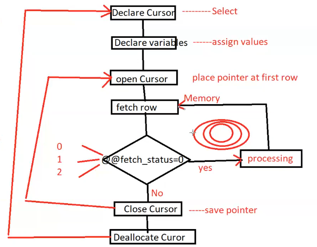
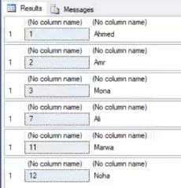
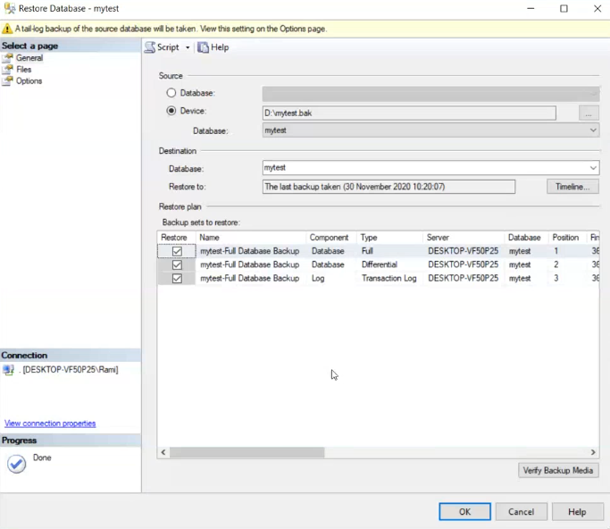
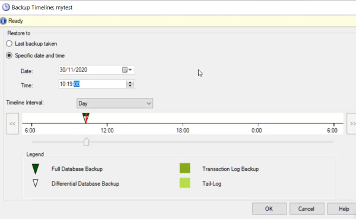
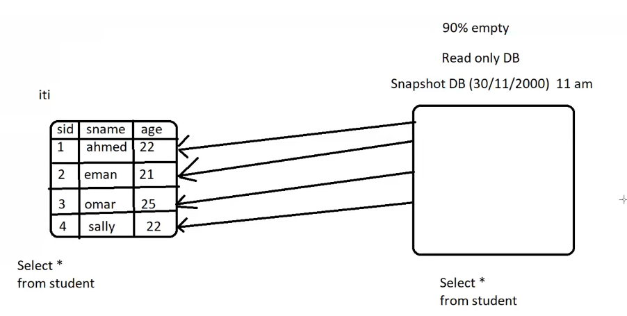
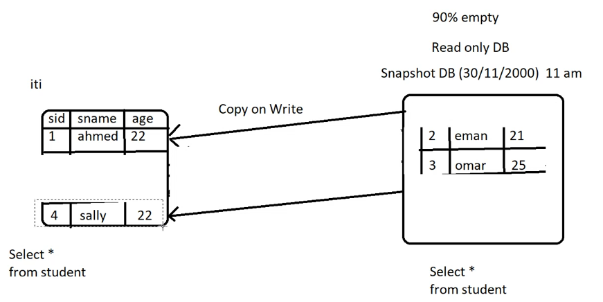
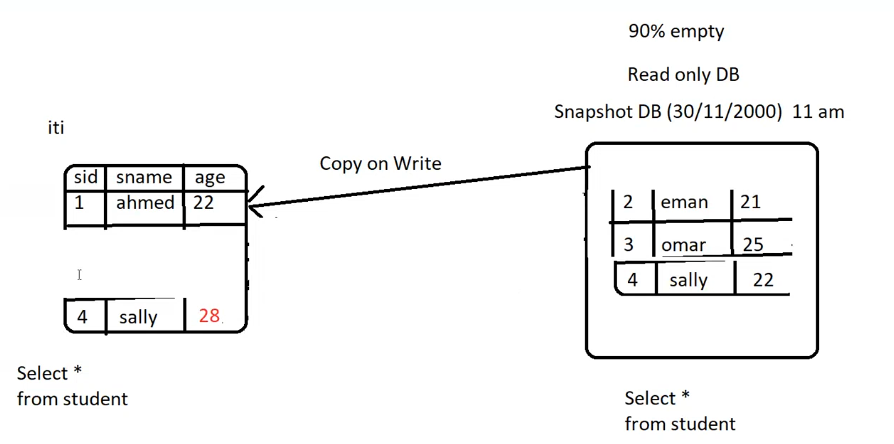
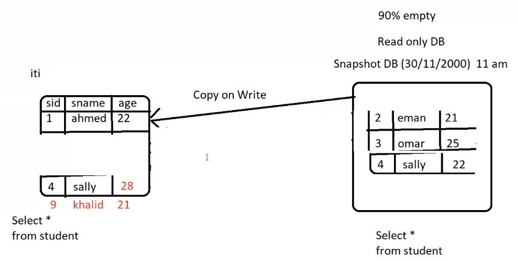

- [1. Cursor](#1-cursor)
- [2. Backup and Restore](#2-backup-and-restore)
  - [2.1. Jobs](#21-jobs)
- [3. Identity Gap](#3-identity-gap)
- [4. Bulk Insert](#4-bulk-insert)
- [5. Snapshots](#5-snapshots)
- [6. SQLCLR](#6-sqlclr)

# 1. Cursor
- how to deal the ResultSet row by row [like For loop for rows]
> Steps:


- Declare the cursor

    ```sql
    declare c1 cursor
    for 
        select st_id , st_fname
        from student
        where st_address = 'cairo'
    for read only       --means that the cursor can be used to read the rows
    --or for update     --means that the cursor can be used to update the rows
    ```

- variable declaration
    ```sql
    declare @id int , @name varchar(50)
    ```

- Open the cursor
    ```sql
    open c1
    ```

- Fetch the rows
    ```sql
    fetch c1 into @id , @name
    ```

- Loop
    ```sql
    while @@fetch_status = 0
        begin
           select @id , @name
            fetch c1 into @id , @name  --fetch the next row like index++
        end
    ```
- Close the cursor
    ```sql
    close c1
    ```
- Deallocate the cursor
    ```sql
    deallocate c1
    ```
>   - **Full Example**
>   
>       ```sql
>       declare c1 cursor
>       for 
>           select st_id , st_fname
>           from student
>           where st_address = 'cairo'
>       for read only
>   
>       declare @id int , @name varchar(50)
>   
>       open c1
>   
>       fetch c1 into @id , @name
>   
>       while @@fetch_status = 0
>           begin
>               select @id , @name
>               fetch c1 into @id , @name
>           end
>   
>       close c1
>       deallocate c1
>       ```

- Result

    
    result is discutered into rows


> **Make query to get names of students in one cell separated by comma**
```sql
declare c1 cursor
for 
    select st_fname
    from student
    where st_fname is not null
for read only

declare @name varchar(50) , @all_names varchar(1000) = ''

open c1
fetch c1 into @name

while @@fetch_status = 0
    begin
        set @all_names = @all_names + @name + ','
        fetch c1 into @name
    end

select @all_names

close c1
deallocate c1
```
- Result 
    ```
    (No column name)
    Ahmed,Mohamed,Ali,Amr,Amira,
    ```

>**Make query to update salaries `if salary >= 3000 increase by 20%` and `if salary<3000 increased by 10%`**
```sql
declare c1 cursor
for 
    select salary
    from instructor
for update
declare @sal int
open c1
fetch c1 into @sal
while @@fetch_status = 0
    begin
        if @sal >= 3000
            begin
                update instructor
                set salary = salary * 1.2
                where current of c1   --current of c1 means the current row in the cursor : like where id = @id
                -- without current of c1 it will update all rows
            end
        else if @sal < 3000
            begin
                update instructor
                set salary = salary * 1.1
                where current of c1  --current of c1 means the current row in the cursor : like where id = @id
                -- without current of c1 it will update all rows

            end
        fetch c1 into @sal
    end
close c1
deallocate c1
```

> **Make query to count how many Amr come after Ahmed in FName**
```sql
declare c1 cursor
for 
    select st_fname
    from student

for read only

declare @name varchar(50) , @prev_name varchar(50)='' , @count int = 0

open c1
fetch c1 into @name

while @@fetch_status = 0
    begin
        if @name = 'Amr' and @prev_name = 'Ahmed'
            set count = count + 1
        
        set @prev_name = @name

        fetch c1 into @name
    end

select @count

close c1
deallocate c1
```

# 2. Backup and Restore

- **Types of Backup**
    - **Full Backup**
        - backup from creation to current state
        - make backup of mdf files
            
            
            by the time the size of backup will increased
    
    - **Differential Backup**
      - backup from last full backup to current state
      - make backup of mdf files
        
        
        by the time the size of backup will increased

    - **Transaction Log Backup**
      - backup from last backup(full or diff or trans) to current state in the log file
      - then the log file will be truncated
      - log file can used to recover the database to any time you want
        
        

    > has this also in case i separate the db into several FileGroup - FileGroup Backup
___
- **Backup**
 
 
  - `the correct way to make backup`
 
      - Full Backup every long time (month) so you have the full database
      - Differential Backup every short time (week) so you have the changes
      - Transaction Log Backup every short time (day , hour) so you have the changes
 
    
    - so you have more flexibility to restore the database to any time you want
    
  - `Practical`
    - if i take full backup and then differential backup and then transaction log backup 
    `in same file or each in separated files`
        - right click on the database
        - Tasks -> Backup
        - select the type of backup
        - select the destination

    - Because i use same file to backup all backups so when selected appeared as multiple files
        
        
    
        can restore to `full` or `full + diff` or `transaction log` so must restore last diff or full before it 
    
    - So can use `timeline` to restore the database to any time you want
    
        
- SQL
    ```sql
    backup database [ITI]
    to disk = 'd:\ITI.bak'
    ```
___
## 2.1. Jobs
- can make automatic backup -> **Job**
- `Job` is a set of tasks that can be scheduled to run at a specific time
- it's exist in services called `SQL Server Agent`
- then make new job 
- add the query to the job
- schedule the job to run at specific time
- then the job will run automatically at the specified time
___
# 3. Identity Gap
- when delete row from table the identity will not be reused
  
  - if has 10 rows and delete the 5th row the next insert will be 11 not 6

- To get identity value
    ```sql
    select @@identity   --return the last identity value of last query

    select IDENT_CURRENT('table_name')
    ```

<br>

- `First Solution` :
    > - identity by default can't insert inside it
    >   
    >    - but can be changed
    >        
    >        ```sql
    >        set identity_insert test_table on   --to allow insert inside identity
    >        -- so here i can full the gap by insert the identity value i want
    >        
    >        ----------------------------------------------------------------------------------
    >        
    >        -- then return it to default
    >        set identity_insert test_table off      --to disallow insert inside identity
    >        ```

- `Second Solution` :
    >```sql
    >dbcc checkident('table_name' , reseed , new_identity_value)
    >``` 

# 4. Bulk Insert
Types of insert
- simple insert `one row`
- insert constructor `multiple rows`
- insert select `insert from another table`
- insert exec `insert from stored procedure`
- bulk insert `insert from file`
  
```sql
bulk insert Employees
from 'd:\employees.txt'
with (fieldterminator = ',' , rowterminator = '\n')
```
- employees.txt
    ```
    1,Ahmed,1000
    2,Mohamed,2000
    ```

# 5. Snapshots
- `Snapshot` is a read-only database
- `Snapshot` is a copy of the database at specific time, pointer to the original database

1. **First take snapshot**
    
    

2. **when data changed**
    
    - Delete two rows , will delete it from original database and take it to snapshot and remove the pointer
    

    - update one row , will update it in original database and take the old value to snapshot and remove the pointer
    

    - when insert it will not affect the snapshot
        
        
        - Select from Original 
            ```
            sid   sname     age
            1     Ahmed     22
            4     Sally     28
            9     Ahmed     21
            ```
        - Select from Snapshot
            ```
            sid   sname     age
            1     Ahmed     22
            2     Eman      21
            3     Omer      25
            4     Sally     22
            ```
>So snapshot is lighter than Backup because it not copy the whole database
> - But it exists in the same server
> - can't copy it to another server like backup
___
- Practical
    ```sql
    create database iti_snapshot
    on
    (
        name = 'iti',                     -- the name of mdf file of database
        filename = 'd:\iti_snapshot.ss'   -- ss is the extension of snapshot  -- which is the pointer of the original database
    )
    as 
        snapshot of iti
    ```
    
# 6. SQLCLR
- `SQLCLR` is a feature of SQL Server that allows you to run .NET code inside SQL Server
  - make complicated function in C# which is faster than function in SQL 
  - write new data type [class , struct] in C# and use it in SQL

```sql
sp_configure 'clr enabled' , 1
go 
reconfigure
 
-- Configuration option 'clr enabled' changed from 0 to 1. Run the RECONFIGURE statement to install.
```

- **Function**
  1. Create new project on Visual Studio
  2. select SQL Server Database Project
  3. add new item -> SQL CLR C# -> User Defined Function
  4. write the function
     
     ```csharp
      public static sqlint16 sum2int(sqlint16 a , sqlint16 b)
      {
          return a + b;
      }
      ```
  5. build the project
  6. publish the project to specific database
  7. then the function will be in the database
      ```sql
      select dbo.sum2int(5,6)
      ```
      ```sql
      select dbo.sum2int(st_id , st_age) 
      from student
      ```
    ___
- **New Data Type**

    1. Create new project on Visual Studio
    2. select SQL Server Database Project
    3. add new item -> SQL CLR C# -> User Defined Data Type
    4. write the class
        - consider two function `Parse` and `ToString`
        
        ```csharp
        public class Circle
        {
            public int x , y , rad;
            
            // Parse function to convert string to object
            public static MyType Parse(SqlString s)
            {
                if(s.IsNull)
                    return null;
                Circle mt = new Circle();

                string[] arr = s.Value.Split(',');
                mt.x = int.Parse(arr[0]);
                mt.y = int.Parse(arr[1]);
                mt.rad = int.Parse(arr[2]);

                return mt;
            }

            // ToString function to convert object to string
            public override string ToString()
            {
                return $"MyCircle = {x},{y},{rad}";
            }
        }
        ```
    5. build the project
    6. publish the project to specific database
    7. then the data type will be in the database
        ```sql
        create table shapes
        (
            id int,
            _coords Circle
        )
        ```
        ```sql
        insert into shapes values(1 , '10,20,30')   --insert the object as string 
                                                    --and the Parse function will convert it to object
        ```

        ```sql
        select * from shapes
        
        -- id   shape
        -- 1    MyCircle = 10,20,30                 -- the ToString function will convert the object to string
        ```
        ```sql
        select _coords.x , _coords.y , _coords.rad from shapes
        ```
        ```
        x   y   rad
        10  20  30
        ```

____

## More Topics
1. Crystal reports
2. SQL Injection
3. Red-Gate
4. Data Quality Services
5. Power View
6. Power Query
7. Power Pivot
8. Targit BI
9. What is new in SQL Server 2019 as Development
10. DB Mirroring
11. DB Encryption
12. SMO
13. SQLServer Snapshot
14. Hadoop & Map Reduce and Hive