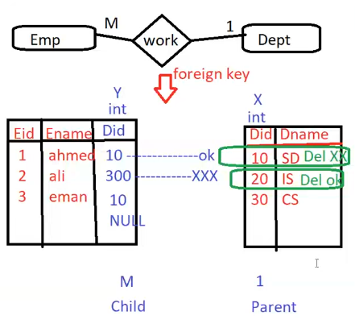
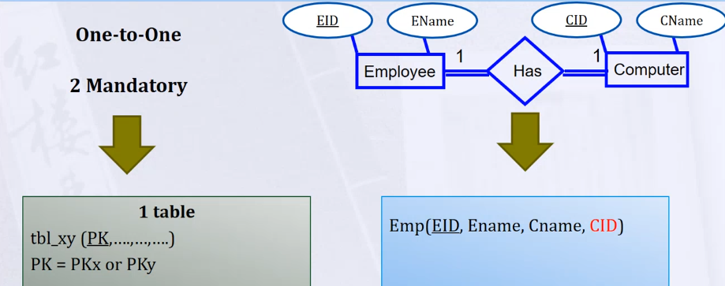
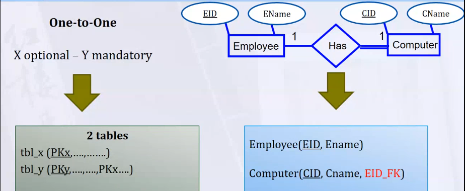
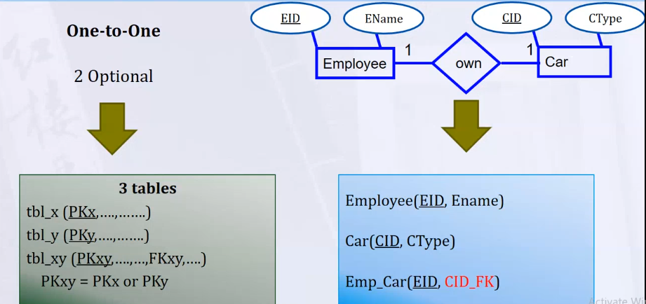
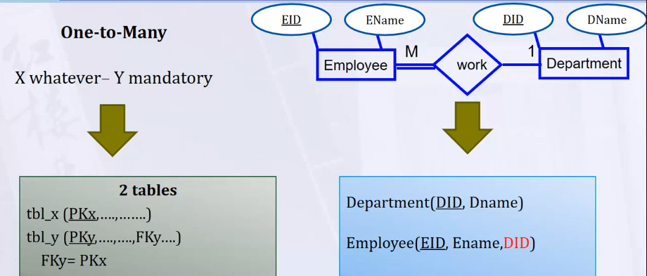
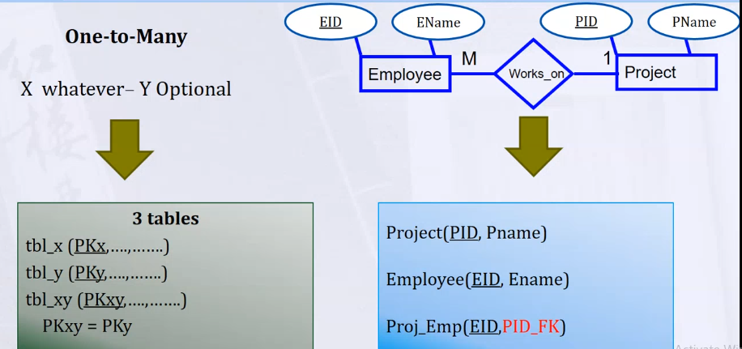
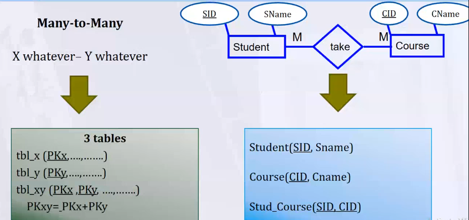
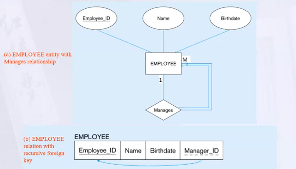
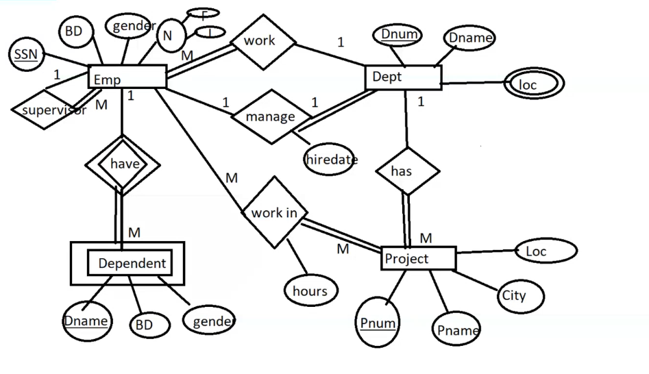
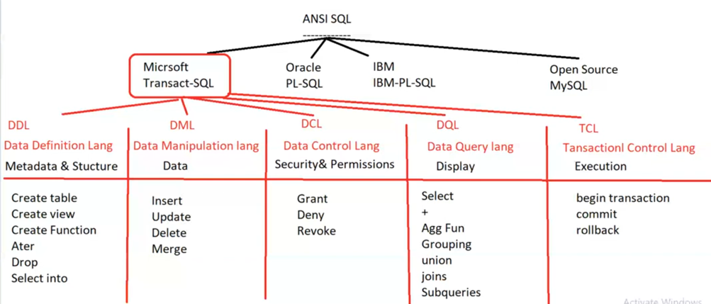

- [1. DB Mapping](#1-db-mapping)
- [2. ER-to-Relational Mapping](#2-er-to-relational-mapping)
  - [2.1. Mapping of Regular Entity Types](#21-mapping-of-regular-entity-types)
  - [2.2. Mapping of Weak Entity Types](#22-mapping-of-weak-entity-types)
  - [2.3. Mapping of Binary 1:1 Relation Types](#23-mapping-of-binary-11-relation-types)
  - [2.4. Mapping of Binary 1:N Relationship Types.](#24-mapping-of-binary-1n-relationship-types)
  - [2.5. Mapping of Binary M:N Relationship Types.](#25-mapping-of-binary-mn-relationship-types)
  - [2.6. Mapping of N-ary Relationship Types.](#26-mapping-of-n-ary-relationship-types)
  - [2.7. Mapping of Unary Relationship.](#27-mapping-of-unary-relationship)
  - [2.8. Notes](#28-notes)
  - [2.9. **Example**](#29-example)
- [3. SQL Server](#3-sql-server)
  - [3.1. Create Database](#31-create-database)
  - [3.2. Create Tables](#32-create-tables)
- [4. SQL](#4-sql)
  - [4.1. DDL](#41-ddl)
  - [4.2. DML](#42-dml)
  - [4.3. DQL](#43-dql)


## 1. DB Mapping
- We can say that entity is mapping to one table in the database. 
  ___
- **Relationship** is mapping to Foreign Key constraint.
  - Foreign Key is primary key of another table.
  - Foreign Key can be null and can have multiple values.
  - Foreign Key not must with the same name , but must have the same type.
  - Foreign Key is used to link two tables together
  ___
- **Attribute** is mapping to column in the table.
  - `Domain` is the set of all possible values that an attribute can have.
  - `Data Type` is the type of data that can be stored in the column.
    - `Quality of data type` -> make sure that the data is valid for certain purpose (number , so just number is stored).
    - `Size` -> how bytes are used to store the data.
  - `Constraints` 
  
    
not Delete Parent when has child.
___
## 2. ER-to-Relational Mapping
### 2.1. Mapping of Regular Entity Types
  > **Strong Entity** : Each strong entity set maps to a table.  
  > Create a table for each entity type -> if there is **no** 1-1 relationship mandatory(total participation) from 2 sides.
  - **Simple Attributes** : maps to a column of the table representing the entity type.
  - **Composite Attributes** : maps to a set of columns of the table representing the entity type.
  - **MultiValue Attributes** : maps to a separate table consisting of two columns (FK , multivalued attribute)-> composite pk.
  - **Complex Attributes** : map to a separate table consisting of columns (FK , Composite attributes)-> composite pk. 
  - **Derived Attributes** : Derived attributes are not stored in the database. `OR` can be stored in the database as a column `if calculated it is very complex for performance`.

### 2.2. Mapping of Weak Entity Types
> **Weak Entity** : Each weak entity set maps to a table with Foreign key of owner entity type.  
> PK -> Partial Key of Weak Entity + FK of Strong Entity.
    
### 2.3. Mapping of Binary 1:1 Relation Types
 - `Rule` : the more partial the more table.

  > **Total from Two sides** -> Both entities are merged into one table. `->` so this case must mapped first before mapping the entities.
  > - PK is any of two entities.
  >
  >
  ___ 
  > **Partial - Total** -> Two Tables and put PK of Total in Partial.
  >
  >
  ___
  > **Two Partial** -> make three tables.
  >   - Third table is for relation -> (PK of two entities).
  >   - PK of it is any of two FK.
  >   
  >

### 2.4. Mapping of Binary 1:N Relationship Types.
  > **Many is Total**
  >
  >
  ___
  > **Many is Partial**
  > - PK of New table is the PK of the many.
  >
  >

### 2.5. Mapping of Binary M:N Relationship Types.
  > Participation is not effect the mapping.
  > Create a new table for the relationship.
  > - PK of the new table is the combination of the PK of the two entities.
  >
  >

___
### 2.6. Mapping of N-ary Relationship Types.
    
  > - Create a new table for the relationship.
  > - Add the FKs to the new table for all Parent Tables.
  > - PK -> look at all candidate keys and choose the best one.
___
### 2.7. Mapping of Unary Relationship.
  > Fk is PK of the same table.
  >
  >
___
### 2.8. Notes
-  `if the relationship has attributes -> add them to the table that has two keys.`
- Composite Primary Key appears in : 
  - MultiValue
  - Complex
  - Weak Entity
  - many to many

___

### 2.9. **Example** 
  
  
- Mapping :
  - Emp [ `SSn` , BD , gender , First ,Last , SuperSSn , Dnum ]
  - Dependent [ `Dname` , `Ssn` , BD , Gender ]
  - Dept [ `Dnum` , Dname , MgrSSn , HireDate ]
  - Location [ `Dnum` , `Dlocation` ]
  - Prpject [ `Pnum` , Pname , City , Plocation , Dnum ]
  - EmployeeProject [ `Pnum` , `Ssn` , Hours ]
___

## 3. SQL Server
- when you install SQL Server, you can install SSMS.
- SQL Server Management Studio (SSMS) is a software application first launched with Microsoft SQL Server 2005 that is used for configuring, managing, and administering all components within Microsoft SQL Server.
- Work with SQL Server(mssqlserver) Services (Server) running in background.
  - When enter SSMS, you can connect to the server(services) by enter `.` which mean local sever on machine.

___
### 3.1. Create Database
- Two files
  - Data File (.mdf) : contains metadata (the tables , structure and objects).
  - Log File (.ldf) : contains the transaction log.

- These files are managed by the SQL Server services.
  - Can't delete , copy them.
  - to copy the DB, you need to backup the DB and restore it.

- Backup and Restore
  - Backup : create a copy of the DB (.bak) file.
  - Restore : restore the DB from the backup.
___
### 3.2. Create Tables
  - **Wizard** : right click on the DB -> Tasks -> New Table.
    - you can add columns and set the data type.
    
    - you can set the primary key.
    
    > **what if i want to modify the table ?**    -> Must open the option of modifying the table.
    > - Tools -> Options -> Designers -> Table and Database Designers -> Prevent saving changes that require table re-creation.

    - Add Foreign Keys -> Database Diagrams -> Add Table -> Add FK.
      - Database Diagrams (ERD after mapping).

___
## 4. SQL
- To write query, you need Sql language.

- ANSI SQL (`American National Standards Institute Structured Query Language`) is a standard for relational databases.
  - `Every database system has its own version of the SQL language.`
  - Microsoft uses T-SQL (Transact-SQL).
  - Oracle uses PL/SQL.
  - IBM use IBM-PL-SQL.
  - Open Source use MySQL.


___
- T-SQL is a set-based language.
  - DDL (Data Definition Language) : Create , Alter , Drop.
  - DML (Data Manipulation Language) : Insert , Update , Delete , Merge.
  - DCL (Data Control Language) : Grant , Deny , Revoke.
  - DQL (Data Query Language) : Select. 
  - TCL (Transaction Control Language) : Commit , Rollback.
___
### 4.1. DDL
  
  - **New Query** : 
    - Something like cmd in the SQL Server.
    
    - When you execute the query , `SSMS` will go to the `services` and `services` will go to `actual data in mdf file` and return the result.
    
    ```sql
    CREATE TABLE Employee
    (
        SSN CHAR(9) PRIMARY KEY,
        FirstName VARCHAR(20) not null,
        LastName VARCHAR(20) ,
        Address VARCHAR(50) default 'unknown',
        HireDate DATE default getdate(), <!-- getdate() is a function to get the current date. -->
    );
    ``` 

    ```sql
      alter table Employee add salary int;
      alter table Employee alter column salary money;
      alter table Employee drop column salary;

    ```

    ```sql
      drop table Employee;
    ```
___
### 4.2. DML
- **Insert** : 
  
  ```sql
    insert into Employee 
    values ('123456789','Ahmed','Ali' , null , 'alex','1/1/2010'); <!-- Must insert all columns with the same ordering. -->

    insert into Employee (SSN,FirstName,LastName) 
    values ('123456789','Ahmed','Ali');
  ```
  - insert multiple rows (`Insert Constructor`).
  
    ```sql
      insert into Employee 
      values ('123456789','Ahmed','Ali' , null , 'alex','1/1/2010'),
             ('103456789','mona','Tarek' , null , 'alex','1/1/2010'),
             ('100456789','Amr','Magdy' , null , 'alex','1/1/2010');
    ```
- **Update** : 
  ```sql
    update Employee
    set FirstName = 'Mohamed'
    <!-- if where clause is not specified, all rows will be updated. -->
    where ssn = `123456789` <!-- must add where clause to specify the row. -->
  ```

- **Delete** : 
  - Delete specific row.
    ```sql
      delete from Employee
      where ssn = `123456789` <!-- must add where clause to specify the row. -->
    ```
  
  - Delete all data in specific column.
    ```sql
      update Employee
      set HireDate = null
    ```
___

### 4.3. DQL
- Select 
  - select represent selection to columns
  ```sql
    select * from Employee

    select FirstName,LastName
    from Employee
  ``` 
- Where
  - where represent selection to rows
  ```sql
    select * from Employee
    where FirstName = 'Ahmed'
  ```
  ```sql
  select * from Employee
  <!-- where FirstName !=Null  -->
  <!-- null is not value to compare with it , can't use >, < , <= , >=  ||-->
  where FirstName is not null
  ```
  ```sql
  select * from Employee
  where Address = 'Cairo' or Address = 'Alex'
  <!-- if we have many values to compare with , we can use in. -->
  where address in ('Cairo','Alex','Giza')

  ```
  ```sql
  select * from Employee
  where Age >= 20 and Age <= 30
  <!-- if we have range of values to compare with , we can use between. -->
  where Age between 20 and 30
  ```

- Order By
  - Return result by ordering them with specific column with no affect on hard disk.
  ```sql
    select * from Employee
    order by FirstName

    select * from Employee
    order by FirstName desc
  ```
  ```sql
    select FName , LName , age from Employee
    order by 1
    -- first column in the select statement.
  ```
- Distinct
  - Return unique values.
  ```sql
    select distinct FirstName from Employee
  ``` 
  also ordered the result.