- [1. Aggregate Functions](#1-aggregate-functions)
- [2. Subqueries](#2-subqueries)
- [3. Union Family](#3-union-family)
  - [3.1. union all](#31-union-all)
  - [3.2. union](#32-union)
  - [3.3. intersect](#33-intersect)
  - [3.4. except](#34-except)
- [4. EERD](#4-eerd)
  - [4.1. EERD Concepts](#41-eerd-concepts)
  - [4.2. **Benefits**](#42-benefits)
  - [4.3. Constraints in Supertype](#43-constraints-in-supertype)
  - [4.4. Mapping](#44-mapping)

# 1. Aggregate Functions
- Some functions are used to perform calculations on a set of values and return a single value. 
- Aggregate functions are often used with the GROUP BY clause of the SELECT statement. 
- The following are the most commonly used aggregate functions:
    - SUM() - Returns the sum.
        - SUM() - Returns the sum of all values.
        - null values are ignored.
    - COUNT() - Returns the number of rows.
        - count(*) === count(PK) - Returns the number of rows in a result set. because it not count NULL values and pk not allow null.
        - count(EName) - if has null , values in EName column, it will not count them.
    - AVG() - Returns the average value.
    - MAX() - Returns the largest value.
    - MIN() - Returns the smallest value.
    
    - FIRST() - Returns the first value.
    - LAST() - Returns the last value.
  ___
**Note the difference**

```sql
select avg(st_age) from students
-- due to the null values in the st_age column, the result can not be the same as 
select sum(st_age)/count(*) from students 

-- what if i want to divide by all rows even it's null
select avg(isnull(st_age,0)) from students
select sum(st_age)/count(*) from students 
-- although the result is the same, but the first one is better due second using two aggregate function so it's slower .
```

  ___

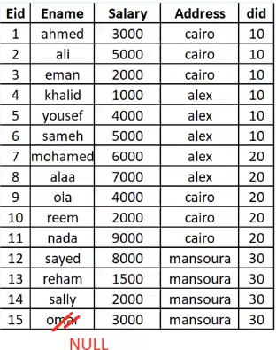
  ___
**What if i use aggregate function + column name in select statement ?**
```sql
SELECT min(salary), Did FROM Employees;
```
- it will give you an error because you are using aggregate function with column name and you are not using group by clause.

- must use `group by` clause with column name if you are using aggregate function with column name.
    - ```sql
        SELECT min(salary), Did FROM Employees GROUP BY Did;
        ```
        result:
        ```
        min(salary) Did
        1000        10
        2000        20
        1500        30
        ```
        Business wise, it will give you the minimum salary of each department.
    - ```sql
        select count(Eid) , Address from Employees group by Address;
        ```
        result:
        ```
        count(Eid) Address
        6          cairo
        5          alex
        4          mansoura
        ```
        Business wise, it will give you the number of employees in each address.
    
    - any column in the select statement should be in the group by clause or in the aggregate function.
        ```sql
        select avg(st_age),st_address , dept_id
        from students 
        group by st_address , dept_id -- all columns in the select
        -- actual groups will be use composite key of st_address and dept_id
        ```

___
**What if i use aggregate function + in where clause ?**

1. EX:
    ```sql
    select count(Eid),Address 
    from Employees 
    where Did in (10,30) -- will affect the rows will be counted.
    group by Address

    ```
    result:
    ```
    count(Eid)   Address
    3            cairo
    3            alex
    4            mansoura
    ```
    Business wise, it will give you the number of employees in each address in departments 10 and 30.
    <br>
    **The way it Performed as follows:**
    ```sql
    4.select count(Eid),Address 
    1.from Employees 
    2.where Did in (10,30)
    3.group by Address

    ```
    ___
2. EX:
    ```sql
    select min(salary),Did
    from Employees
    where Address like '_a%'
    group by Did;
    ```
    result:
    ```
    min(salary) Did
    2000        10
    2000        20
    1500        30
    ```
___
**What if i use aggregate function + group by clause + want to exclude one of group**
```sql
select sum(salary),Did
from Employees
group by Did;
where sum(salary) > 5000; -- will give you an error.
-- because where clause should be before group by clause. so should write before group by clause.
-- also where is performed to each row. so can't perform on aggregate function.
```
1. so must use `having` clause instead of `where` clause.
    ```sql
    select sum(salary),Did
    from Employees
    group by Did
    having sum(salary) > 22000
    ```
    result:
    ```
    sum(salary) Did
    29000       20
    ```
    business wise, it will give you the sum of salary for each department and exclude the department that has sum of salary less than 22000.<br>
    so the having condition will be performed on the result of the group by clause.

2. also can use another aggregate in the having
    ```sql
    select sum(salary),Did
    from Employees
    group by Did
    having count(Eid) > 5
    ```
    result:
    ```
    sum(salary) Did
    20000       10
    ```
    business wise, it will give you the sum of salary for department employees is greater 5 .<br>

- **Special case if the select is aggregate only and the having is aggregate only.**
    ```sql
    select sum(salary)
    from Employees
    having count(Eid) > 100
    ```
    result:
    ```
    sum(salary)
    100000
    ```
    business wise, it will give you the sum of salary for all employees if there count is greater than 100<br>

    
___
**What if i use aggregate function + group by + where + having?**
1. Ex:
    ```sql
    select sum(salary),Did
    from Employees
    where Address like '_a%'
    group by Did
    having sum(salary) > 12000;
    ```
    result:
    ```
    sum(salary) Did
    15000       10
    14500       20
    ```
    ___
2. EX:
    ```sql
    select max(salary),address
    from Employees
    where Did in (10,30)
    group by address
    having count(Eid) > 3
    ```
    result:
    ```
    max(salary) address
    8000        mansoura
    ```
___


# 2. Subqueries
- A subquery is a query within another query.
1. **using result of one in another query.**
    ```sql 
    select * from student
    where st_age < avg(st_age) -- this will give you an error. because you can't use aggregate function in where clause.
    ```
    do the following:
    ```sql
    select * from student
    where st_age < (select avg(st_age) from student)
    ```
    so we have inner query and outer query. `the inner query will be executed first` and then the outer query will be executed.


2. **Subqueries are written in any part of the query**
    - if want to show student info and the count of all students
        ```sql
        select *, (select count(*) from student) as total 
        from student
        ```
        so the inner query will be executed for each row in the outer query.

3. **Subqueries can be from other tables.**
    ```sql
    select dept_name from Department
    where dept_id in (select distinct dept_id 
                        from student 
                        where dept_id is not null)
    ```
    Business wise, it will give you the department name that has students.

    - `this query can be written using join.`
        
        ```sql
        select distinct dept_name
        from Department d join student s
        on d.dept_id = s.dept_id
        ```
        - this query will be faster than the subquery.
        - also the engine tried to optimize the query and make it using join so subquery is the last option to do.
4. **Subqueries can be used with DML commands (INSERT, UPDATE, DELETE)**

   - delete all student_courses for students who live in cairo.

        ```sql
        delete from Stud_Course
        where St_id in (select St_id from Student where st_address = 'cairo')
        ```

___

# 3. Union Family
## 3.1. union all
- it will return all rows from both tables.
- select must use same number of columns and data type in both tables.
- it will not sort the result.
```sql
select st_name from student
union all
select ins_name from instructor
```
result will be :
```
st_name
ahmed        -- from student Table
mohamed      -- from student Table
ali          -- from student Table
mohamed      -- from instructor Table
```
## 3.2. union
- it will return distinct rows from both tables.
- it will remove null values.
- it will sort the result.
```sql  
select st_name from student
union
select ins_name from instructor
```
result will be :
```
st_name
ahmed        -- from student Table
ali          -- from student Table
mohamed      -- from instructor Table
```


## 3.3. intersect
- it will return distinct common rows between both tables.
- it will sort the result.
```sql
select st_name from student
intersect
select ins_name from instructor
```
result will be :
```
st_name
mohamed
```

## 3.4. except
- it will return distinct rows from the first table that are not in the second table.
- it will sort the result.
```sql
select st_name from student
except
select ins_name from instructor
```
result will be :
```
st_name
ahmed
ali
```
___
# 4. EERD
- Enhanced Entity Relationship Diagram (ERD + Inheritance)
- Two Entities of same type has some common attributes and some diff
  
    Under_Stud | Post_Stud
    ---|---
    id | id
    name | name
    GPA | Research
    
    if there is another table Department that has a relation with Under_Stud and Post_Stud. so it will increase the relationships existed.
- so we can use EERD to solve this problem.
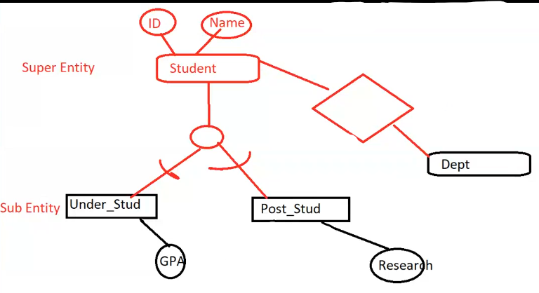

## 4.1. EERD Concepts
- **Subtype** : A subgrouping of the entities in an entity type which has attributes that are distinct from those in other subgroupings.
- **Subtype** : An generic entity type that has a relationship with one or more subtypes
-  **Inheritance**:
   - Subtype entities inherit values of all attributes of the supertype
   - An instance of a subtype is also an instance of the supertype


- **Generalization**: The process of defining a more general entity type from a set of more specialized entity types. `BOTTOM-UP`

- **Specialization**: The process of defining one or more subtypes of the supertype, and forming supertype/subtype relationships. `TOP-DOWN`
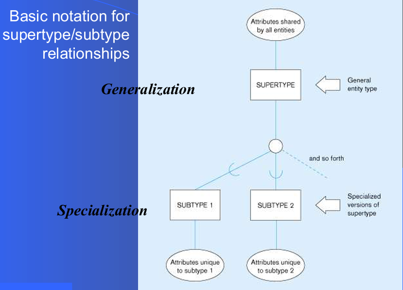


<br>

## 4.2. **Benefits**

**This helps in case of `scalability` if i need to add new employee just add its own attributes and inherit the common attributes from the employee table.without affecting the other tables.**|
-|
**Relationships at the `supertype` level indicate that `all subtypes will participate in the relationship`.**<br>**The instances of a `subtype` may `participate in a relationship unique to that subtype`.**


1. 
    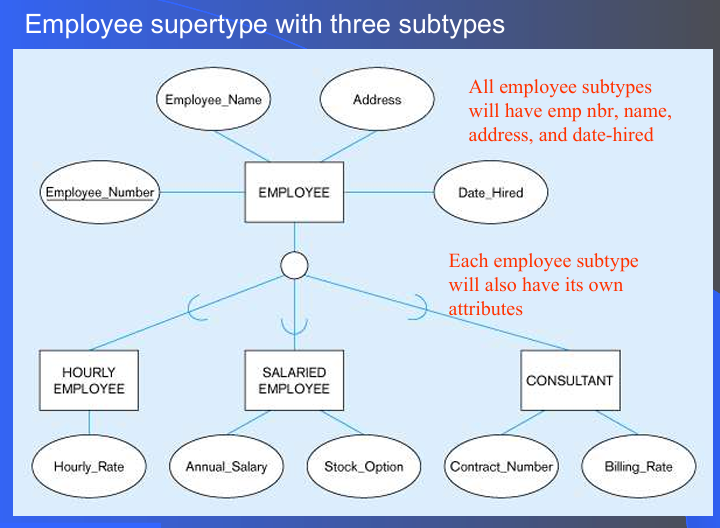
2. 
    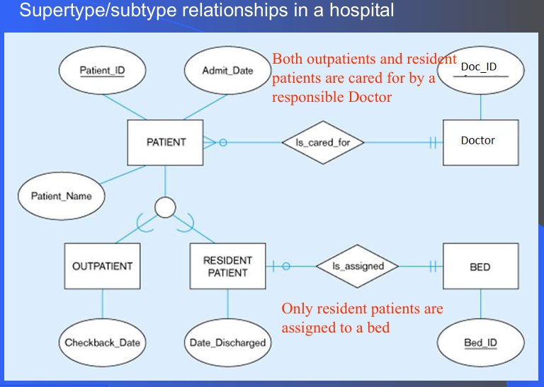


## 4.3. Constraints in Supertype

- **Completeness Constraints**  :Whether an instance of a supertype must also be a member of at least one subtype.
    
    Total Specialization Rule: Yes (double line) |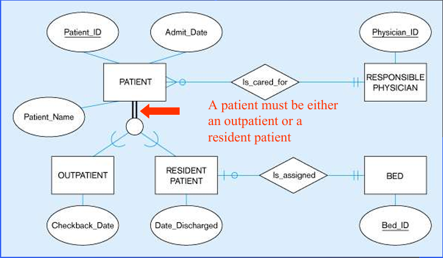
    ---|---  
    Partial Specialization Rule: No (single line) لو في نوع ملوش كلاس فرعي وموجود بس في الاب|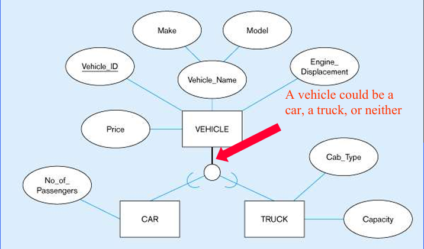
<br>

- **Disjointness Constraints** :Whether an instance of a supertype may simultaneously be a member of two (or more) subtypes.
  
  Disjoint Rule: An instance of the supertype can be only ONE of the subtypes<br> `one parent is one child`|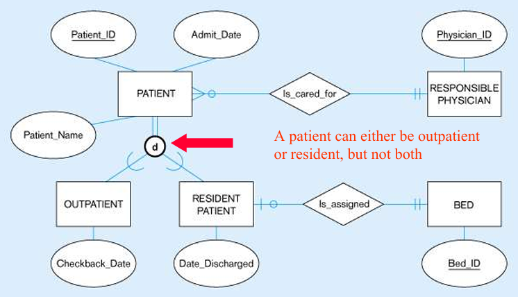
    ---|-
  **Overlap Rule: An instance of the supertype could be more than one of the subtypes**<br> `one parent can be both`|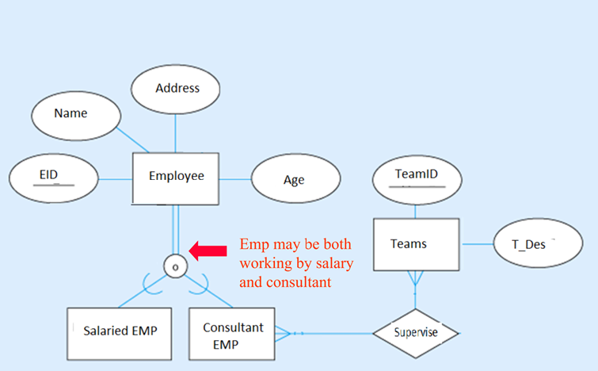


- **Subtype Discriminator** : An attribute of the supertype whose values determine the target subtype(s)
  - Disjoint – a simple attribute    
    
    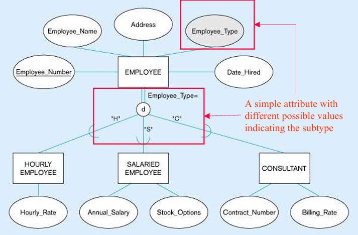
  
  - Overlapping – a composite attribute   
    
    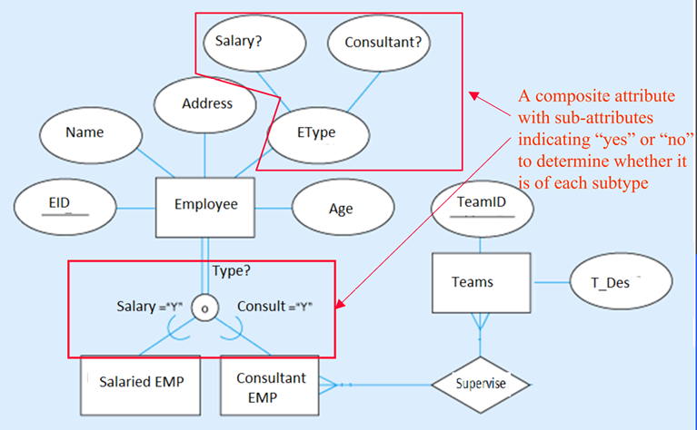

## 4.4. Mapping
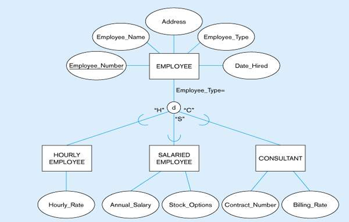

will be the same number of the entities in the database.

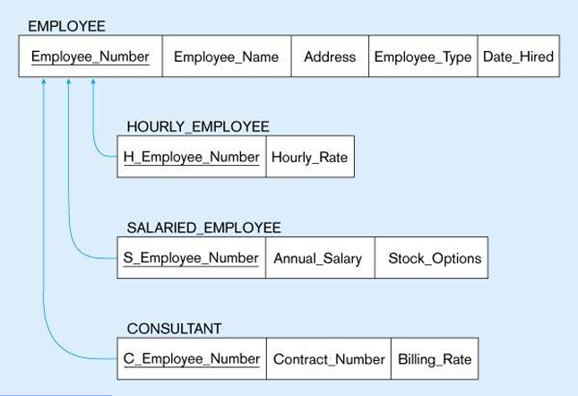

- PKs of all are the same.
- Subtype will have a FK to the supertype which is the PK.
___

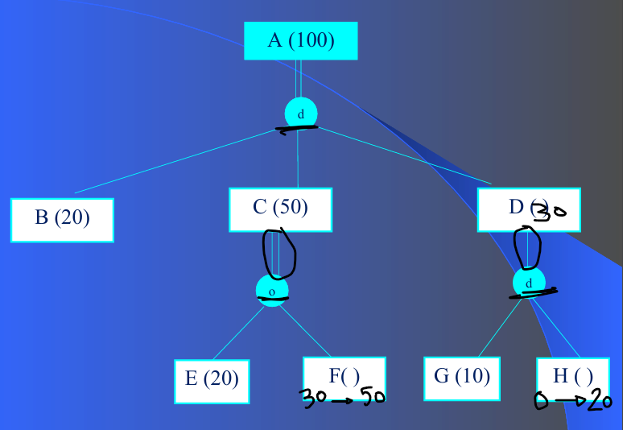
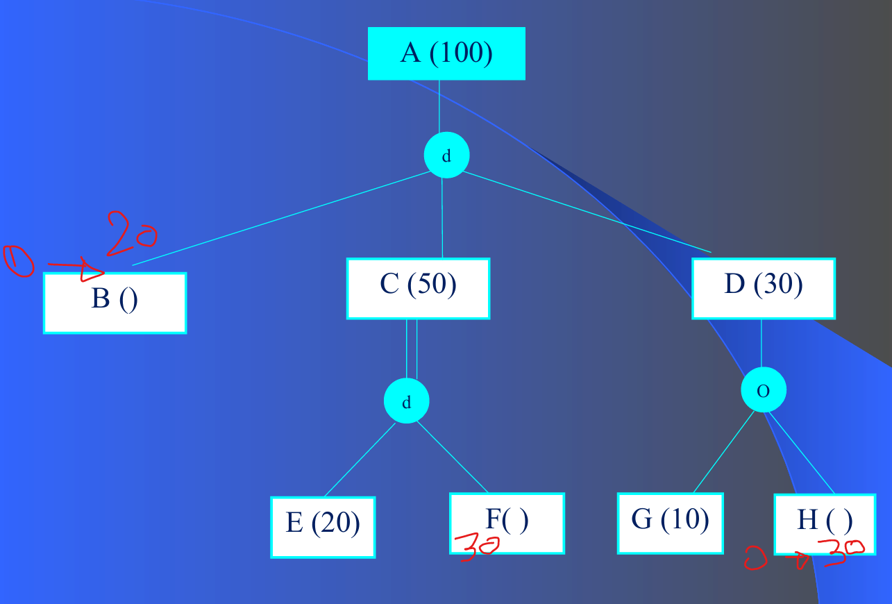