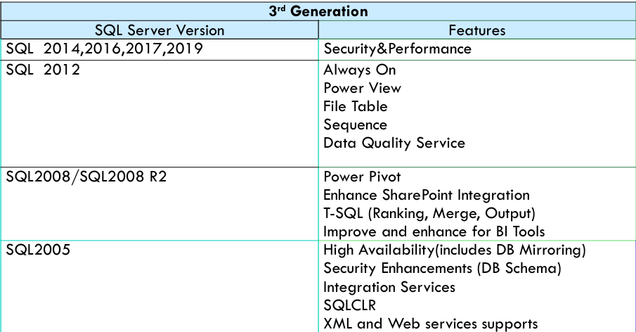
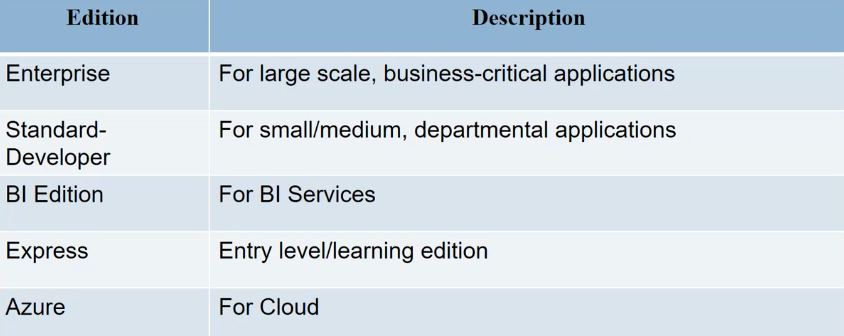
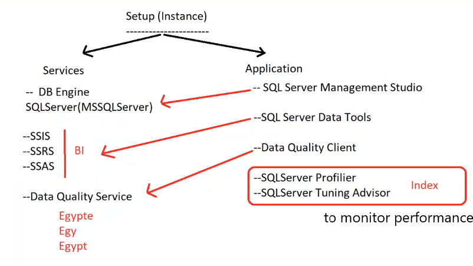
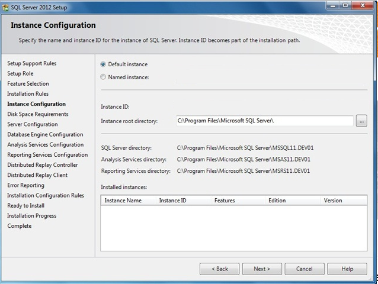
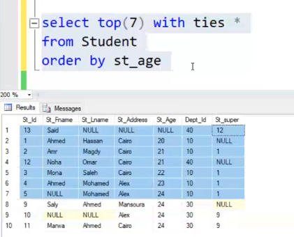
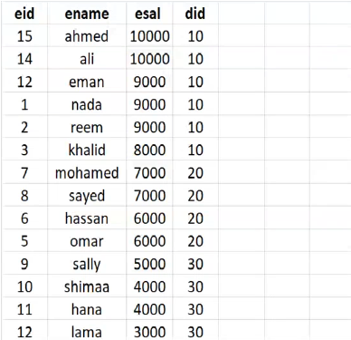
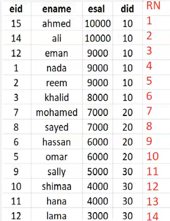
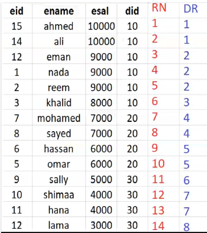
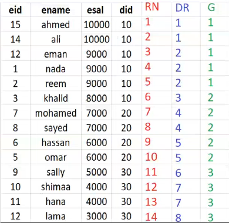
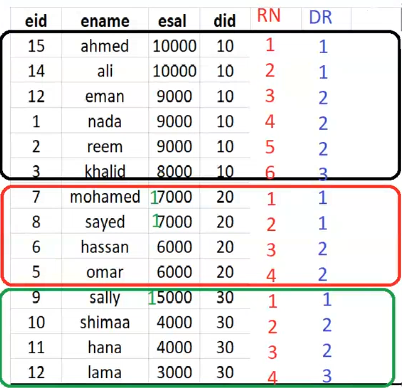

- [1. Microsoft SQL Server](#1-microsoft-sql-server)
  - [1.1. Introduction](#11-introduction)
  - [1.2. Engine](#12-engine)
  - [1.3. Instance](#13-instance)
  - [1.4. Authentication](#14-authentication)
- [2. Functions](#2-functions)
  - [2.1. Top , Top with ties , newid() , Execution order , DB Objects , Select into , Insert into](#21-top--top-with-ties--newid--execution-order--db-objects--select-into--insert-into)
- [3. Ranking Functions](#3-ranking-functions)
  - [3.1. Row\_Number()](#31-row_number)
  - [3.2. Dense\_rank()](#32-dense_rank)
  - [3.3. NTiles(Group)](#33-ntilesgroup)
  - [3.4. Rank()](#34-rank)
  - [3.5. using Partition by](#35-using-partition-by)
- [4. Data Types](#4-data-types)
- [5. Built-in Functions](#5-built-in-functions)
  - [5.1. case](#51-case)
  - [5.2. iif function](#52-iif-function)
  - [5.3. cast function](#53-cast-function)
  - [5.4. format function](#54-format-function)
  - [5.5. eomonth function](#55-eomonth-function)
  
# 1. Microsoft SQL Server
## 1.1. Introduction
- **Microsoft has 4-categories:**
  - Writing queries using Microsoft sql server (T-SQL)
  - Implementing a Microsoft SQL Server database
  - Maintain a Microsoft SQL Server database
  - Sql server Business Intelligence (BI) development 

- **Relational Databases**
    - SQL Server is fully RDBMS
    - The Tables have one to many relationships

- **SQL server history**
    - `version` : is the year of release
    
    - `edition` : is the type of the server (Enterprise, Standard, Express, Developer) feature-to-money 
    
    cloud-based SQL server is called `Azure SQL Database` : 
      - has critical points :
          - data is available by vendor
          - latency due to network

## 1.2. Engine
- once we make setup we install instance(services + applications)

- if select all features
    
    

- if select only database engine

    
    why install multiple instances on the same machine ?
    - each engine use limited resources (Processor, memory)
    - so when has large DB , Large number of users.
    - can install multiple engines on the same machine to distribute the load.

## 1.3. Instance
- **So We have named to the instance to distinguish between them.**

    
    - **default instance (DB engine only)**: `service -> SQLServer(MSSQLSERVER)` 
        >connect to it by `.` or `localhost` or `pc-name` or `ip (current ip)`
    
    - Named instance (DB engine only): `service -> SQLServer(MSSQLSERVER)` 
        > connect to it by `.\test` or `localhost\test` or `pc-name\test` or `ip\test` 

## 1.4. Authentication
- **Authentication (userName + password)**
    - Windows Authentication
        > win Admin => SQL Server Admin 
    - SQL Server Authentication
        > SQL Server Admin : just for SQL Server (not windows)  Dev_ahmed : 123  
        Dev_ali : 987  
        **But to do this we need to enable mixed mode authentication**
    - Mixed Mode (Windows + SQL Server Authentication)

        
        once choose mixed mode 
        > we have two user `windows admin` and `SQL admin user (sa)`
        we need to set the password for the `sa` user

- **How to make new user ?**
  - `make login to server` server -> properties -> security -> SQL Server and Windows Authentication mode (restart the db)
     > here he can login to the server but not see the data , need to be user in the db
  
  - `make user to db` db -> security -> users -> new user -> user name (Dev_ahmed) -> select the login name (Dev_ahmed) -> ok
     > here he can see the DB but not see the tables , need Permissions

- **How to active sa user ?**
    - `make login to server` server -> security -> logins -> sa -> properties -> status -> login -> enable -> ok
    - `make login to server` server -> security -> logins -> sa -> properties -> general -> password -> 123 -> confirm password -> 123 -> ok


# 2. Functions
## 2.1. Top , Top with ties , newid() , Execution order , DB Objects , Select into , Insert into
- **Top** 
  - select top n rows from the table
  ```sql
    select top(3) * from Student
    ```

- **Top with ties**
  - select top n rows from the table 
  - and if the ties values are the same it will show all of them
  > اول 3 مراكز في المسابقة مثلا بس اخر مركز مكرر فهيرجع 4 مش 3
  ```sql
    select top(3) with ties * from Student
    order by st_age 
    ```
    

- **newid()**
  - GUID (globally universal identifier) 
  - it will generate random values and unique from all ids in all tables
  ```sql
    select newid()
    ```
    ```sql
    select * , newid() as new_id from Student -- every time you run it will generate randoms ids
    ```
    so if ordered by new_id it will be random order
    ```sql
    select *  from Student
    order by newid()    -- every time you run it will shuffle the rows
    ```
    of if use top(3) it will show random 3 rows
    ```sql
    select top(3) *  from Student
    order by newid()    -- every time you run it will shuffle the rows
    ```

- **Execution order**
    >this code will work 
    >```sql
    >select st_fname+' '+st_lname as fullname 
    >from Student
    >order by fullname
    >```
    
    >but this code will not work error because the alias name is not recognized in the where clause
    >```sql
    >select st_fname+' '+st_lname as fullname
    >from Student
    >where fullname='ahmed ali'
    >```
- Order :
  - from `know the tables i work on`
  - join 
  - on
  - where
  - group by
  - having [aggregate]
  - select  [distinct , aggregate] 
  - order by
  - top

- to solve the above error we can main column in the DB in the where clause
  ```sql
  select st_fname+' '+st_lname as fullname
  from Student
  where st_fname+' '+st_lname='ahmed ali'
  ```
- Or use sub query to solve the above error
  ```sql
  select * 
  from  (select st_fname+' '+st_lname as fullname
            from Student) as new_table
  where fullname='ahmed ali'
  ```

- DB Objects ---------->`[table     view     function     stored procedure     trigger     index]`
    - have path to access them `[ServerName].[DB].[Schema].[Object]`
    - for example I use `ITI DB`
        ```sql
        select * 
        from [desktop-7vq6t6b].[ITI].[dbo].[Student]
        ```
    - also can access other table in other DB
        ```sql
        select * 
        from [Company_SD].[dbo].[Project]
        ```
    
    - so we can make join or union between two tables in different DBs
        ```sql
        select * 
        from [ITI].[dbo].[Student] as s
        join [Company_SD].[dbo].[Project] as p
        on s.st_id=p.prj_id
        ```
    - also can access other table in other DB in the different server
        ```sql
        select *
        from [local].[ITI].[dbo].[Student] as s
        join [remote].[ITI].[dbo].[Project] as p
        on s.st_id=p.prj_id
        ```

- **Select into** 
  - create new table from the select statement
    ```sql
    select * into new_table
    from Student
    ```
    - if the table already exists it will give error

  - i can use select into to create new table with specific columns
    ```sql
    select st_id,st_fname,st_lname into new_table
    from Student
    ```
  - also can use select into to create new table in different DB
    ```sql
    select * into [Company_SD].[dbo].[new_table]
    from iti.dbo.Student
    ```

  - can make new table with structure only without data
    ```sql
    select * into new_table
    from Student
    where 1=0
    ```

- **Insert into**
  - if the table already exists and you want to append the data to it
  > must have same structure
    ```sql
    insert into new_table
    select * 
    from Student
    ```
  
# 3. Ranking Functions
Special functions that are used to rank the rows in the table
- Row_Number()
- Dense_rank()
- NTiles(Group)
- Rank()

    
## 3.1. Row_Number()
- it will give number to each row in the table based on the order by column
- this number will be unique for each row 
- function only do this 
    ```sql
    select *, row_number() over (order by esal desc) as rn
    From employee
    ```
    

- but can use it after to easy the query
    ```sql
    select * 
    from (select *, row_number() over (order by esal desc) as rn
            From employee) as new_table
    
    where rn=1  -- get the highest salary , this can be with top(1) and be easier
    
    where rn=3  -- get the third highest salary , can't use top
    ```


## 3.2. Dense_rank()
- it will give number to each row in the table based on the order by column
- but if the values are the same it will give the same rank to them
    ```sql
    select *, row_number() over (order by esal desc) as RN,
            dense_rank() over (order by esal desc) as DR
    From employee
    ```
    

- but can use it after to easy the query
    ```sql
    select * 
    from (select *, dense_rank() over (order by esal desc) as rn
            From employee) as new_table
    
    where DR = 1 -- get the highest salary , this will return two rows because the highest salary is repeated
    
    where DR =< 2  -- get the two highest salary , this will return 3 rows because the highest salary is repeated
    ```


## 3.3. NTiles(Group)
- it will divide the rows into groups
- and give each group a number
   
    ```sql
    select *, ntile(3) over (order by esal desc) as NT
                        -- the rows is 14 so it will divide them into 3 groups and 
                        -- last group will be decreased by 1 row 
                        -- must the decrease is in the last groups by 1 row 
                        -- 14 (5 , 5 , 4)
                        -- 13 (5 , 4 , 4)
    From employee
    ```
    

- but can use it after to easy the query
    ```sql
    select *
    from (select *, ntile(3) over (order by esal desc) as G
            From employee) as new_table
    
    where G = 1 -- get the highest salary group
    
    where G = 2 -- get the second highest salary group

    where G = 3 -- get the third highest salary group
    ```

## 3.4. Rank()
self
## 3.5. using Partition by
- it will divide the rows into groups based on the column
- and will treat each group as a separate table , has its own row_number , dense_rank , also order by

    
    ```sql
    select *, row_number() over (partition by did order by esal desc) as RN,
            dense_rank() over (partition by did order by esal desc) as DR
    From employee
    ```
    

- using it as 
    ```sql
    select * 
    from (select *, row_number() over (partition by did order by esal desc) as rn
            From employee) as new_table
    
    where RN = 1 -- get the highest salary in each department

    where RN = 2 -- get the second highest salary in each department

    where DR = 1 -- get the highest salaries (with repeated) in each department

    where DR = 2 -- get the second highest salaries (with repeated) in each department
    ```

# 4. Data Types
>it consists of categories
- **Numeric**
  - bit (0,1)
  
  - tinyint `1 byte` -128:127 `unsigned 0:255`
  - smallint `2 bytes` 
  - int `4 bytes` 
  - bigint `8 bytes`

- **Decimal DT**
  - smallmoney `4 bytes` 4 decimal places
  
  - money `8 bytes` 4 decimal places
  - real `4 bytes` 7 decimal places
  - float `8 bytes` 15 decimal places
  - decimal `5-17 bytes` 28 decimal places `can be constarint on the DB` dec(5,2) `5 total digits 2 decimal places` 
    > `123.45` , `12.34` , `1.23` <br> 
    `12.098 its not allowed because the total digits is 5 but the decimal places is 3`

- **Char DT**
  - char(n) `fixed length` `n bytes` 
  
  - varchar(n) `variable length` `var bytes` 
  - nchar(n) `fixed length` `2*n bytes` 
  - nvarchar(n) `variable length` `2*n bytes` 
    > n is mean unicode (arabic , english) <br>
  - nvchar(max) `max length` upto 2GB 

- **DateTime**  
  - date  `mm/dd/yyyy`
  
  - Time  `hh:mm:ss/1000` 12:00:02.030 AM
  - Time(7) `hh:mm:ss/10000000` 12:00:02.0300000 AM
  - smalldatetime `mm/dd/yyyy hh:mm` 1/1/1900 12:00 AM
  - datetime `mm/dd/yyyy hh:mm:ss/1000` 1/1/1900 12:00:02.030 AM
  - datetime2(7) `mm/dd/yyyy hh:mm:ss/10000000` 1/1/1900 12:00:02.0300000 AM
  - datetimeoffset `mm/dd/yyyy hh:mm:ss/1000 +hh:mm` 1/1/1900 12:00:02.0300000 AM +02:00 timezone

- **Binary**
    - binary 110200

    - image  `binary of the object image`

- **Xml** 
- **uniqueidentifier** `GUID` `16 bytes` `unique` `index` `primary key`
- **sql_variant** `any data type` `8 bytes` `can't be used in the where clause`
  
# 5. Built-in Functions
## 5.1. case 
- `case` is used to make if else statement in the select statement and many other statements also update and insert

    ```sql
    select ins_name, salary,
            case 
                when salary >= 3000 then 'high salary'
                when salary < 3000 then 'medium salary'
                else 'No value'
            end as new_salary
    from instructor
    ``` 
- Update salary based on the condition
    ```sql
    update instructor
    set salary = 
            case 
                when salary >= 3000 then salary * 1.1
                when salary < 3000 then salary * 1.2
                else salary
            end
    ```

## 5.2. iif function 
- `iif` is used to make if else statement in the select statement only
- used if conditions is if and else only

    ```sql
    select ins_name, salary,
            iif(salary >= 3000, 'high salary', 'medium salary') as new_salary
    from instructor
    ``` 

## 5.3. cast function
- `cast` is used to convert the data type of the column to another data type
    ```sql
    select cast(getdate() as varchar(20))

- Same as `Convert` but the convert function with date is more powerful than cast due to the format of the date
    ```sql
    select convert(varchar(20), getdate(), 102)  -- 102 is the format of the date
    select convert(varchar(20), getdate(), 103)  -- 103 is the format of the date
    select convert(varchar(20), getdate(), 104)  -- 104 is the format of the date
    ```

## 5.4. format function
- `format` is used to format the date in the specific format
   
    ```sql
    select format(getdate(), 'dd/MM/yyyy')  -- 20/05/2021
    select format(getdate(), 'dd-MM-yyyy')  -- 20-05-2021
    select format(getdate(), 'ddd MMM yyyy') -- Thu May 2021
    select format(getdate(), 'dddd MMMM yyyy') -- Thursday May 2021
    select format(getdate(), 'dddd') -- Thursday
    select format(getdate(), 'dd/MM/yyyy hh:mm:ss') -- 20/05/2021 08:00:00
    select format(getdate(), 'dd/MM/yyyy hh:mm:ss tt') -- 20/05/2021 08:00:00 AM
    
    select format(getdate(), 'dd') -- 20 -- this is string
    select day(getdate()) -- 20 -- this is int    
    ```
## 5.5. eomonth function
- `eomonth` is used to get the end of the month of the date
    ```sql
    select eomonth(getdate()) -- 2021-05-31
    select eomonth(getdate(), 1) -- 2021-06-30
    select eomonth(getdate(), -1) -- 2021-04-30
    
    select eomonth('2021-02-01') -- 2021-02-28
    
    select format(eomonth(getdate()), 'dddd') -- Monday
    select format(eomonth(getdate()), 'dd')  -- 31d
    
    
    ```