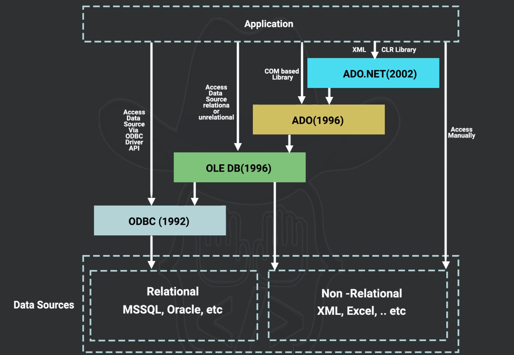
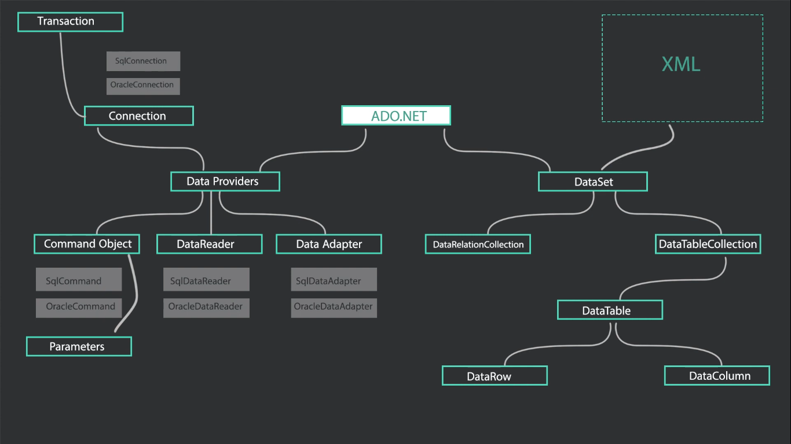

 ### 0.1. `Agenda`
  
- [1. `Why need DB in Program?`](#1-why-need-db-in-program)
- [2. `History`](#2-history)
- [3. `ADO.Net`](#3-adonet)
  - [3.1. `SqlConnection`](#31-sqlconnection)
    - [3.1.1. `Connection String`](#311-connection-string)
  - [3.2. `SqlCommand`](#32-sqlcommand)
    - [3.2.1. `SQL Injection`](#321-sql-injection)
    - [3.2.2. `Prevent SQL Injection`](#322-prevent-sql-injection)
    - [3.2.3. `Stored Procedure`](#323-stored-procedure)
  - [3.3. `SqlDataReader`](#33-sqldatareader)
  - [3.4. `SqlDataAdapter`](#34-sqldataadapter)
  - [3.5. `DataTable`](#35-datatable)
  - [3.6. `DataSet`](#36-dataset)
  - [3.7. `Modifying`](#37-modifying)
  - [3.8. `Data Binding`](#38-data-binding)
    - [3.8.1. `Complex Data Binding`](#381-complex-data-binding)
    - [3.8.2. `Simple Data Binding`](#382-simple-data-binding)
___
## 1. `Why need DB in Program?`
- **Storing data in a database rather than directly in the program has several advantages:**
  1. **Persistence:** Databases provide a way to store data persistently, even after the program has terminated.
  2. **Scalability:** Databases can handle large volumes of data efficiently.
  3. **Concurrency:** Databases support multiple users accessing and modifying data simultaneously.
  4. **Security**: Databases offer robust security features to protect data.
  5. **Data Integrity**: Databases enforce data integrity through constraints and transactions.
  6. **Querying**: Databases provide powerful querying capabilities to retrieve and manipulate data.
  7. **Backup and Recovery**: Databases offer mechanisms for data backup and recovery in case of failures.
## 2. `History`

- ADO.NET provides functionality to developers who write managed code similar to the functionality provided to native component object model (COM) developers by ActiveX Data Objects (ADO).
- We recommend that you use ADO.NET, not ADO, for accessing data in your .NET applications.
## 3. `ADO.Net`
- ADO.NET provides consistent access to data sources such as SQL Server and XML, and to data sources exposed through `OLE DB` (Relational or Non-Relational) and `ODBC` (Relational).

- using it I can open `pipeline` with the database 
  
- **ADO.Net api -> has classes help to handle data from outside get and post -> `System.Data`**
  - **Classes like :**
    - SqlConnection
    - SqlCommand
    - DataTable
    - DataSet `A DataSet represents a complete set of data including the tables that contain, order, and constrain the data, as well as the relationships between the tables.`

    

- Any DB has Provider which follow base provider ( ODBC Provider ) 
  - for Sql Server you install its provider `System.Data.SqlClient`
    
    - Commonly Used Types:
     
        - System.Data.SqlClient.SqlConnection
        - System.Data.SqlClient.SqlException
        - System.Data.SqlClient.SqlParameter
        - System.Data.SqlDbType
        - System.Data.SqlClient.SqlDataReader
        - System.Data.SqlClient.SqlCommand
        - System.Data.SqlClient.SqlTransaction
        - System.Data.SqlClient.SqlParameterCollection
        - System.Data.SqlClient.SqlClientFactory
         
### 3.1. `SqlConnection`

-  A `SqlConnection object` represents a `unique session` to a SQL Server data source.  

- it is equivalent to a `network connection to the server`.

- SqlConnection is unmanaged by GC.
  
  - so If the SqlConnection goes out of scope, it won't be closed.
  - Therefore, you must explicitly close the connection by calling Close or Dispose. `Close and Dispose are functionally equivalent.` 
    - If the connection pooling value Pooling is set to true or yes, the underlying connection is returned back to the connection pool.
    - On the other hand, if Pooling is set to false or no, the underlying connection to the server is actually closed. 

- Some Properties
  - ConnectionString
  - State
  - StateChange --event
  - InfoMessage --event
  - ChangeDatabase("to change the database in the connection string")

- Key points:

  - It should be opened inside a `using` block to ensure the connection is closed automatically `Dispose the connection`.
  - When connection pooling is enabled (by default), connections are returned to the pool rather than fully closed.
```cs
using (SqlConnection connection = new SqlConnection(connectionString))
{
    connection.Open();
    // Do work here; connection closed on following line.
}
```
#### 3.1.1. `Connection String`
  - SqlConnection has property name connectionString -> `Gets or sets the string used to open a SQL Server database.`
    
  - `connection.ConnectionString = "write the connection here";`
    - `Data Source` : mean the server has the DB , local ( . ) 
    - `initial catalog` : name of database in the engine
    - `integrated security` : true or false
      - true : use the win authentication
      - false : use sql authentication and here it need user and pass
  
  1. **Static Connection String**
   
      ```cs
      private static void OpenSqlConnection()
      {
          using (SqlConnection connection = new SqlConnection("Data Source=MSSQL1;Initial Catalog=Northwind;Integrated Security=true;"))
          {
              connection.Open();

              Console.WriteLine($"State: {connection.State}");
              Console.WriteLine($"ConnectionString: {connection.ConnectionString}");
          }
      }
      ```
  2. **Dynamic Connection String**
     - **What ?** : not put the ConnectionString in the C# code
     
     - **Why ?** ->  so when change the server of DB I don't need to modify the C# code build it again
     
     - **How ?**
       1. **using a `config` File**

            ```xml
            <configuration>
            <connectionStrings>
                <add name="DefaultConnection" 
                    connectionString="Data Source=MSSQL1;Initial Catalog=Northwind;Integrated Security=true;"
                    providerName="System.Data.SqlClient" />
            </connectionStrings>
            </configuration>
            ``` 
            **Accessing it in Code (C#)**
             
            ```cs
            using System.Configuration;

            public class DatabaseConfig
            {
                public string GetConnectionString()
                {
                    return ConfigurationManager.ConnectionStrings["DefaultConnection"].ConnectionString;
                }
            }            
            ```

       2. **Json file (appsettings.json)**
        
            ```json
            {
                "ConnectionStrings": {
                    "DefaultConnection": "Data Source=MSSQL1;Initial Catalog=Northwind;Integrated Security=true;"
                }
            }
            ```
            **Accessing it in Code (C#)**
            
            ```cs
            using Microsoft.Extensions.Configuration;

            public void GetConnection()
            {
                // Build the configuration from appsettings.json
                IConfiguration configuration = new ConfigurationBuilder()
                    .SetBasePath(Directory.GetCurrentDirectory())  // Set the base path where appsettings.json is located
                    .AddJsonFile("appsettings.json", optional: false, reloadOnChange: true)  // Load the appsettings.json file
                    .Build();

                // Get the connection string
                string connectionString = configuration.GetConnectionString("DefaultConnection");

                // Create the SqlConnection using the retrieved connection string
                using (SqlConnection connection = new SqlConnection(connectionString))
                {
                    //do anything
                }
            }
            ```
### 3.2. `SqlCommand`
  - class is used to prepare SQL Statement or StoredProcedure to execute in Sql Server Database 
      ```cs
          SqlCommand command = new SqlCommand(); // this can take the cmdtext or (cmdtext , Conn)
      ```
  - **its Properties**
    - *Connection* : pass the SqlConnection object
      
      ```cs
          SqlCommand command = new SqlCommand();
          command.Connection = Connection_Object;
      ```
    - *CommandText* : write the Sql Query
      
      ```cs
          SqlCommand command = new SqlCommand();
          command.CommandText = "Select * from Table";
      ```
    - *CommandType* : `CommandType.Text` or `CommandType.StoredProcedure`
      
      ```cs
          SqlCommand command = new SqlCommand();
          //command.CommandType = CommandType.Text; //CommandType is enum 
          command.CommandType = CommandType.StoredProcedure; 
      ```

  - **its Methods**  
    before you execute the command you open the connection
    - ExecuteReader -> when T-Sql statement 
     
      ```cs
          SqlCommand command = new SqlCommand("Select * form Table", connection);
          connection.open();
          gridView.DataSource = command.ExecuteReader();//return SqlDataReader
          gridView.DataBind();
      ``` 
    - ExecuteNonQuery -> when perform insert , update , delete return no of rows affected  
      also Stored Procedure used it
      
      ```cs
          SqlCommand command = new SqlCommand("Insert into Table values (1,'hi')", connection);
          connection.open();
          int rowsAffected = command.ExecuteNonQuery();//return int no of rows affected
      ```
    - ExecuteScalar -> when query returns single(Scalar) value (count , avg)
     
      ```cs
          SqlCommand command = new SqlCommand("Select count (ProductId) from products" , connection);
          int number = command.ExecuteScalar();//return int 
      ```
#### 3.2.1. `SQL Injection`
- Normal case

    ```cs
    string command = "Select * From tblProductInventory Where ProductName like '" + ProductNameTextBox.Text + "%'";
    SqlCommand cmd = new SqlCommand(command, con);
    con.Open();
    ProductsGridView.DataSource = cmd.ExecuteReader();
    ProductsGridView.DataBind();
    ```
    if input is `ip` the command will be `Select * From tblProductInventory Where ProductName like 'ip%'`

- if the input is `ip'; delete from tblProductInventory--`   
    ```sql
    Select from tblProductInventory where ProductName like 'ip';
    Delete from tblProductInventory --%' 
    ```

#### 3.2.2. `Prevent SQL Injection`   
>using  : - `Parameterized Query` - `Stored Procedure`
- Parameterized Query
    ```cs
    SqlCommand cmd = new SqlCommand("Select * From tblProductInventory Where ProductName like @ProductName");
    cmd.Parameters.AddWithValue("@ProductName", ProductNameTextBox.Text + "%");
    con.Open();
    ProductsGridView.DataSource = cmd.ExecuteReader();
    ProductsGridView.DataBind();
    ```
    will be in sql as
    ```sql
    exec sp_executesql N'Select * From tblProductInventory Where ProductName like @ProductName',
        N'@ProductName nvarchar(40)',
        @ProductName=N'ip''; Delete from tblProductInvento --%'
                <!-- he take the value until the ; and ignore the remain -->
    ```
- Stored Procedure
    
    ```sql
    Create Procedure spGetProductsByName
     @ProductName nvarchar(50) I
    as
    Begin
        Select * from tblProductInventory 
        where ProductName like @ProductName + '%'
    End
    ```
    same result will get when execute it and prevent the sql injection 
    ```cs 
    SqlCommand cmd = new SqlCommand("spGetProductsByName", con);
    cmd.CommandType = CommandType.Stored Procedure;
    cmd.Parameters.AddWithValue("@ProductName", ProductNameTextBox.Text);
    con.Open();

    ProductsGridView.DataSource = cmd.ExecuteReader();
    ProductsGridView.DataBind();
    ```

#### 3.2.3. `Stored Procedure`
- if i have StoredProcedure that take parameter and return out parameter
 
    ```sql
    Create Procedure spAddEmployee
    @Name nvarchar(50),
    @Gender nvarchar(20),
    @Salary int,
    @EmployeeId int Out
    as
    Begin
        Insert into tblEmployees values (@Name, @Gender, @Salary
        Select @EmployeeId = SCOPE_IDENTITY()
    End
    ```
- this need to pass `SqlParameter` object to StoredProcedure and config its direction to be output 
    ```cs
    SqlCommand cmd = new SqlCommand("spAddEmployee", con);
    cmd.CommandType = System.Data.CommandType.Stored Procedure;

    // input parameters 
    // also these can passed as SqlParameter objects
    cmd.Parameters.AddWithValue("@Name", txtEmployeeName.Text);
    cmd.Parameters.AddWithValue("@Gender", ddlGender.SelectedValue);
    cmd.Parameters.AddWithValue("@Salary", txtSalary.Text);

    //must define output parameter to get the out value returned from the StoredProcedure
    SqlParameter outputParameter = new SqlParameter();
    outputParameter.ParameterName = "@EmployeeId";
    outputParameter.SqlDbType = System.Data.SqlDbType.Int;
    outputParameter.Direction = System.Data.ParameterDirection.Output;

    cmd.Parameters.Add(outputParameter);

    con.Open();
    cmd.ExecuteNonQuery();
    string EmpId=outputParameter.Value.ToString();
    lblMessage.Text = "Employee ID = " + EmpId;
    ```

- **Modes to access data are two** 
  - Connected Mode -> using SqlDataReader
  - Disconnected Mode -> using SqlDataAdapter

### 3.3. `SqlDataReader`

- SqlDataReader reads data in the most efficient manner possible.

- SqlDataReader is connection oriented, meaning it `requires an active connection to the data source, while reading` data.
  - must open connection before ExecuteReader and close it after 
  - Data is valid as long as connection is opened 
    - but this cause locking to table 
    - also cause overhead

- SqlDataReader is `read-only` so not possible to change the data using SqlDataReader.

- SqlDataReader is `forward only`
  -  meaning once you read a record and go to the next record, there is no way to go back to the previous record.

- Instance of SqlDataReader cannot be created using the new operator
  - The SqlCommand object's ExecuteReader() method creates and returns an instance of SqlDataReader     
 
  ```cs
  SqlCommand cmd = new SqlCommand("Select ProductId, ProductName, UnitPrice From tblProducts", con);

  con.Open();

  using(SqlDataReader dr = cmd.ExecuteReader())
  {
      GridView1.DataSource = dr;
      GridView1.DataBind();
  }
  ```
    ```cs
    SqlCommand sqlGetPrdIDs = new SqlCommand("Select ProductID from Products", SqlCN);

    SqlCN.Open();

    SqlDataReader Dr = sqlGetPrdIDs.ExecuteReader();
    //here no data came form database in program just query 
    //cmbProductIDs.DataSource = Dr;
    /// data binding not fit in reader because data not in application
    //although i executed the cmd but while reading connection must be opened also because data came while reading data not while executing query here is `Readonly mode`
    while (Dr.Read()){
        //Dr.Read -> is reading record by record

        //cmbProductIds.Items.Add(Dr["ProductID"]);
        cmbProductIds.Items.Add(Dr.GetInt32("ProductID"));
    }
    ///or use DataBind()
    SqlCN.Close();
    ```

- what if i need to read row by row and making process on it
    ```cs
        con.Open();
        
        using(SqlDataReader dr = cmd.ExecuteReader())
        {
            DataTable table = new DataTable();
            table.Columns.Add("ID"); 
            table.Columns.Add("Name"); 
            table.Columns.Add("Price"); 
            table.Columns.Add("DiscountedPrice"); 

            while (dr.Read())
            {
                DataRow dataRow= table.NewRow();
                dataRow["ID"] = dr["ProductId"];
                dataRow["Name"] =dr["ProductName"];
                dataRow["Price"] = Convert.ToInt32(dr["UnitPrice"]);
                &ataRow["DiscountedPrice"] = Convert.ToInt32(dr["UnitPrice"]) * 0.9;
              
                table.Rows.Add(dataRow);
            }
            
            GridView1.DataSource = table;
            GridView1.DataBind()
        }
    ``` 
- if I return `two results`
    ```cs
    // the reader will contain all result returned throw command you write
    SqlCommand cmd new SqlCommand("Select * From tblProducts; Select From tblProduct Inventory", con); con.Open();
    con.Open();
    using (SqlDataReader rdr = cmd.ExecuteReader())
    {
        ProductsGridView.DataSource = rdr;
        ProductsGridView.DataBind();
        while(rdr.NextResult())
        {
            Product InventoryGridView.DataSource = rdr;
            ProductInventoryGridView.DataBind();
        }
    }

    ```

### 3.4. `SqlDataAdapter`
- disconnected data access model
  - connected mode not fit to read data and put it in runtime objects
   
    ```cs
    SqlConnection sq1CN = new SqlConnection("Data Source=.; Initial Catalog=NorthWind; Integrated Security=true");

    SqlCommand sqlCmd;

    SqlDataAdapter DA;

    DataTable DT;

    private void Execute(){
        sqlCmd = new SqlCommand("select * form Products",sqlCn);
       
        DA = new SqlDataAdapter(sqlCmd);

        DT = new DataTable(); // has data row objects

        DA.Fill(DT); // fill -> open sql connection, execute select command , fetch data into data table
        this.Text =DT.Rows.Count.ToString();
    }
    ```

- it works with multiple Constructors
  - SqlDataAdapter() 
    ```cs
    public static SqlDataAdapter CreateSqlDataAdapter(SqlConnection connection)
    {
        SqlDataAdapter adapter = new SqlDataAdapter();
        adapter.MissingSchemaAction = MissingSchemaAction.AddWithKey;

        // Create the commands.
        adapter.SelectCommand = new SqlCommand("SELECT CustomerID, CompanyName FROM CUSTOMERS", connection);

        adapter.InsertCommand = new SqlCommand(
            "INSERT INTO Customers (CustomerID, CompanyName) " +
            "VALUES (@CustomerID, @CompanyName)", connection);
       
        adapter.UpdateCommand = new SqlCommand(
            "UPDATE Customers SET CustomerID = @CustomerID, CompanyName = @CompanyName " +
            "WHERE CustomerID = @oldCustomerID", connection);
        
        adapter.DeleteCommand = new SqlCommand("DELETE FROM Customers WHERE CustomerID = @CustomerID", connection);

        // Create the parameters.
        adapter.InsertCommand.Parameters.Add("@CustomerID",SqlDbType.Char, 5, "CustomerID");
        adapter.InsertCommand.Parameters.Add("@CompanyName",SqlDbType.VarChar, 40, "CompanyName");

        adapter.UpdateCommand.Parameters.Add("@CustomerID",SqlDbType.Char, 5, "CustomerID");
        adapter.UpdateCommand.Parameters.Add("@CompanyName",SqlDbType.VarChar, 40, "CompanyName");
        adapter.UpdateCommand.Parameters.Add("@oldCustomerID",SqlDbType.Char, 5, "CustomerID").SourceVersion = DataRowVersion.Original;

        adapter.DeleteCommand.Parameters.Add("@CustomerID", SqlDbType.Char, 5, "CustomerID").SourceVersion = DataRowVersion.Original;

        return adapter;
    }
    ```

  - SqlDataAdapter(SqlCommand)
    ```cs
    public static SqlDataAdapter CreateSqlDataAdapter(SqlCommand selectCommand, SqlConnection connection)
    {
        SqlDataAdapter adapter = new SqlDataAdapter(selectCommand);

        return adapter;
    }
    ```

  - SqlDataAdapter(String, SqlConnection)
    ```cs
    public static SqlDataAdapter CreateSqlDataAdapter(string commandText,SqlConnection connection)
    {
        SqlDataAdapter adapter = new SqlDataAdapter(commandText, connection);

        return adapter;
    }
    ```

### 3.5. `DataTable`
- store one table only which has DataRow -> RowState
- State management
  - Types 
    - Detached : has row (record) but not add it to any table
    - Unchanged
    - Added
    - Modified
    - Deleted
  - How to show this states

    ```cs
    foreach (DataRow row in DT.Rows)
    {
        Debug.WriteLine($"{row.RowState}");
        if (row.RowState == DataRowState.Modified)
        {
            // also can get the previous data before modifying
            Debug.WriteLine($"Modified From {row["ProductName", DataRowVersion.Original]}" +
                                        $"To {row["ProductName", DataRowVersion.Current]}");
        }
    }
    ```
    
### 3.6. `DataSet`
- store table or more 
  
    ```cs
    SqlDataAdapter da new SqlDataAdapter("spGetProductAndCategoriesData", con); da.SelectCommand.CommandType = CommandType.Stored Procedure;
    DataSet ds = new DataSet();
    da.Fill(ds);
    
    ds.Tables[0].TableName = "ProductInventory";
    ds.Tables[1].TableName = "ProductCategories";
    
    GridView1.DataSource = ds.Tables["ProductInventory"];
    GridView2.DataSource = ds.Tables["ProductCategories"];
    
    GridView1.DataBind();
    GridView2.DataBind();

    ```

### 3.7. `Modifying`

- after modifying and save change
    ```cs
    void saveBTN(){

        dataAdapter.Update(dataTable);
        // will execute InsertCommand ,UpdateCommand , DeleteCommand which must be assigned to the adaptor
        //so before execute update must define these commands
    }
    ```

- OR making **SqlCommandBuilder**
  - and will Generate `Insert`, `Update`, `Delete` Commands based on select statement you write
    ```cs
    void saveBTN(){

        dataAdapter.Update(dataTable);
        
        SqlCommandBuilder builder = new SqlCommandBuilder(dataAdapter);
        dataAdapter.InsertCommand = builder.GetInsertCommand();
        dataAdapter.DeleteCommand = builder.GetDeleteCommand();
        dataAdapter.UpdateCommand = builder.GetUpdateCommand();
    }
    ```

### 3.8. `Data Binding`
#### 3.8.1. `Complex Data Binding`
```cs
    //complex data binding -> lists , grids
    //assign items of it with single fill assign with collection
    lstProducts.DataSourse = DT;
    //that will show the ToString function of the object
    // AND ToString of the DataRowView return the name of the class

    lstProducts.DisplayMember ="ProductName";
    lstProducts.ValueMember ="ProductId";//what is selected is id not  the display name
    lstProducts.SelectedValue//return the id of selected
```

#### 3.8.2. `Simple Data Binding`
```cs
SqlConnection sq1CN = new SqlConnection("Data Source=.; Initial Catalog=NorthWind; Integrated Security=true");
SqlCommand sqlCmd;
SqlDataAdapter DA;
DataTable DT = new DataTable();

private void frmProductsDetailedView_Load()
{
    sqlCmd= new SqlCommand("Select * from Products", sq1CN);
    DA= new SqlDataAdapter (sqlCmd);
    DA.Fill(DT);
    
    ///Simple Data Binding
    lblProductID.DataBindings.Add("Text", DT, "ProductID");
    txtProductName.DataBindings.Add("Text", DT, "ProductName");
    numUnitsInStock.DataBindings.Add("Value", DT, "UnitsInStock");

    //to move through data source
    BindingSource ProductBindingSource = new BindingSource(DT,"");//"" data member take name of the table if you pass dataset has many tables
    //this class listen to changes and affect in Database,
    //also can move forward and back

    lblProductID.DataBindings.Add("Text", ProductBindingSource, "ProductID");
    txtProductName.DataBindings.Add("Text", ProductBindingSource, "ProductName");
    numUnitsInStock.DataBindings.Add("Value", ProductBindingSource, "UnitsInStock");
}

void btnNextClick(){
    ProductBindingSource.MovePrevious();
    ProductBindingSource.MoveNext();
    ProductBindingSource.Current();
}
```