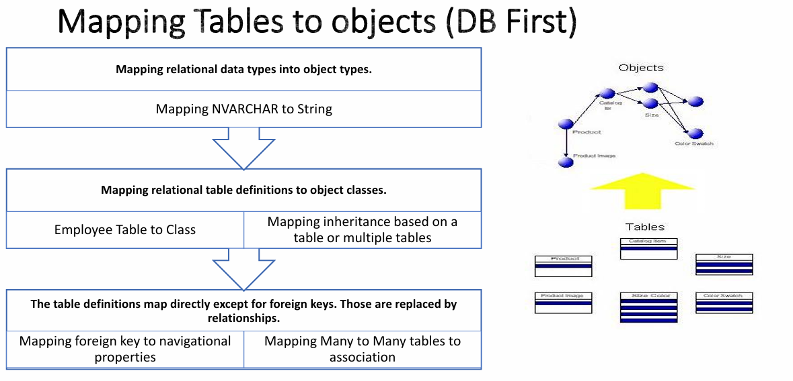

## 0.1. Table of Contects
- [1. Some Terminologies Before ORM](#1-some-terminologies-before-orm)
  - [1.1. Database Concepts and Standards](#11-database-concepts-and-standards)
    - [1.1.1. Relational DB](#111-relational-db)
    - [1.1.2. ACID Properties](#112-acid-properties)
    - [1.1.3. How data stored](#113-how-data-stored)
      - [1.1.3.1. Index](#1131-index)
    - [1.1.4. Locking](#114-locking)
  - [1.2. Object Relational Mapping](#12-object-relational-mapping)
    - [1.2.1. Data Persistence world](#121-data-persistence-world)
    - [1.2.2. Programming World](#122-programming-world)
    - [1.2.3. Impedance Mismatch](#123-impedance-mismatch)
  - [1.3. Object oriented database management systems (ODMS)](#13-object-oriented-database-management-systems-odms)
- [2. ORM](#2-orm)
  - [2.1. ORM Provides](#21-orm-provides)
  - [2.2. How ORM Works ?](#22-how-orm-works-)
  - [2.3. Type System and Meta Mapping](#23-type-system-and-meta-mapping)
    - [2.3.1. Type System](#231-type-system)
    - [2.3.2. Meta Mapping](#232-meta-mapping)
  - [2.4. Data Source Architectural Patterns](#24-data-source-architectural-patterns)
    - [2.4.1. Table Gateway](#241-table-gateway)
    - [2.4.2. Row Data Gateway](#242-row-data-gateway)
    - [2.4.3. Active Record Pattern](#243-active-record-pattern)
    - [2.4.4. Data Mapper Pattern](#244-data-mapper-pattern)
    - [2.4.5. Identity Field](#245-identity-field)
  - [2.5. Mapping Relationships](#25-mapping-relationships)
- [3. ORM `vs` MicroORM](#3-orm-vs-microorm)
  - [3.1. ORM](#31-orm)
    - [3.1.1. **Benefits**](#311-benefits)
    - [3.1.2. **Pain Points**](#312-pain-points)
    - [3.1.3. Optimizing your ORM experience](#313-optimizing-your-orm-experience)
  - [3.2. MicroORM](#32-microorm)
  - [3.3. Performance of SELECT mapping over 500 iterations - POCO serialization](#33-performance-of-select-mapping-over-500-iterations---poco-serialization)
    - [3.3.1. When to use a Micro-ORM](#331-when-to-use-a-micro-orm)
    - [3.3.2. When to use an ORM](#332-when-to-use-an-orm)


# 1. Some Terminologies Before ORM

## 1.1. Database Concepts and Standards
- Relational Database
- ACID Properties
- SQL Server stores data
- Locking
  - Levels of Locking.
  - Types of Locking.
  - Optimistic Vs. Pessimistic.

### 1.1.1. Relational DB
| SQL term           | Relational database term | Description                                                            |
| ------------------ | ------------------------ | ---------------------------------------------------------------------- |
| Row                | Tuple or record          | A data set representing a single item                                  |
| Column             | Attribute or field       | A labeled element of a tuple, e.g. "Address" or "Date of birth"        |
| Table              | Relation or Base relvar  | A set of tuples sharing the same attributes                            |
| View or Result set | Derived relvar           | Any set of tuples; a data report from the RDBMS in response to a query |

### 1.1.2. ACID Properties

- **A**tomicity
  - guarantee: A group of operations (**transaction**) either succeed or fail.
  - Something like transfer money from one account to another (one take and second give)
  - Must two operation success together or fail together
  - **Atomicity ->  Transaction Management Component**
  
    ```sql
    BEGIN TRANSACTION;
    BEGIN TRY

        -- here will do all operation i want
        -- the operations will done in memory if all success it will commit the transaction 
        -- if fail will catch the fail by rollback again
        COMMIT TRANSACTION;
    END TRY

    BEGIN CATCH
        ROLLBACK TRANSACTION; 
    END CATCH;
    ```
- **C**onsistency
  - guarantee: Your data will be consistent;
  - data be consistent means data follow constrains i make on it
  - none of the constraints you have on related data will ever be violated.  
  - **Consistency -> Application / Programmer**
  

- **I**solation
  - guarantee: One transaction cannot read data from another transaction that is not yet completed.
  - **Isolation -> Concurrency Control Manager** 

- **D**urability
  - guarantee: All of the changes have been recorded to a durable medium (such as a hard disk).
  - all time i want data, data must be exist 
  - **Durability -> Recovery Manager / DB Administration**

### 1.1.3. How data stored 

- logical ->  data in tables is stored in row and column format
- physically -> it stores data in something called data pages.   
            A data page is the fundamental unit of data storage in SQL 
Server and it is 8KB in size


**1- Page** 
- Smallest Unit of allocation; there are no half pages
- 8KB in Size or 8192 Bytes
- Header is 96 Bytes​
- Contains:
  - Page ID​
  - Pointers to Previous and Next Pages
  - Free space
  - Total # of rows on the page​
- 128 Pages = 1 Megabyte | 128,000 = 1 Gigabyte​
  
  why rows take different size ? -> because the vChar take size according to actual chars stored in it

some information about pages importance الي كتبته

**2- Extent**
- A set of 8 Pages 
- 1 Page = 8KB | 8 Pages = 64 KB
- Two Types
  - **`Mixed`**: contains pages owned by multiple objects (up to 8)​
  - **`Uniform`**: all pages contained within come from one object and the entire extent can only be used by that object​.  
- Note :   
Usually all new tables or indexes are allocated pages from `mixed extents`.  
SQL Server extent switches from `mixed to uniform` type only when a table or index has `at least eight or more pages`.
- `MIXED_PAGE_ALLOCATION = {OFF|ON}` (New for SQL 2016)

#### 1.1.3.1. Index
> EmployeeId is the primary key column So by default, a clustered index on this.  
> This means the data that is physically stored in the database is sorted by EmployeeId column
>**so cluster index is one because he is the only indicator sorting to data in physical**  
>`Root Node` 
>
>
>
>the tree is logical but stored in cache in metadata of sql server 

1. Index Seek  
   cluster index seek searching for element using his cluster index (the PK)  
   search by cluster index using the tree created
   
2. Index Scan 
   scan all pages from first page which get by cluster index to get the data  
   Sequential search

3. **Index Seek (non-cluster)**
  >**to reduce the search time because it's seq using non-cluster index  
  >How it created ?**
  >
  > 
  > 

1. Table scan

   - Heap Table is a table that has no PK (no Cluster Index)  
     sql server create `RowId` and make it cluster to make the tree according to it 
   - but still make scan from first to last element to get the row i want  
     because he don't know the index he just know other attribute 
   - but what if he make non-cluster index he map the two index together  
     so when search with no-cluster index he map to cluster index and get in in one read `Index Seek (non-cluster)`


### 1.1.4. Locking
If there are two transaction must first transaction is lock the table and second is blocked until the first is completed
Default the sql server is locked about the table
- **Levels**
  - Table Level
    - lock the complete table.
  - Hobt Level (Partitions)
    - When a table is partitioned it is possible a Single partition will be locked.
  - Page Level
    - A page lock in SQL Server will lock 8K worth of data even when your query only needs 10 bytes from the page.
    - So your query will lock additional data which you do not request in your query.
  - Row level
    - one or more specific rows will be locked, and the adjacent rows are still available for locking by concurrent queries.
- **Types**
  - Binary Locks 
    -  Too restrictive for data items because at most one transaction can hold on a given item whether the  transaction is reading or writing.
  -  Shared/Exclusive Locks
     - Shared(or Read) Locks : allow multiple users to read data, but do not allow any users to change that data
     - Exclusive(or Write) Locks : allows only one user/connection to update a particular piece of data (insert, update, and delete).
- **Optimistic** vs **Pessimistic**
    
  |Optimistic|Pessimistic|
  |--|--|
  |means that multiple users can open a record for editing at the same Time.| means that a user can't open a record for editing if another user has already opened it.
  | You'd use this when the chance of a conflict between users is low.|You'd use this when the chance of a conflict between users is high.


## 1.2. Object Relational Mapping
### 1.2.1. Data Persistence world
- Data persistence doesn’t mean a DB its means the ability to save some kind of information and retrieve it later , could be file .
- A most common approach is a Relational Database.
- The Relational Database key terms are Table, Column, record and Relations.
- Database uses a declarative language “SQL” slightly differs from one implementation to another.
### 1.2.2. Programming World
- Procedural, Object oriented , …
- In an object oriented model the key terms are class , attribute , object and Relations.
- All programming language are imperative.

The **Problem** here is that every world has its own language, structure, ways and techniques.  
From the start of both these worlds, visionaries try to mix these worlds together.
### 1.2.3. Impedance Mismatch
- Declarative vs. Imperative programming
  - The object-oriented paradigm is based on practical software engineering principles
  - The relational paradigm, however, is based on proven mathematical principles
- Instance vs. Record
 • Object Life Cycle
- Mismatched Concepts
  -  No Encapsulation, Inheritance, Polymorphism
  - No concepts of Interface
- Structural differences
- Validation vs. Integrity Constraints
- Association vs. Foreign Keys
- Type Differences
  - String vs. NVAR CHAR
- Functions vs Stored Procedures
- Transactional Differences
- Performance


## 1.3. Object oriented database management systems (ODMS)
- When you integrate database capabilities with object programming 
language capabilities,  
the result is an object-oriented database 
management system (ODBMS).

- An ODBMS makes database objects appear as programming language 
objects in one or more existing programming languages.

- Object database management systems extend the object programming 
language with `transparently persistent data`, `concurrency control`, `data recovery`, `associative queries`, and other database capabilities.

- With ODBMS there is no need to:
  - Develop two data models.
  - Maintain two data models. 
  - Develop mapping between the relational and object models.
  - Maintain the mapping between the relational and object models.


# 2. ORM
## 2.1. ORM Provides
- Remove the need of learning another languages (SQL).
- ORMs abstract the developers from the complexity of The DB.(in some cases the best is to go to sql and handle by yourself)
- ORM Tools provide Data source ignorant API’s that allow developers 
to switch the Data Source without affecting the application
## 2.2. How ORM Works ?
- Most ORM tools rely heavily on `metadata` about both the `data source` and `objects`, 
  - so that the objects need to know nothing about the data source and the data source doesn’t need to know anything about how the data is structured in the application.
- ORM provides data `repositories` or other data sources and sinks,
  -  while simultaneously hiding the often changing details of related interfaces from developers and the code they create.



## 2.3. Type System and Meta Mapping
### 2.3.1. Type System 
 
    | Database type | Programming Type |
    | ------------- | ---------------- |
    | NVarchar      | String           |
    | Date          | DateTime         |
    | Time          | DateTime         |
    | Int           | Int              |
    | bit           | Boolean          |
    | Decimal       | Decimal          |
    | Float         | Float            |
    | Double        | Double           |

### 2.3.2. Meta Mapping
- Most ORMs use a meta data conversion look up table to convert between Relational Scheme and OOP
- Conversion table includes:
  - Types Mapping
  - Naming Convention
  - otherwise you need to make it using configuration
- **The Result will be a mapping table between types**

## 2.4. Data Source Architectural Patterns
how we use ORM to manage the code 
we have different patterns
### 2.4.1. Table Gateway
- A Table Data Gateway holds all the SQL for accessing a single table or view: selects, inserts, updates, and deletes.
  - Other code calls its methods for all interaction with the database.
- is concerned for the class , take the class and make operations above it

### 2.4.2. Row Data Gateway
- gives you objects that look exactly like the record in your record structure but can be accessed with the regular mechanisms of your programming language.
- have the codes that accessing the objects throw the SQL
- All details of data source access are hidden behind this interface.
- It is totally separated:
  - The access code 
  - The data manipulation code
  - The presentation entities
- 
### 2.4.3. Active Record Pattern
- An object carries both data and access logic
- this way all people know how to read and write their data to and from the database.
- The Active Record class typically has methods that do the following:
  - Construct an instance of the Active Record from a SQL result set row
  - Construct a new instance for later insertion into the table
  - Static finder methods to wrap commonly used SQL queries and return Active Record objects
  - Update the database and insert into it the data in the Active Record
  - Get and set the fields
  - Implement some pieces of business logic
  
  

**Active Record Pattern is very suitable for very simple Business logic that only contains CRUD Operations.**

### 2.4.4. Data Mapper Pattern

**Data Mapper Pattern is very suitable for cases where the Database and the domain entities evolve separately.**


### 2.4.5. Identity Field
- Saves a database key field in an object to maintain identity between an in-memory object and a database row.
- There Are Two Main Methods to Represent an Identity Field:
    - Metadata (Configuration or Attribute based)
    - Same Name (A Key should always name as ID)
- Creating Keys
  - Database Created
    - The Database creates the key and usually sets an auto increment identifier.
  - GUID
    - (Globally Unique Identifier) is a number generated on one machine that's guaranteed to be unique across all machines in space and time.
  - Business Defined Key
    -  A Key is known to be unique e.g. SSN

## 2.5. Mapping Relationships
- OOP doesn’t have the concept of Foreign Keys instead it is created as associations.

- Relationships have two points of view:
  - First Category (Cardinality):
    - One to One Relationship: Object Reference – Object Reference
    - One to Many Relationship: Object Reference – Collection
    - Many to Many Relationship: Collection – Collection
  - Second Category (Direction):
    - Uni-directional Relationship: A root object references the other one `only one can get the another but the opposite not`
    - Bi-directional Relationship: Both Objects reference each other `base and child in the relation can access each other`


# 3. ORM `vs` MicroORM 


## 3.1. ORM
### 3.1.1. **Benefits**

- Hide details of database

- Generate SQL based on object model and configuration

- State Change Tracking

   
- Complex mapping strategies
  - Many-to-many relationships
  - Inheritance
  
### 3.1.2. **Pain Points**
- Black box code generation - What is going on?
- Dealing with disconnected entities (in a web context)
- Performance Problems
  - Check out MiniProfiler (http://miniprofiler.com/)
- Eager Loading vs Lazy Loading --> i think new implementation of lazy load was perfect
- Complex Inheritance Chains


### 3.1.3. Optimizing your ORM experience
- No Tracking
- Use SQL Projections
- Avoid Lazy Loading
  - here he talks about the old lazy load which lead to (N+1) problem which go to DB N times request
- Avoid the God Context
- Write SQL!


## 3.2. MicroORM

Just do one simple thing, take data coming from a database query an use it to populate pre-existing or dynamic objects.
- Nothing more and nothing less
- No frills approach: Not identity mapping, no lazy load
- SQL *MUST* be written manually (no LINQ or other intermediate language like HQL)
- Tries not to introduce friction when accessing and operating on data
  
One of the most used, proven and well-known is [Dapper .NET](https://blogs.msdn.microsoft.com/dotnet/2016/11/09/net-core-data-access/)

## 3.3. Performance of SELECT mapping over 500 iterations - POCO serialization


### 3.3.1. When to use a Micro-ORM
- Speed & Efficiency are extremely important
- You don't mind (or prefer) writing your own SQL
- Simple object graphs
- Read models / Reports
  
### 3.3.2. When to use an ORM
- You like the convenience of change tracking
- Your application logic requires a complex object graph
- You prefer writing queries using LINQ

