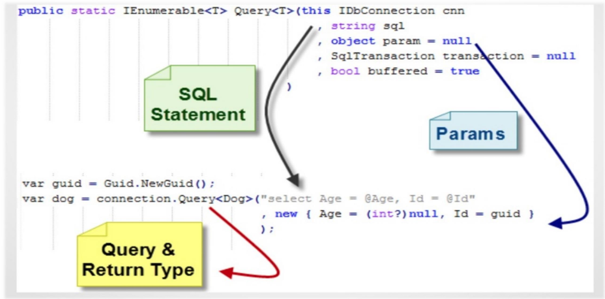
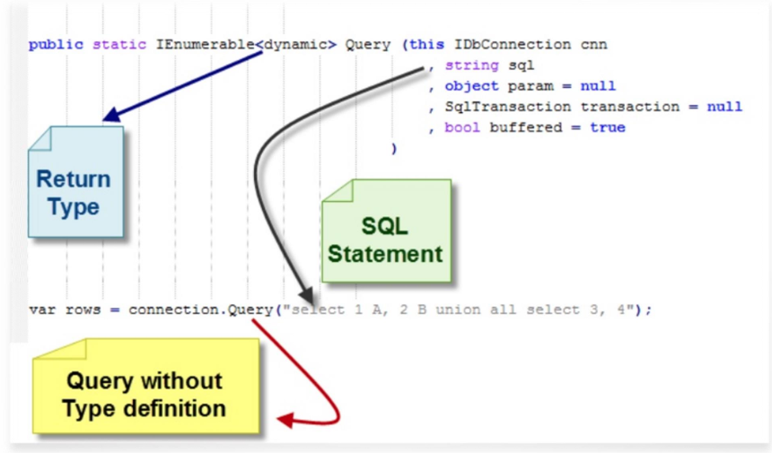
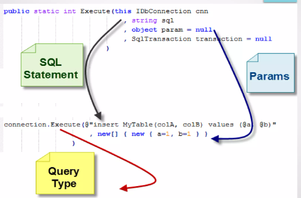
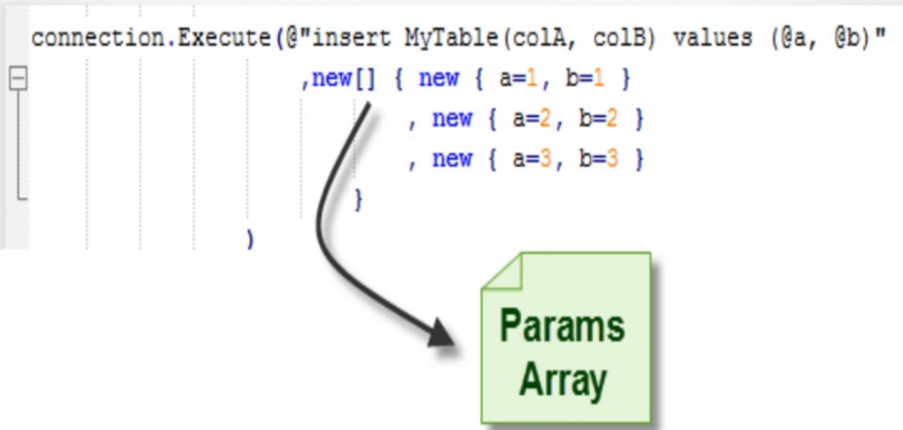
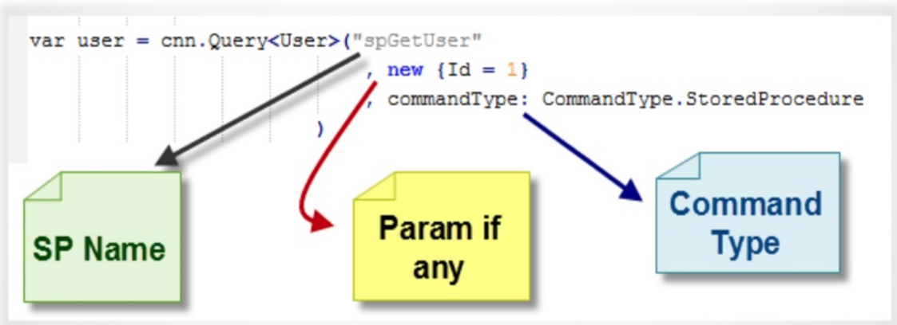
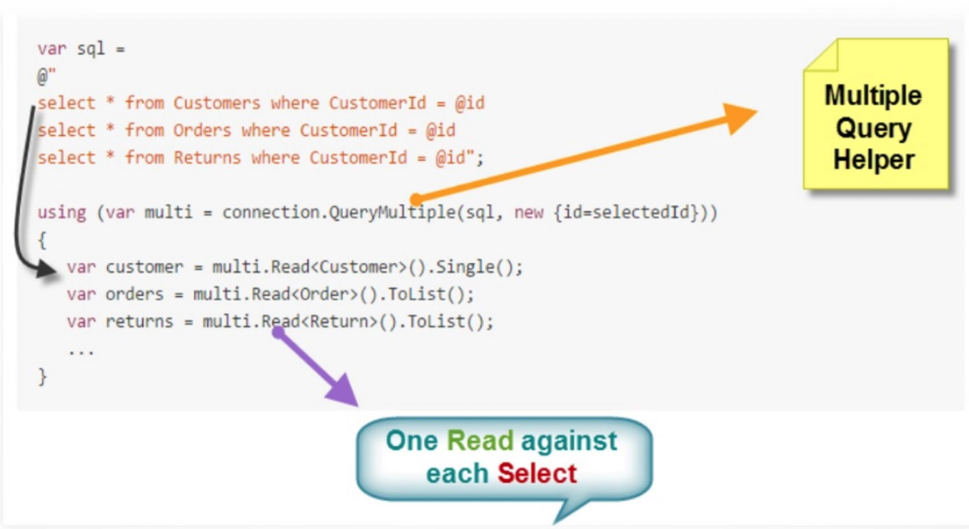

### 0.1. Agenda
- [1. Dapper](#1-dapper)
  - [1.1. What is Dapper](#11-what-is-dapper)
  - [1.2. How To used](#12-how-to-used)
    - [1.2.1. Query with Strongly Typed Result](#121-query-with-strongly-typed-result)
    - [1.2.2. Query with Dynamic Object Result](#122-query-with-dynamic-object-result)
    - [1.2.3. Command with No Result](#123-command-with-no-result)
    - [1.2.4. Execute Command multiple times](#124-execute-command-multiple-times)
    - [1.2.5. Execute a Stored Procedure](#125-execute-a-stored-procedure)
    - [1.2.6. Multiple Results in Single Query](#126-multiple-results-in-single-query)
- [2. Mix EFcore , Dapper](#2-mix-efcore--dapper)

___


## 1. Dapper
### 1.1. What is Dapper 
Dapper is a "single file” (SqlMapper.cs) that will extend your IDbConnection interface.  

Represent some of Extensions Methods work on any object of `SqlConnection` , `DbConnection` , `IDbConnection`
> - Simple and lightweight to implement / use.
> - Open source 
> - Provide enough helpers / support to do ORM activities.
> - Doesn't suppress developers SQL skills because we still write SQL Statements.

- Difference with ADO  -> I write sql query but return business object data

- It provides 3 helpers:
  > - Execute a query and map the results to a `list of dynamic objects`
  > - Execute a query and map it to a `strongly typed List (Business Objects)`   
  actually it return `IEnumerable`
  > - Execute a `Command that returns no results` Create, Update, Delete.     
  
   
```cs
var configuration = new Configuration Builder()
                                        .AddJsonFile("appsettings.json")
                                        .Build();

IDbConnection db = new SqlConnection(configuration.GetSection("constr").Value);

var sql = "SELECT * FROM WALLETS";

    Console.WriteLine("-------------using Dynamic Query-------------");
    var resultAsDynamic = db.Query(sql);

    foreach (var item in resultAsDynamic)
    Console.WriteLine(item);

    Console.WriteLine("-------------using Typed Query-------------");
    var wallets = db.Query<Wallet>(sql);

    foreach (var wallet in wallets)
    Console.WriteLine(wallet);

```

### 1.2. How To used 
- any Prams passed to execute must be object of this params
  
  > int id = 5;  
  > var sql = "Delete from products where Id = @ID";  
  > var result = connection.Execute(sql , new { ID = id } );
#### 1.2.1. Query with Strongly Typed Result
  
#### 1.2.2. Query with Dynamic Object Result
  
#### 1.2.3. Command with No Result
  
#### 1.2.4. Execute Command multiple times
  
#### 1.2.5. Execute a Stored Procedure
  
#### 1.2.6. Multiple Results in Single Query
  
  


## 2. Mix EFcore , Dapper
- Dapper mostly used to read data without changeTracker

  - to make it read and write must track by yourself the state 

- EF for insert , update , delete => because has change Tracker

```cs
interface IManager<T>
{
    bool Add(T item);
    bool Delete(long ID);
    List<T> GetAll();
    T GetByID(long ID);
    bool Update(T item);
}

class ProductManager : IManager<Product>
{
    //IDbConnection DbConnection = new SqlConnection("Data Source =.; Initial Catalog = Northwind; Integrated Security = true");

    IDbConnection DbConnection;

    public ProductManager(NorthwindContext context)
        => DbConnection = context.Database.GetDbConnection();

    public bool Add(Product item)
    {
        try
        {
            return
                DbConnection.Execute("INSERT INTO Products " +
                    "(ProductName, SupplierID, CategoryID, QuantityPerUnit, UnitPrice, UnitsInStock, UnitsOnOrder," +
                    " ReorderLevel, Discontinued) VALUES(@ProductName, @SupplierID, @CategoryID, @QuantityPerUnit," +
                    " @UnitPrice, @UnitsInStock, @UnitsOnOrder, @ReorderLevel, @Discontinued)", item) > 0;
                    
        }
        catch
        {
            return false;
        }
    }

    public bool Delete(long ID)
    => DbConnection.Execute("DeleteProductByID", new { ProductID = ID }, commandType: CommandType.StoredProcedure) > 0;

    public List<Product> GetAll()
        => DbConnection.Query<Product>("SelectAllProducts", commandType: CommandType.StoredProcedure)?.ToList() ?? new();

    public Product GetByID(long ID)
        => DbConnection.QueryFirstOrDefault<Product>("Select * from Products where ProductID = @ProductID",
            new { ProductID = ID });


    public bool Update(Product item)
        => DbConnection.Execute("PrdsUpdateCommand", 
            new
            {
                ProductName = item.ProductName,
                SupplierID = item.SupplierId,
                CategoryID = item.CategoryId,
                QuantityPerUnit = item.QuantityPerUnit,
                UnitPrice = item.UnitPrice,
                UnitsInStock = item.UnitsInStock,
                UnitsOnOrder = item.UnitsOnOrder,
                ReorderLevel = item.ReorderLevel,
                ProductID = item.ProductId,
                Discontinued = item.Discontinued
            }
            , commandType: CommandType.StoredProcedure) > 0;
}

``` 