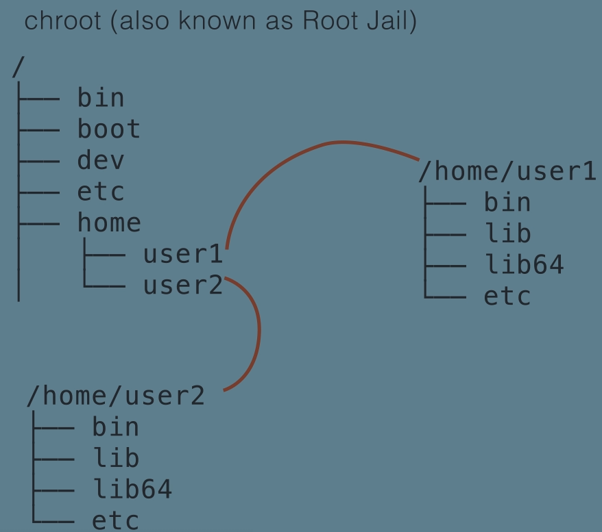
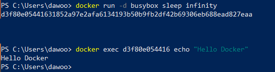
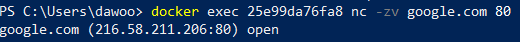
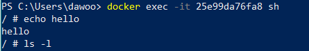
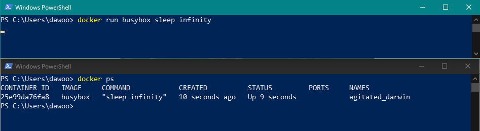

###  0.1. Material
  - [Docker from zero to hero (Arabic) (Udemy)](https://www.udemy.com/course/docker-from-zero-to-hero-arabic/?couponCode=24T3MT120924) For Eng. Ahmed Elfakharany

### 0.2. Contents
- [1. Introduction](#1-introduction)
  - [1.1. What is a kernel and what is an operating system?](#11-what-is-a-kernel-and-what-is-an-operating-system)
  - [1.2. What is a Linux container and what is Docker?](#12-what-is-a-linux-container-and-what-is-docker)
  - [1.3. Installing Docker](#13-installing-docker)
- [2. Your First Steps with Docker](#2-your-first-steps-with-docker)
  - [2.1. Running your first docker container](#21-running-your-first-docker-container)
    - [2.1.1. `Pull image`](#211-pull-image)
    - [2.1.2. `Run container`](#212-run-container)
    - [2.1.3. `List containers`](#213-list-containers)
    - [2.1.4. `Stop container`](#214-stop-container)
    - [2.1.5. `Remove the container`](#215-remove-the-container)
    - [2.1.6. `Remove the image`](#216-remove-the-image)


## 1. Introduction
### 1.1. What is a kernel and what is an operating system?
- **Kernel** is the core of OS which is the interface between the hardware and the software.
- Hardware : has very much different types and models.
- so must be a layer between the hardware and the software to make the software work on any hardware.
- The layer is kernel which the deriver is installed upon it
- **OS** is the kernel + the software that is installed upon it.

<br>

Linux is a kernel (open source) , and the software that is installed upon it is called GNU.
- For Example
  - Redhat Enterprise Linux (RHEL)
  - linux(free) + Redhat software(paid) = RHEL 

- ترتيب العمليات الاساسية 
  - لو فتحت ملف صوت (vlc)في برنامج هيشتغل 
  - البرنامج هيبقي محتاج صوت فيقول للكيرنال فالكيرنال تروح للدرايفر
  - ومن خلاله هيكلم كارت الصوت ويحور البيانات لمحتوى صوتي


### 1.2. What is a Linux container and what is Docker?
**Need of isolation**
- in the past :
  - there was one computer with many users and each user has his own environment.
  - so the need of isolation was to make each user has his own storage, memory, CPU, and network.
>   - **IBM** make isolation in space `chroot` command (also known as Root Jail) to make each user has his own environment.
>   
>       
>    - Also `ulimit` command to limit the resources(memory , space) of each user .
>    - `nice/renice` command to limit the CPU usage of each user.
___
>- **Virtualization** : way to organize the resources of the computer to make several virtual machines.
>   - make full isolation between the virtual machines.
>    - but it's heavy because each virtual machine has its own OS.
> 
>So we have two level of virtualization :
>- Hardware virtualization : each virtual machine has its own OS.
>   - pure hardware install software `hypervisor` on it without kernel that make many virtual machines on HW then each VM has its own OS.
>- OS virtualization : each virtual machine has its own environment but share the os.

**Linux make in 2002**
  - **Control Groups (cgroups)** : is processes container
  - **Linux Namespaces** : is the network, storage, and memory container


**Then Linux in 2008**
  - **Linux Containers (LXC)** : is a tool to make containers with the help of cgroups and namespaces. it's low level tool treat with the kernel.

**Then in 2013 they make Docker**
  - high level tool to make containers with the help of LXC.
  - which is working on the linux kernel 
  - so anything installed in Docker container work upon the linux kernel
  - so any other OS can work with this program as long as this os is build upon linux kernel.

- `This can help in :`
  - versioning : to make the same environment for the developer and the production.
  - making dependencies in the container and not in the OS so the OS can be updated without affecting the dependencies.


### 1.3. Installing Docker
- Docker is working with the linux kernel so it can't be installed on windows or mac directly.

**So Docker Desktop for Windows and Mac** 
- is a lightweight virtual machine service that has a linux kernel and docker installed on it.
>- Docker client : is the tool that you use to interact with the docker engine or server.
>- Docker server : the engine that is responsible for running the linux and has the containers (LNC).

- Mac 
  - the docker desktop is installed on the mac step forward.

- Windows  
  - There are two way because windows has two ways to run linux :
    - **Hyper-V** : is a full virtual machine that has a linux kernel and docker installed on it.

    - **WSL2** : Windows Subsystem for Linux
      - is a lightweight virtual machine that has a linux kernel and docker installed on it.

## 2. Your First Steps with Docker
### 2.1. Running your first docker container
- Images : is the template of the container.

  >- template is the structure of the container.
  >- so the image is the structure of the container.
  >- so can has one image and many containers.

- Containers : is the instance of the image.

<br>

___
#### 2.1.1. `Pull image`
  ```docker
  docker pull busybox 
  ```
  - docker registry look like repository but for docker images
  - from docker registry -> there is docker hub 
  - docker hub is the public registry for docker images
  
  - `to know the images that you have`
    ```docker
    docker images
    ```
    ```
    REPOSITORY   TAG       IMAGE ID       CREATED        SIZE
    busybox      latest    db142d433cdd   2 weeks ago    1.23MB
    Mssql        latest    020584afccce   2 weeks ago    1.23MB
    ```
  ___
#### 2.1.2. `Run container`
- Run container without command
  >  ```docker
  >  docker run busybox
  >  ```
  >  - if the image is not found in the local machine it will download it from the docker hub.
  >    - not must to pull the image before running the container.
  >  - if you run the container without any command it will run and exit immediately.
  
  >- There are two types of images 
  >   - Image with entry point command : once you run the container it will run the command and exit.
  >   - Image without entry point command : once you run the container it will run the container and exit.

- Run container with command
  >```docker
  >docker run busybox echo "Hello Docker"
  >```
  >- the command will run and exit.

- Run container in foreground
  >  ```docker
  >  docker run busybox sleep 5s
  >  ```  
  > - during the 5 seconds the container will run and not exit.
  >   - you you can't run any other command. 
  > - once the 5 seconds are finished the container will exit.

 
- Run container in background
  >  ```docker
  >  docker run -d busybox sleep infinity
  >  
  >  # -d : to run the container in the background.
  >  # equal to --detach
  >  ```
  >  - to run the container in the background.
  >  - the container will run and not exit.
  - once this container is running in background you use it to run other commands.
      ```docker
      docker exec <container_id> Command
      ```
      

      

      - also can open shell in the container so can run many commands.
        
        
        `-it : to run the container in the interactive mode.`


>**Note**  
  Running of the container is very fast process because it's not like the virtual machine that has to boot the OS.

___
#### 2.1.3. `List containers`
  >  ```docker
  >  docker ps
  >  ```
  >  - to show the running containers.
  >  - once the container command is finished the container will exit.
  >  - if not finished the container will be in the list.
  >
  >     

  >  ```docker
  >  docker ps -a
  >  ```
  >  ```
  >  CONTAINER ID   IMAGE     COMMAND             CREATED          STATUS                      PORTS     NAMES
  >  13902bea8d9b   busybox   "ls -l"             4 minutes ago    Exited (0) 3 minutes ago              blissful_euler              
  >  8cc8ee3ad60e   busybox   "echo helloWorld"   13 minutes ago   Exited (0) 13 minutes ago             laughing_euler              
  >  d23362ac38ca   busybox   "sh"                15 minutes ago   Exited (0) 15 minutes ago             compassionate_mccarthy 
  >  ```
  >  - to show all the containers that you have run.
  >  - the container that has exited will be in the list. 

___
#### 2.1.4. `Stop container`
  >  ```docker
  >  docker stop <container_id>
  >  ```
  >  - to stop the container.
  >  - the container will be in the list of the exited containers.
  >  - the container will not be deleted so can start it again.
  - Start the container again
    
    ```docker
    docker start <container_id>
    ```

___
#### 2.1.5. `Remove the container`
  >  ```docker
  >  docker rm <container_id>
  >  ```
  >  - to remove the container after you stopped it.
  >  - once the container is removed it will not be in the list of the exited containers.
  >  - the container will be deleted.

  - to remove the container without stopping it.

    ```docker
    docker rm -f <container_id>
    ```
___
#### 2.1.6. `Remove the image`
  ```docker
  docker rmi <image_id>
  ```
  - if container is running upon the image you can't remove the image.
 
  - so you have to remove the container first.
  
    ```docker
    docker rmi -f <image_id>
    ```