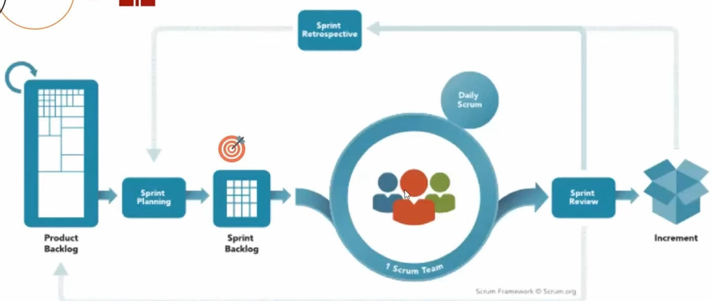
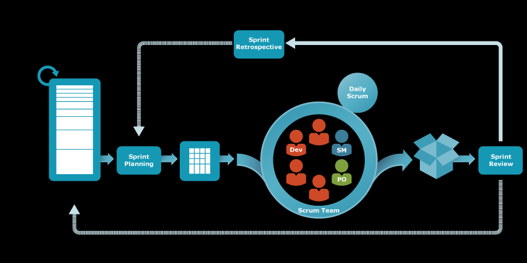
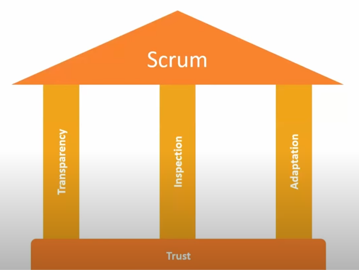
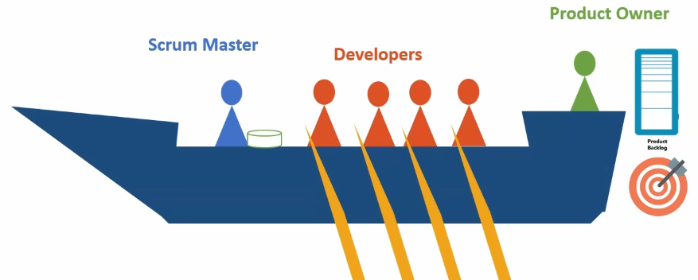
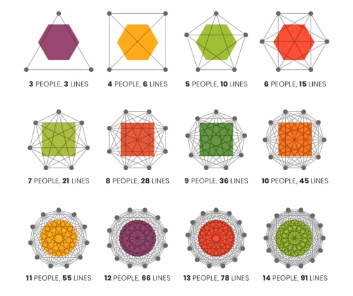
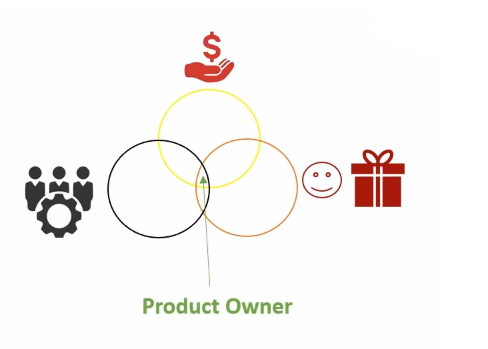
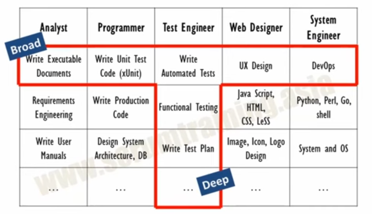
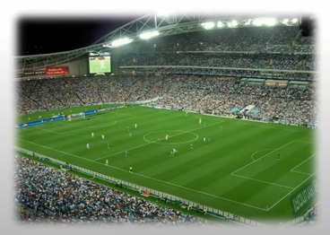

[Scrum Video](https://www.youtube.com/watch?v=MHBXs-iIjrk)

- [1. Introduction to Scrum](#1-introduction-to-scrum)
- [2. History](#2-history)
- [3. Scrum Guide](#3-scrum-guide)
- [4. Scrum Theory](#4-scrum-theory)
- [5. Scrum Values](#5-scrum-values)
- [6. Scrum Team](#6-scrum-team)
  - [6.1. Developers](#61-developers)
  - [6.2. Product Owner](#62-product-owner)
  - [6.3. Scrum Master](#63-scrum-master)
- [7. Scrum Events](#7-scrum-events)
  - [7.1. Sprint Planning](#71-sprint-planning)
  - [7.2. Daily Scrum](#72-daily-scrum)
  - [7.3. Sprint Review](#73-sprint-review)
  - [7.4. Sprint Retrospective](#74-sprint-retrospective)
- [8. Scrum Artifacts](#8-scrum-artifacts)
  - [8.1. Product Backlog](#81-product-backlog)

## 1. Introduction to Scrum
- scrum is a framework for developing, delivering, and sustaining complex products.

Map of Scrum
- Product Backlog : List of all the features that are needed in the product.
- Sprint Planning like month , 2 weeks, 3 weeks
- Sprint Backlog : List of all the features that are needed in the product. 
- Daily Scrum : 15 minutes meeting once a day to discuss the progress.
- Sprint Review : Review the product and get feedback.

    

## 2. History
- Scrum was introduced by Jeff Sutherland and Ken Schwaber in 1995.
- presented paper `Scrum Development Process` at OOPSLA conference in 1995.

## 3. Scrum Guide
- Scrum Guide is the official guide to Scrum.
- Definition : lightweight framework that helps people, teams, and organizations generate value `through adaptive solutions for complex problems.`
- Scrum requires a `Scrum Master` to foster an environment where:
    - A **Product Owner** orders the work for a complex problem into a Product Backlog.
    - The **Scrum Team** turns a selection of the work into an Increment of value during a Sprint.
    - The Scrum Team and its stakeholders inspect the results and adjust for the next Sprint.
    - Repeating the cycle of inspecting and adapting.
  
  

## 4. Scrum Theory
> - Scrum built on empiricism and lean thinking.
> - Scrum is founded on empirical process control theory, or empiricism.

**Empiricism** :
  - Knowledge comes from experience and making decisions based on what is known.التجربة

1. **Transparency** : All aspects of the process must be **visible** to those responsible for the outcome.
    - Inspection without transparency is misleading and wasteful.
    - لو مش شايف نتيجة يبقي في خطأ ووقت ضائع

2. **Inspection** : Scrum users must frequently inspect Scrum artifacts and progress toward a Sprint Goal to detect undesirable variances.

3. **Adaptation** : adjust the process, product, or work environment as soon as possible to minimize further deviation.

 **Lean Thinking** : reduce waste and focus on value.

## 5. Scrum Values
Scrum values are the life blood, the beating heart of Scrum, without it scrum is just a skeleton.

- Five values
  - Commitment
  - Focus
  - Openness
  - Respect
  - Courage

`Openness`
- to all stakeholders and their feedback.
- there is Self reporting(no hiding), also Scrum Events must openness for anything.

`Courage`
- to do the right thing and work on tough problems.

`Respect`
- respect each other's skills, knowledge, and experience.

`Focus`
- Focus on the Sprint Goal.
- on the work of the Sprint and the goals of the Scrum Team.
- only Sprint Timebox.

`Commitment`
- to achieve the goals of the Scrum Team.

## 6. Scrum Team
- Fundamental unit of Scrum is a small team of people.
  - Product Owner
  - Scrum Master
  - Developers

>- `Vikings Team`
>    - Vikings King : `Product Owner` : Prioritize the work and determine the goals.
>    - Vikings Warrior : `Developers` : who work already on the product.
>   - Vikings Shield : `Scrum Master` : apply the events and rules of Scrum according to scrum goals.
>
>   

- Within a scrum team, there are no sub-teams or hierarchies.
- it's a cohesive unit of professionals focused on one objective at a time, the Product Goal.

- `small enough` to remain nimble and `large enough` to complete significant work within a Sprint typically<=10.

  
  
  as the team increase as the communication increase and the productivity decrease.

- Responsibility
  - all product-related activities
  - empowered to manage their work
  - focus and consistency
  - accountable for creating high-value Increments every sprint.

### 6.1. Developers
the specific skills needed developers are often broad and will vary with the product.

Developers are responsible for:
- creating a plan for the Sprint `Sprint Backlog`
- instilling quality by `adhering to a Definition (Quality) of Done`
- adapting their plan each day toward the Sprint Goal `Daily Scrum`
- holding each other accountable as professionals.
___
**Scrum Values for Developers**

>Openness
>- open about their work and progress made.
>- problems and conflicts are surfaced and resolved.
>- collaborate with the Product Owner to ensure everyone understands the work.

>Courage
>- rasing impediments and issues.
>- incorporating feedback into the product.
>- embracing change and uncertainty.

>Respect
>- ordering of Product Backlog as per the Product Owner.
>- Delivering work of high quality and value.
>- respect stakeholders and their feedback.
>- respect other team members and their skills.

>Focus
>- creating Done Increments.
>- finishing work before starting new work.
>- Growing their cross-functional capabilities.
>- team goals rather than individual goals.

>Commitment
>- to self-management and collaboration.
>- uphold transparency so they can regularly inspect their progress.

### 6.2. Product Owner
- The Product Owner is accountable for maximizing the value of the product resulting from the work of the Scrum Team.
- also communication is key for the Product Owner. 

  
    
    Between investors, clients, and the Scrum Team.

- Product owner is also accountable for effective `Product Backlog`.
  - Product Goal
  - Product Backlog items and their ordering.
  
  - Make sure that the Product Backlog is visible, transparent, and clear to all.

- one person must make the final call on what features are included in the product.

### 6.3. Scrum Master
accountable for establishing Scrum as defined in the Scrum Guide.
- helps everyone understand Scrum theory, practices, rules, and values.
- coaching the Scrum Team and stakeholders.

accountable for the Scrum Team's effectiveness.
- improving the team's practices within the scrum framework.

- serve the Product Owner, Scrum Team, and organization.

- scrum team is self-organizing and cross-functional.

  
  عندهم معرفة عن كل الشغل علشان لو حد عطل في الشغل يقدر يكمله.
  وتعمق في مجال او مجالين علشان يكونوا قادرين يعملوا الشغل بشكل كامل.

- remove impediments to the Development Team's progress.

## 7. Scrum Events
- Optimally , all events are held at the same time and place to reduce complexity.
  

Events
- sprint planning
- daily scrum
- sprint review
- sprint retrospective.

During Sprint , No changes are made that would affect the Sprint Goal.
- Quality goals do not decrease.

### 7.1. Sprint Planning
- Is the beginning of the Sprint.
- The work to be performed in the Sprint is planned at the Sprint Planning.

 

- All team members should attend.
  - The Product Owner ensures that the Product Backlog is visible, transparent, and clear to all.
  - also enure to discuss most important product backlog items.

>Sprint planning addresses the following:
1. Why is this Sprint valuable? - Product Owner
     - according to the Product Goal and the Product Backlog.

2. What can be done this Sprint? - Developers
   - according to last increment, sprint : what can be done in the upcoming sprint.
3. How will the chosen work get done? - Developers
    - break down the work into tasks.
    - create a plan for the Sprint.
    - prefer to make the break down planning one item a day.

Sprint Planning is time-boxed to a maximum of eight hours for a one-month Sprint.

### 7.2. Daily Scrum
- Daily Scrum is a 15-minute `at max` time-boxed event for the Developers of the Scrum Team.
- to synchronize activities and check progress of the day according to sprint planning for the day `so adjust the plan for the upcoming planned work.`

> same time and place every day to reduce complexity.

Participants `vs` Attendees
- Participants : Developers
- Attendees : Scrum Master, Product Owner, Stakeholders just listening.

  

> one of the structure of the Daily Scrum is :
> - what i did yesterday.
> - what i will do today.
> - any impediments.

The Daily scrum not the only time are allowed to adjust the plan.

### 7.3. Sprint Review
inspect the `outcome` of the Sprint and determine `future adaptations`.
- working session and the Scrum Team and stakeholders.
- not limited to presentation of the Increment can be a demo, a presentation, or a product review.

Time-boxed to a maximum of four hours for a one-month Sprint.

### 7.4. Sprint Retrospective
plan ways to increase quality and effectiveness.
- to obtain continuous improvement.

:
- Individual team members can improve their work.
- interactions between team members can be improved.
- processes and tools can be adjusted.

Time-boxed to a maximum of three hours for a one-month Sprint.

## 8. Scrum Artifacts
represent **work or value** to provide transparency and opportunities for inspection and adaptation.
- Product Backlog
- Sprint Backlog
- Increment

### 8.1. Product Backlog
The product backlog is an ordered list of everything that is known to be needed in the product to achieve the Product Goal.
- it is the single source of requirements for any changes to be made to the product.
- not must be user stories, can be any type of requirements.

  
  - not must to know all the requirements at the beginning of the project.

### 8.2. Sprint Backlog
The Sprint Backlog is the `set of Product Backlog items selected` for the Sprint, `plus` a `plan for delivering the product Increment` and realizing the Sprint Goal.

### 8.3. Increment
Increment is a `concrete stepping stone` toward the Product Goal.
- Commitment : Definition of Done.
- must follow it as minimum criteria to be called done.